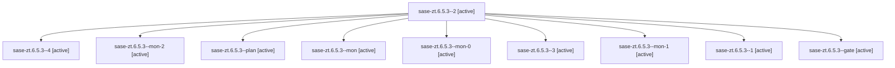

# Family: sase-zt.6.5.3

[Agent Hoods](../README.md) / [bbugyi200](../users/bbugyi200/README.md) / [athena](../users/bbugyi200/machines/athena/README.md) / [sase-zt](../users/bbugyi200/machines/athena/hoods/sase-zt/README.md) / sase-zt.6.5.3

Owner: `bbugyi200.athena` · Hood: `sase-zt` · Members: 10 · Bead: [sase-zt.6.5.3](https://github.com/sase-org/sase--beads/blob/main/pages/sase-zt/sase-zt.6.5.3.md)

## Lineage

The diagram is an optional enhancement; the ordered table below contains the same lineage in accessible text.

| Role | Agent | State | Model / provider | Timing | Commits | Prompt | Chat |
|---|---|---|---|---|---:|---|---|
| 2 | sase-zt.6.5.3--2 | active | grok-4.6 / grok | 2026-09-13T21:12:24.849136+00:00 | 0 | [Prompt](../agents/bbugyi200.athena.sase-zt.6.5.3--2/prompt.md) | [Chat](../agents/bbugyi200.athena.sase-zt.6.5.3--2/chat.md) |
| 4 | sase-zt.6.5.3--4 | active | grok-4.6 / grok | 2026-09-13T22:49:57.478412+00:00 | [1](../agents/bbugyi200.athena.sase-zt.6.5.3--4/README.md#commits) | [Prompt](../agents/bbugyi200.athena.sase-zt.6.5.3--4/prompt.md) | [Chat](../agents/bbugyi200.athena.sase-zt.6.5.3--4/chat.md) |
| mon-2 | sase-zt.6.5.3--mon-2 | active | grok-4.6 / grok | 2026-09-13T22:20:14.989343+00:00 | 0 | — | [Chat](../agents/bbugyi200.athena.sase-zt.6.5.3--mon-2/chat.md) |
| plan | sase-zt.6.5.3--plan | active | grok-4.6 / grok | 2026-09-13T20:34:46.877113+00:00 | 0 | [Prompt](../agents/bbugyi200.athena.sase-zt.6.5.3--plan/prompt.md) | [Chat](../agents/bbugyi200.athena.sase-zt.6.5.3--plan/chat.md) |
| mon | sase-zt.6.5.3--mon | active | grok-4.6 / grok | 2026-09-13T21:07:58.048330+00:00 | 0 | — | — |
| mon-0 | sase-zt.6.5.3--mon-0 | active | grok-4.6 / grok | 2026-09-13T21:10:09.892183+00:00 | 0 | — | [Chat](../agents/bbugyi200.athena.sase-zt.6.5.3--mon-0/chat.md) |
| 3 | sase-zt.6.5.3--3 | active | grok-4.6 / grok | 2026-09-13T22:06:13.780373+00:00 | 0 | [Prompt](../agents/bbugyi200.athena.sase-zt.6.5.3--3/prompt.md) | [Chat](../agents/bbugyi200.athena.sase-zt.6.5.3--3/chat.md) |
| mon-1 | sase-zt.6.5.3--mon-1 | active | grok-4.6 / grok | 2026-09-13T21:17:14.652613+00:00 | 0 | — | [Chat](../agents/bbugyi200.athena.sase-zt.6.5.3--mon-1/chat.md) |
| 1 | sase-zt.6.5.3--1 | active | grok-4.6 / grok | 2026-09-13T21:02:39.062978+00:00 | [1](../agents/bbugyi200.athena.sase-zt.6.5.3--1/README.md#commits) | [Prompt](../agents/bbugyi200.athena.sase-zt.6.5.3--1/prompt.md) | [Chat](../agents/bbugyi200.athena.sase-zt.6.5.3--1/chat.md) |
| gate | sase-zt.6.5.3--gate | active | grok-4.6 / grok | 2026-09-13T20:59:34.093957+00:00 | 0 | — | [Chat](../agents/bbugyi200.athena.sase-zt.6.5.3--gate/chat.md) |

## Commits

| Role | Repo | Commit | Subject | Committed |
|---|---|---|---|---|
| 1 | sase | [`1ebcb2f`](https://github.com/sase-org/sase/commit/1ebcb2f1893a7c8f48c18121c87efca29b65a3a6) | fix(monitor): collapse duplicate continuation-protocol fixture stamp | 2026-09-13 17:20:34 EDT |
| 4 | sase | [`0eb2bbe`](https://github.com/sase-org/sase/commit/0eb2bbea5a2b8f89142be80ec490bfab93359b04) | test(monitor): bound Jinja 49 assertion to captured-output span | 2026-09-13 19:04:29 EDT |

## Neighbors

| Agent | Relation | State |
|---|---|---|
| [sase-zt.6.5.1](../agents/bbugyi200.athena.sase-zt.6.5.1/README.md) | sase-zt.6.5 hood | active |
| [sase-zt.6.5.2](bbugyi200.athena.sase-zt.6.5.2.md) (family · 5) | sase-zt.6.5 hood | active 5 |
| [sase-zt.6.5.4.1](../agents/bbugyi200.athena.sase-zt.6.5.4.1/README.md) | sase-zt.6.5 hood | active |
| [sase-zt.6.5.4.2](../agents/bbugyi200.athena.sase-zt.6.5.4.2/README.md) | sase-zt.6.5 hood | active |
| [sase-zt.6.5.4.3](bbugyi200.athena.sase-zt.6.5.4.3.md) (family · 3) | sase-zt.6.5 hood | active 3 |
| [sase-zt.6.5.4.land](../agents/bbugyi200.athena.sase-zt.6.5.4.land/README.md) | sase-zt.6.5 hood | active |
| [sase-zt.6.5.land](bbugyi200.athena.sase-zt.6.5.land.md) (family · 3) | sase-zt.6.5 hood | active 3 |
| [sase-zt.6.1](../agents/bbugyi200.athena.sase-zt.6.1/README.md) | sase-zt.6 hood | active |
| [sase-zt.6.2](../agents/bbugyi200.athena.sase-zt.6.2/README.md) | sase-zt.6 hood | active |
| [sase-zt.6.3](../agents/bbugyi200.athena.sase-zt.6.3/README.md) | sase-zt.6 hood | active |
| [sase-zt.6.4](../agents/bbugyi200.athena.sase-zt.6.4/README.md) | sase-zt.6 hood | active |
| [sase-zt.6.land](bbugyi200.athena.sase-zt.6.land.md) (family · 3) | sase-zt.6 hood | active 3 |
| [sase-zt.1](../agents/bbugyi200.athena.sase-zt.1/README.md) | sase-zt hood | active |
| [sase-zt.2](../agents/bbugyi200.athena.sase-zt.2/README.md) | sase-zt hood | active |
| [sase-zt.3](../agents/bbugyi200.athena.sase-zt.3/README.md) | sase-zt hood | active |
| [sase-zt.4](../agents/bbugyi200.athena.sase-zt.4/README.md) | sase-zt hood | active |
| [sase-zt.5](bbugyi200.athena.sase-zt.5.md) (family · 4) | sase-zt hood | active 4 |
| [sase-zt.land](bbugyi200.athena.sase-zt.land.md) (family · 3) | sase-zt hood | active 3 |
