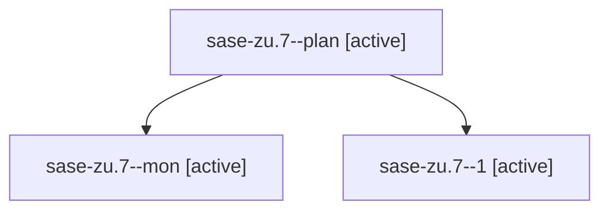

# Family: sase-zu.7

[Agent Hoods](../README.md) / [bbugyi200](../users/bbugyi200/README.md) / [athena](../users/bbugyi200/machines/athena/README.md) / [sase-zu](../users/bbugyi200/machines/athena/hoods/sase-zu/README.md) / sase-zu.7

Owner: `bbugyi200.athena` · Hood: `sase-zu` · Members: 3 · Bead: [sase-zu.7](https://github.com/sase-org/sase--beads/blob/main/pages/sase-zu/sase-zu.7.md)

## Lineage

The diagram is an optional enhancement; the ordered table below contains the same lineage in accessible text.

| Role | Agent | State | Model / provider | Timing | Commits | Prompt | Chat |
|---|---|---|---|---|---:|---|---|
| plan | sase-zu.7--plan | active | gpt-5.5 / codex | 2026-09-13T12:20:11.654650+00:00 | 0 | [Prompt](../agents/bbugyi200.athena.sase-zu.7--plan/prompt.md) | [Chat](../agents/bbugyi200.athena.sase-zu.7--plan/chat.md) |
| mon | sase-zu.7--mon | active | gpt-5.5 / codex | 2026-09-13T12:53:25.006375+00:00 | 0 | — | [Chat](../agents/bbugyi200.athena.sase-zu.7--mon/chat.md) |
| 1 | sase-zu.7--1 | active | sonnet / claude | 2026-09-13T12:55:38.789967+00:00 | [1](../agents/bbugyi200.athena.sase-zu.7--1/README.md#commits) | [Prompt](../agents/bbugyi200.athena.sase-zu.7--1/prompt.md) | [Chat](../agents/bbugyi200.athena.sase-zu.7--1/chat.md) |

## Commits

| Role | Repo | Commit | Subject | Committed |
|---|---|---|---|---|
| 1 | sase | [`ea18f53`](https://github.com/sase-org/sase/commit/ea18f5366e74258a7d5b62ffd725fdffdb8dc5f5) | fix(tools): sync validate\_sase\_core\_rs expected schema version to 9 | 2026-09-13 09:09:46 EDT |

## Neighbors

| Agent | Relation | State |
|---|---|---|
| [sase-zu.1](../agents/bbugyi200.athena.sase-zu.1/README.md) | sase-zu hood | active |
| [sase-zu.2](../agents/bbugyi200.athena.sase-zu.2/README.md) | sase-zu hood | active |
| [sase-zu.3](../agents/bbugyi200.athena.sase-zu.3/README.md) | sase-zu hood | active |
| [sase-zu.4](../agents/bbugyi200.athena.sase-zu.4/README.md) | sase-zu hood | active |
| [sase-zu.5](../agents/bbugyi200.athena.sase-zu.5/README.md) | sase-zu hood | active |
| [sase-zu.6](../agents/bbugyi200.athena.sase-zu.6/README.md) | sase-zu hood | active |
| [sase-zu.8.1](../agents/bbugyi200.athena.sase-zu.8.1/README.md) | sase-zu hood | active |
| [sase-zu.8.2](../agents/bbugyi200.athena.sase-zu.8.2/README.md) | sase-zu hood | active |
| [sase-zu.8.3](../agents/bbugyi200.athena.sase-zu.8.3/README.md) | sase-zu hood | active |
| [sase-zu.8.4](../agents/bbugyi200.athena.sase-zu.8.4/README.md) | sase-zu hood | active |
| [sase-zu.8.5](bbugyi200.athena.sase-zu.8.5.md) (family · 7) | sase-zu hood | active 7 |
| [sase-zu.8.land](../agents/bbugyi200.athena.sase-zu.8.land/README.md) | sase-zu hood | active |
| [sase-zu.land](bbugyi200.athena.sase-zu.land.md) (family · 3) | sase-zu hood | active 3 |
