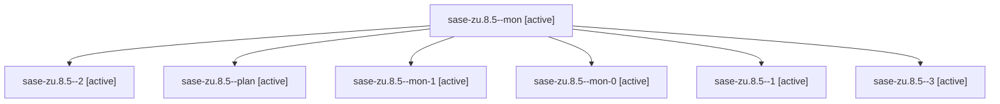

# Family: sase-zu.8.5

[Agent Hoods](../README.md) / [bbugyi200](../users/bbugyi200/README.md) / [athena](../users/bbugyi200/machines/athena/README.md) / [sase-zu](../users/bbugyi200/machines/athena/hoods/sase-zu/README.md) / sase-zu.8.5

Owner: `bbugyi200.athena` · Hood: `sase-zu` · Members: 7 · Bead: [sase-zu.8.5](https://github.com/sase-org/sase--beads/blob/main/pages/sase-zu/sase-zu.8.5.md)

## Lineage

The diagram is an optional enhancement; the ordered table below contains the same lineage in accessible text.

| Role | Agent | State | Model / provider | Timing | Commits | Prompt | Chat |
|---|---|---|---|---|---:|---|---|
| mon | sase-zu.8.5--mon | active | sonnet / claude | 2026-09-13T18:30:06.595482+00:00 | 0 | — | [Chat](../agents/bbugyi200.athena.sase-zu.8.5--mon/chat.md) |
| 2 | sase-zu.8.5--2 | active | opus / claude | 2026-09-13T20:17:28.176837+00:00 | 0 | [Prompt](../agents/bbugyi200.athena.sase-zu.8.5--2/prompt.md) | [Chat](../agents/bbugyi200.athena.sase-zu.8.5--2/chat.md) |
| plan | sase-zu.8.5--plan | active | sonnet / claude | 2026-09-13T18:21:47.988823+00:00 | 0 | [Prompt](../agents/bbugyi200.athena.sase-zu.8.5--plan/prompt.md) | [Chat](../agents/bbugyi200.athena.sase-zu.8.5--plan/chat.md) |
| mon-1 | sase-zu.8.5--mon-1 | active | opus / claude | 2026-09-13T20:32:08.730383+00:00 | 0 | — | [Chat](../agents/bbugyi200.athena.sase-zu.8.5--mon-1/chat.md) |
| mon-0 | sase-zu.8.5--mon-0 | active | opus / claude | 2026-09-13T19:37:08.000016+00:00 | 0 | — | [Chat](../agents/bbugyi200.athena.sase-zu.8.5--mon-0/chat.md) |
| 1 | sase-zu.8.5--1 | active | opus / claude | 2026-09-13T18:42:35.956514+00:00 | 0 | [Prompt](../agents/bbugyi200.athena.sase-zu.8.5--1/prompt.md) | [Chat](../agents/bbugyi200.athena.sase-zu.8.5--1/chat.md) |
| 3 | sase-zu.8.5--3 | active | opus / claude | 2026-09-13T21:04:49.112063+00:00 | [1](../agents/bbugyi200.athena.sase-zu.8.5--3/README.md#commits) | [Prompt](../agents/bbugyi200.athena.sase-zu.8.5--3/prompt.md) | [Chat](../agents/bbugyi200.athena.sase-zu.8.5--3/chat.md) |

## Commits

| Role | Repo | Commit | Subject | Committed |
|---|---|---|---|---|
| 3 | sase | [`ef254fd`](https://github.com/sase-org/sase/commit/ef254fd6dcb4bfbf3d14243579d2f96ea6a8708c) | test(perf): complete agent load tiering measured acceptance | 2026-09-13 17:21:40 EDT |

## Neighbors

| Agent | Relation | State |
|---|---|---|
| [sase-zu.8.1](../agents/bbugyi200.athena.sase-zu.8.1/README.md) | sase-zu.8 hood | active |
| [sase-zu.8.2](../agents/bbugyi200.athena.sase-zu.8.2/README.md) | sase-zu.8 hood | active |
| [sase-zu.8.3](../agents/bbugyi200.athena.sase-zu.8.3/README.md) | sase-zu.8 hood | active |
| [sase-zu.8.4](../agents/bbugyi200.athena.sase-zu.8.4/README.md) | sase-zu.8 hood | active |
| [sase-zu.8.land](../agents/bbugyi200.athena.sase-zu.8.land/README.md) | sase-zu.8 hood | active |
| [sase-zu.1](../agents/bbugyi200.athena.sase-zu.1/README.md) | sase-zu hood | active |
| [sase-zu.2](../agents/bbugyi200.athena.sase-zu.2/README.md) | sase-zu hood | active |
| [sase-zu.3](../agents/bbugyi200.athena.sase-zu.3/README.md) | sase-zu hood | active |
| [sase-zu.4](../agents/bbugyi200.athena.sase-zu.4/README.md) | sase-zu hood | active |
| [sase-zu.5](../agents/bbugyi200.athena.sase-zu.5/README.md) | sase-zu hood | active |
| [sase-zu.6](../agents/bbugyi200.athena.sase-zu.6/README.md) | sase-zu hood | active |
| [sase-zu.7](bbugyi200.athena.sase-zu.7.md) (family · 3) | sase-zu hood | active 3 |
| [sase-zu.land](bbugyi200.athena.sase-zu.land.md) (family · 3) | sase-zu hood | active 3 |
