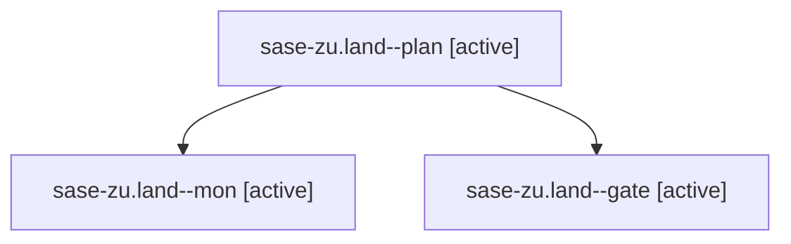

# Family: sase-zu.land

[Agent Hoods](../README.md) / [bbugyi200](../users/bbugyi200/README.md) / [athena](../users/bbugyi200/machines/athena/README.md) / [sase-zu](../users/bbugyi200/machines/athena/hoods/sase-zu/README.md) / sase-zu.land

Owner: `bbugyi200.athena` · Hood: `sase-zu` · Members: 3 · Bead: [sase-zu](https://github.com/sase-org/sase--beads/blob/main/pages/sase-zu/README.md)

## Lineage

The diagram is an optional enhancement; the ordered table below contains the same lineage in accessible text.

| Role | Agent | State | Model / provider | Timing | Commits | Prompt | Chat |
|---|---|---|---|---|---:|---|---|
| plan | sase-zu.land--plan | active | gpt-6-astra / codex | 2026-09-13T14:02:44.494398+00:00 | 0 | [Prompt](../agents/bbugyi200.athena.sase-zu.land--plan/prompt.md) | [Chat](../agents/bbugyi200.athena.sase-zu.land--plan/chat.md) |
| mon | sase-zu.land--mon | active | gpt-6-astra / codex | 2026-09-13T14:21:02.098738+00:00 | 0 | — | [Chat](../agents/bbugyi200.athena.sase-zu.land--mon/chat.md) |
| gate | sase-zu.land--gate | active | gpt-6-astra / codex | 2026-09-13T14:20:36.040533+00:00 | 0 | — | [Chat](../agents/bbugyi200.athena.sase-zu.land--gate/chat.md) |

## Neighbors

| Agent | Relation | State |
|---|---|---|
| [sase-zu.1](../agents/bbugyi200.athena.sase-zu.1/README.md) | sase-zu hood | active |
| [sase-zu.2](../agents/bbugyi200.athena.sase-zu.2/README.md) | sase-zu hood | active |
| [sase-zu.3](../agents/bbugyi200.athena.sase-zu.3/README.md) | sase-zu hood | active |
| [sase-zu.4](../agents/bbugyi200.athena.sase-zu.4/README.md) | sase-zu hood | active |
| [sase-zu.5](../agents/bbugyi200.athena.sase-zu.5/README.md) | sase-zu hood | active |
| [sase-zu.6](../agents/bbugyi200.athena.sase-zu.6/README.md) | sase-zu hood | active |
| [sase-zu.7](bbugyi200.athena.sase-zu.7.md) (family · 3) | sase-zu hood | active 3 |
| [sase-zu.8.1](../agents/bbugyi200.athena.sase-zu.8.1/README.md) | sase-zu hood | active |
| [sase-zu.8.2](../agents/bbugyi200.athena.sase-zu.8.2/README.md) | sase-zu hood | active |
| [sase-zu.8.3](../agents/bbugyi200.athena.sase-zu.8.3/README.md) | sase-zu hood | active |
| [sase-zu.8.4](../agents/bbugyi200.athena.sase-zu.8.4/README.md) | sase-zu hood | active |
| [sase-zu.8.5](bbugyi200.athena.sase-zu.8.5.md) (family · 7) | sase-zu hood | active 7 |
| [sase-zu.8.land](../agents/bbugyi200.athena.sase-zu.8.land/README.md) | sase-zu hood | active |
