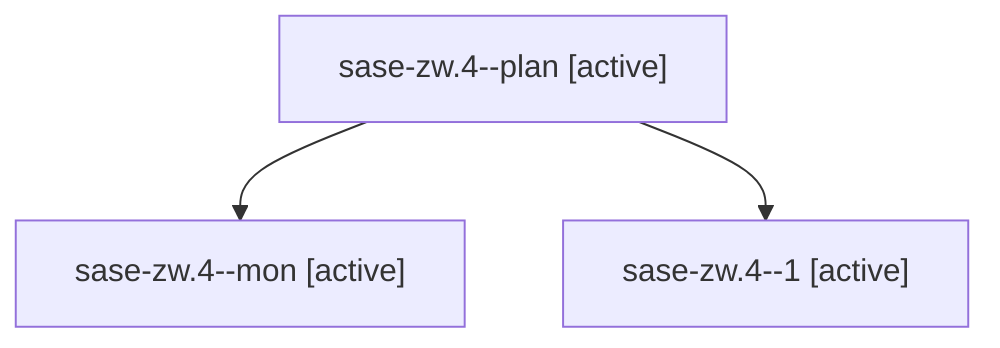

# Family: sase-zw.4

[Agent Hoods](../README.md) / [bbugyi200](../users/bbugyi200/README.md) / [athena](../users/bbugyi200/machines/athena/README.md) / [sase-zw](../users/bbugyi200/machines/athena/hoods/sase-zw/README.md) / sase-zw.4

Owner: `bbugyi200.athena` · Hood: `sase-zw` · Members: 3 · Bead: [sase-zw.4](https://github.com/sase-org/sase--beads/blob/main/pages/sase-zw/sase-zw.4.md)

## Lineage

The diagram is an optional enhancement; the ordered table below contains the same lineage in accessible text.

| Role | Agent | State | Model / provider | Timing | Commits | Prompt | Chat |
|---|---|---|---|---|---:|---|---|
| plan | sase-zw.4--plan | active | gpt-5.5 / codex | 2026-09-12T19:30:21.715168+00:00 | 0 | [Prompt](../agents/bbugyi200.athena.sase-zw.4--plan/prompt.md) | [Chat](../agents/bbugyi200.athena.sase-zw.4--plan/chat.md) |
| mon | sase-zw.4--mon | active | gpt-5.5 / codex | 2026-09-12T20:08:27.676151+00:00 | 0 | — | [Chat](../agents/bbugyi200.athena.sase-zw.4--mon/chat.md) |
| 1 | sase-zw.4--1 | active | gpt-5.5 / codex | 2026-09-12T20:12:33.095559+00:00 | [1](../agents/bbugyi200.athena.sase-zw.4--1/README.md#commits) | [Prompt](../agents/bbugyi200.athena.sase-zw.4--1/prompt.md) | [Chat](../agents/bbugyi200.athena.sase-zw.4--1/chat.md) |

## Commits

| Role | Repo | Commit | Subject | Committed |
|---|---|---|---|---|
| 1 | sase | [`edaf35b`](https://github.com/sase-org/sase/commit/edaf35bd95fd9312a3704e0e8ddf7830cbdcdeb6) | fix(rust): keep dev builds in managed targets | 2026-09-12 17:09:13 EDT |

## Neighbors

| Agent | Relation | State |
|---|---|---|
| [sase-zw.1](../agents/bbugyi200.athena.sase-zw.1/README.md) | sase-zw hood | active |
| [sase-zw.2](../agents/bbugyi200.athena.sase-zw.2/README.md) | sase-zw hood | active |
| [sase-zw.3](../agents/bbugyi200.athena.sase-zw.3/README.md) | sase-zw hood | active |
| [sase-zw.5](../agents/bbugyi200.athena.sase-zw.5/README.md) | sase-zw hood | active |
| [sase-zw.6](bbugyi200.athena.sase-zw.6.md) (family · 3) | sase-zw hood | active 2, completed 1 |
| [sase-zw.7](bbugyi200.athena.sase-zw.7.md) (family · 5) | sase-zw hood | active 5 |
| [sase-zw.8.1](../agents/bbugyi200.athena.sase-zw.8.1/README.md) | sase-zw hood | active |
| [sase-zw.8.2](../agents/bbugyi200.athena.sase-zw.8.2/README.md) | sase-zw hood | active |
| [sase-zw.8.3](../agents/bbugyi200.athena.sase-zw.8.3/README.md) | sase-zw hood | active |
| [sase-zw.8.4](../agents/bbugyi200.athena.sase-zw.8.4/README.md) | sase-zw hood | active |
| [sase-zw.8.5](../agents/bbugyi200.athena.sase-zw.8.5/README.md) | sase-zw hood | active |
| [sase-zw.8.6](../agents/bbugyi200.athena.sase-zw.8.6/README.md) | sase-zw hood | active |
| [sase-zw.8.7.1](../agents/bbugyi200.athena.sase-zw.8.7.1/README.md) | sase-zw hood | active |
| [sase-zw.8.7.2](../agents/bbugyi200.athena.sase-zw.8.7.2/README.md) | sase-zw hood | active |
| [sase-zw.8.7.3](../agents/bbugyi200.athena.sase-zw.8.7.3/README.md) | sase-zw hood | active |
| [sase-zw.8.7.4](../agents/bbugyi200.athena.sase-zw.8.7.4/README.md) | sase-zw hood | active |
| [sase-zw.8.7.5](../agents/bbugyi200.athena.sase-zw.8.7.5/README.md) | sase-zw hood | active |
| [sase-zw.8.7.6](../agents/bbugyi200.athena.sase-zw.8.7.6/README.md) | sase-zw hood | active |
| [sase-zw.8.7.7](bbugyi200.athena.sase-zw.8.7.7.md) (family · 13) | sase-zw hood | active 13 |
| [sase-zw.8.7.8.1](../agents/bbugyi200.athena.sase-zw.8.7.8.1/README.md) | sase-zw hood | active |
| [sase-zw.8.7.8.2](../agents/bbugyi200.athena.sase-zw.8.7.8.2/README.md) | sase-zw hood | active |
| [sase-zw.8.7.8.3](../agents/bbugyi200.athena.sase-zw.8.7.8.3/README.md) | sase-zw hood | waiting |
| [sase-zw.8.7.8.4](../agents/bbugyi200.athena.sase-zw.8.7.8.4/README.md) | sase-zw hood | active |
| [sase-zw.8.7.8.5](../agents/bbugyi200.athena.sase-zw.8.7.8.5/README.md) | sase-zw hood | active |
| [sase-zw.8.7.8.6](../agents/bbugyi200.athena.sase-zw.8.7.8.6/README.md) | sase-zw hood | waiting |
| [sase-zw.8.7.8.7](../agents/bbugyi200.athena.sase-zw.8.7.8.7/README.md) | sase-zw hood | waiting |
| [sase-zw.8.7.8.land](../agents/bbugyi200.athena.sase-zw.8.7.8.land/README.md) | sase-zw hood | waiting |
| [sase-zw.8.7.land](bbugyi200.athena.sase-zw.8.7.land.md) (family · 3) | sase-zw hood | active 3 |
| [sase-zw.8.land](bbugyi200.athena.sase-zw.8.land.md) (family · 3) | sase-zw hood | active 3 |
| [sase-zw.land](bbugyi200.athena.sase-zw.land.md) (family · 3) | sase-zw hood | active 3 |
