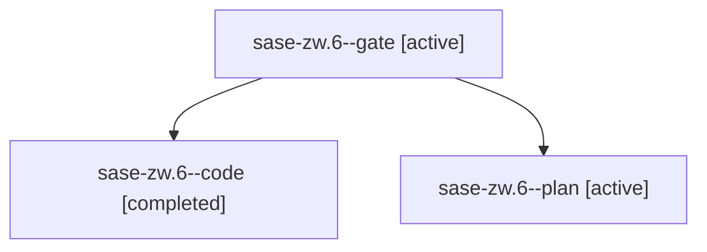

# Family: sase-zw.6

[Agent Hoods](../README.md) / [bbugyi200](../users/bbugyi200/README.md) / [athena](../users/bbugyi200/machines/athena/README.md) / [sase-zw](../users/bbugyi200/machines/athena/hoods/sase-zw/README.md) / sase-zw.6

Owner: `bbugyi200.athena` · Hood: `sase-zw` · Members: 3 · Bead: [sase-zw.6](https://github.com/sase-org/sase--beads/blob/main/pages/sase-zw/sase-zw.6.md)

## Lineage

The diagram is an optional enhancement; the ordered table below contains the same lineage in accessible text.

| Role | Agent | State | Model / provider | Timing | Commits | Prompt | Chat |
|---|---|---|---|---|---:|---|---|
| gate | sase-zw.6--gate | active | gpt-5.6-sol / codex | 2026-09-12T19:41:58.947964+00:00 | 0 | — | [Chat](../agents/bbugyi200.athena.sase-zw.6--gate/chat.md) |
| code | sase-zw.6--code | completed | gpt-5.5 / codex | 2026-09-12T19:42:27.260461+00:00 → 2026-09-13T00:00:18.665766+00:00 | [1](../agents/bbugyi200.athena.sase-zw.6--code/README.md#commits) | — | [Chat](../agents/bbugyi200.athena.sase-zw.6--code/chat.md) |
| plan | sase-zw.6--plan | active | gpt-5.6-sol / codex | 2026-09-12T19:35:43.374111+00:00 | 0 | [Prompt](../agents/bbugyi200.athena.sase-zw.6--plan/prompt.md) | [Chat](../agents/bbugyi200.athena.sase-zw.6--plan/chat.md) |

## Commits

| Role | Repo | Commit | Subject | Committed |
|---|---|---|---|---|
| code | sase | [`4460e13`](https://github.com/sase-org/sase/commit/4460e13c4465fa36f2394f88a0723d67d7bb5970) | feat(workspace): share git objects across checkouts | 2026-09-12 19:57:44 EDT |

## Neighbors

| Agent | Relation | State |
|---|---|---|
| [sase-zw.1](../agents/bbugyi200.athena.sase-zw.1/README.md) | sase-zw hood | active |
| [sase-zw.2](../agents/bbugyi200.athena.sase-zw.2/README.md) | sase-zw hood | active |
| [sase-zw.3](../agents/bbugyi200.athena.sase-zw.3/README.md) | sase-zw hood | active |
| [sase-zw.4](bbugyi200.athena.sase-zw.4.md) (family · 3) | sase-zw hood | active 3 |
| [sase-zw.5](../agents/bbugyi200.athena.sase-zw.5/README.md) | sase-zw hood | active |
| [sase-zw.7](bbugyi200.athena.sase-zw.7.md) (family · 5) | sase-zw hood | active 5 |
| [sase-zw.8.1](../agents/bbugyi200.athena.sase-zw.8.1/README.md) | sase-zw hood | active |
| [sase-zw.8.2](../agents/bbugyi200.athena.sase-zw.8.2/README.md) | sase-zw hood | active |
| [sase-zw.8.3](../agents/bbugyi200.athena.sase-zw.8.3/README.md) | sase-zw hood | active |
| [sase-zw.8.4](../agents/bbugyi200.athena.sase-zw.8.4/README.md) | sase-zw hood | active |
| [sase-zw.8.5](../agents/bbugyi200.athena.sase-zw.8.5/README.md) | sase-zw hood | active |
| [sase-zw.8.6](../agents/bbugyi200.athena.sase-zw.8.6/README.md) | sase-zw hood | active |
| [sase-zw.8.7.1](../agents/bbugyi200.athena.sase-zw.8.7.1/README.md) | sase-zw hood | active |
| [sase-zw.8.7.2](../agents/bbugyi200.athena.sase-zw.8.7.2/README.md) | sase-zw hood | active |
| [sase-zw.8.7.3](../agents/bbugyi200.athena.sase-zw.8.7.3/README.md) | sase-zw hood | active |
| [sase-zw.8.7.4](../agents/bbugyi200.athena.sase-zw.8.7.4/README.md) | sase-zw hood | active |
| [sase-zw.8.7.5](../agents/bbugyi200.athena.sase-zw.8.7.5/README.md) | sase-zw hood | active |
| [sase-zw.8.7.6](../agents/bbugyi200.athena.sase-zw.8.7.6/README.md) | sase-zw hood | active |
| [sase-zw.8.7.7](bbugyi200.athena.sase-zw.8.7.7.md) (family · 13) | sase-zw hood | active 13 |
| [sase-zw.8.7.8.1](../agents/bbugyi200.athena.sase-zw.8.7.8.1/README.md) | sase-zw hood | active |
| [sase-zw.8.7.8.2](../agents/bbugyi200.athena.sase-zw.8.7.8.2/README.md) | sase-zw hood | active |
| [sase-zw.8.7.8.3](../agents/bbugyi200.athena.sase-zw.8.7.8.3/README.md) | sase-zw hood | waiting |
| [sase-zw.8.7.8.4](../agents/bbugyi200.athena.sase-zw.8.7.8.4/README.md) | sase-zw hood | active |
| [sase-zw.8.7.8.5](../agents/bbugyi200.athena.sase-zw.8.7.8.5/README.md) | sase-zw hood | active |
| [sase-zw.8.7.8.6](../agents/bbugyi200.athena.sase-zw.8.7.8.6/README.md) | sase-zw hood | waiting |
| [sase-zw.8.7.8.7](../agents/bbugyi200.athena.sase-zw.8.7.8.7/README.md) | sase-zw hood | waiting |
| [sase-zw.8.7.8.land](../agents/bbugyi200.athena.sase-zw.8.7.8.land/README.md) | sase-zw hood | waiting |
| [sase-zw.8.7.land](bbugyi200.athena.sase-zw.8.7.land.md) (family · 3) | sase-zw hood | active 3 |
| [sase-zw.8.land](bbugyi200.athena.sase-zw.8.land.md) (family · 3) | sase-zw hood | active 3 |
| [sase-zw.land](bbugyi200.athena.sase-zw.land.md) (family · 3) | sase-zw hood | active 3 |
