# Family: sase-zw.8.7.7

[Agent Hoods](../README.md) / [bbugyi200](../users/bbugyi200/README.md) / [athena](../users/bbugyi200/machines/athena/README.md) / [sase-zw](../users/bbugyi200/machines/athena/hoods/sase-zw/README.md) / sase-zw.8.7.7

Owner: `bbugyi200.athena` · Hood: `sase-zw` · Members: 13 · Bead: [sase-zw.8.7.7](https://github.com/sase-org/sase--beads/blob/main/pages/sase-zw/sase-zw.8.7.7.md)

## Lineage

```mermaid
flowchart TD
  n0["sase-zw.8.7.7--mon-3 [active]"]
  n1["sase-zw.8.7.7--mon-1 [active]"]
  n0 --> n1
  n2["sase-zw.8.7.7--mon [active]"]
  n0 --> n2
  n3["sase-zw.8.7.7--5 [active]"]
  n0 --> n3
  n4["sase-zw.8.7.7--mon-2 [active]"]
  n0 --> n4
  n5["sase-zw.8.7.7--6 [active]"]
  n0 --> n5
  n6["sase-zw.8.7.7--1 [active]"]
  n0 --> n6
  n7["sase-zw.8.7.7--3 [active]"]
  n0 --> n7
  n8["sase-zw.8.7.7--4 [active]"]
  n0 --> n8
  n9["sase-zw.8.7.7--plan [active]"]
  n0 --> n9
  n10["sase-zw.8.7.7--mon-4 [active]"]
  n0 --> n10
  n11["sase-zw.8.7.7--mon-0 [active]"]
  n0 --> n11
  n12["sase-zw.8.7.7--2 [active]"]
  n0 --> n12
```

The diagram is an optional enhancement; the ordered table below contains the same lineage in accessible text.

| Role | Agent | State | Model / provider | Timing | Commits | Prompt | Chat |
|---|---|---|---|---|---:|---|---|
| mon-3 | sase-zw.8.7.7--mon-3 | active | gpt-5.5 / codex | 2026-09-15T21:05:30.986568+00:00 | 0 | — | [Chat](../agents/bbugyi200.athena.sase-zw.8.7.7--mon-3/chat.md) |
| mon-1 | sase-zw.8.7.7--mon-1 | active | gpt-5.5 / codex | 2026-09-15T19:57:28.810724+00:00 | 0 | — | [Chat](../agents/bbugyi200.athena.sase-zw.8.7.7--mon-1/chat.md) |
| mon | sase-zw.8.7.7--mon | active | gpt-5.5 / codex | 2026-09-15T19:18:00.070495+00:00 | 0 | — | [Chat](../agents/bbugyi200.athena.sase-zw.8.7.7--mon/chat.md) |
| 5 | sase-zw.8.7.7--5 | active | gpt-5.5 / codex | 2026-09-15T21:31:53.994682+00:00 | 0 | [Prompt](../agents/bbugyi200.athena.sase-zw.8.7.7--5/prompt.md) | [Chat](../agents/bbugyi200.athena.sase-zw.8.7.7--5/chat.md) |
| mon-2 | sase-zw.8.7.7--mon-2 | active | gpt-5.5 / codex | 2026-09-15T20:29:15.023529+00:00 | 0 | — | [Chat](../agents/bbugyi200.athena.sase-zw.8.7.7--mon-2/chat.md) |
| 6 | sase-zw.8.7.7--6 | active | gpt-5.5 / codex | 2026-09-15T22:00:07.809089+00:00 | [1](../agents/bbugyi200.athena.sase-zw.8.7.7--6/README.md#commits) | [Prompt](../agents/bbugyi200.athena.sase-zw.8.7.7--6/prompt.md) | [Chat](../agents/bbugyi200.athena.sase-zw.8.7.7--6/chat.md) |
| 1 | sase-zw.8.7.7--1 | active | gpt-5.5 / codex | 2026-09-15T19:22:51.214393+00:00 | 0 | [Prompt](../agents/bbugyi200.athena.sase-zw.8.7.7--1/prompt.md) | [Chat](../agents/bbugyi200.athena.sase-zw.8.7.7--1/chat.md) |
| 3 | sase-zw.8.7.7--3 | active | gpt-5.5 / codex | 2026-09-15T20:24:03.470821+00:00 | 0 | [Prompt](../agents/bbugyi200.athena.sase-zw.8.7.7--3/prompt.md) | [Chat](../agents/bbugyi200.athena.sase-zw.8.7.7--3/chat.md) |
| 4 | sase-zw.8.7.7--4 | active | gpt-5.5 / codex | 2026-09-15T20:59:32.681078+00:00 | 0 | [Prompt](../agents/bbugyi200.athena.sase-zw.8.7.7--4/prompt.md) | [Chat](../agents/bbugyi200.athena.sase-zw.8.7.7--4/chat.md) |
| plan | sase-zw.8.7.7--plan | active | gpt-5.5 / codex | 2026-09-15T19:00:23.063277+00:00 | 0 | [Prompt](../agents/bbugyi200.athena.sase-zw.8.7.7--plan/prompt.md) | [Chat](../agents/bbugyi200.athena.sase-zw.8.7.7--plan/chat.md) |
| mon-4 | sase-zw.8.7.7--mon-4 | active | gpt-5.5 / codex | 2026-09-15T21:34:36.450415+00:00 | 0 | — | [Chat](../agents/bbugyi200.athena.sase-zw.8.7.7--mon-4/chat.md) |
| mon-0 | sase-zw.8.7.7--mon-0 | active | gpt-5.5 / codex | 2026-09-15T19:25:52.247530+00:00 | 0 | — | [Chat](../agents/bbugyi200.athena.sase-zw.8.7.7--mon-0/chat.md) |
| 2 | sase-zw.8.7.7--2 | active | gpt-5.5 / codex | 2026-09-15T19:54:12.753663+00:00 | 0 | [Prompt](../agents/bbugyi200.athena.sase-zw.8.7.7--2/prompt.md) | [Chat](../agents/bbugyi200.athena.sase-zw.8.7.7--2/chat.md) |

## Commits

| Role | Repo | Commit | Subject | Committed |
|---|---|---|---|---|
| 6 | sase | [`05be391`](https://github.com/sase-org/sase/commit/05be391f7aeb275b84e2dab716166dfdd7b553e4) | test(disk): finish retention acceptance gate | 2026-09-15 18:06:19 EDT |

## Neighbors

| Agent | Relation | State |
|---|---|---|
| [sase-zw.8.7.1](../agents/bbugyi200.athena.sase-zw.8.7.1/README.md) | sase-zw.8.7 hood | active |
| [sase-zw.8.7.2](../agents/bbugyi200.athena.sase-zw.8.7.2/README.md) | sase-zw.8.7 hood | active |
| [sase-zw.8.7.3](../agents/bbugyi200.athena.sase-zw.8.7.3/README.md) | sase-zw.8.7 hood | active |
| [sase-zw.8.7.4](../agents/bbugyi200.athena.sase-zw.8.7.4/README.md) | sase-zw.8.7 hood | active |
| [sase-zw.8.7.5](../agents/bbugyi200.athena.sase-zw.8.7.5/README.md) | sase-zw.8.7 hood | active |
| [sase-zw.8.7.6](../agents/bbugyi200.athena.sase-zw.8.7.6/README.md) | sase-zw.8.7 hood | active |
| [sase-zw.8.7.8.1](../agents/bbugyi200.athena.sase-zw.8.7.8.1/README.md) | sase-zw.8.7 hood | active |
| [sase-zw.8.7.8.2](../agents/bbugyi200.athena.sase-zw.8.7.8.2/README.md) | sase-zw.8.7 hood | active |
| [sase-zw.8.7.8.3](../agents/bbugyi200.athena.sase-zw.8.7.8.3/README.md) | sase-zw.8.7 hood | waiting |
| [sase-zw.8.7.8.4](../agents/bbugyi200.athena.sase-zw.8.7.8.4/README.md) | sase-zw.8.7 hood | active |
| [sase-zw.8.7.8.5](../agents/bbugyi200.athena.sase-zw.8.7.8.5/README.md) | sase-zw.8.7 hood | active |
| [sase-zw.8.7.8.6](../agents/bbugyi200.athena.sase-zw.8.7.8.6/README.md) | sase-zw.8.7 hood | waiting |
| [sase-zw.8.7.8.7](../agents/bbugyi200.athena.sase-zw.8.7.8.7/README.md) | sase-zw.8.7 hood | waiting |
| [sase-zw.8.7.8.land](../agents/bbugyi200.athena.sase-zw.8.7.8.land/README.md) | sase-zw.8.7 hood | waiting |
| [sase-zw.8.7.land](bbugyi200.athena.sase-zw.8.7.land.md) (family · 3) | sase-zw.8.7 hood | active 3 |
| [sase-zw.8.1](../agents/bbugyi200.athena.sase-zw.8.1/README.md) | sase-zw.8 hood | active |
| [sase-zw.8.2](../agents/bbugyi200.athena.sase-zw.8.2/README.md) | sase-zw.8 hood | active |
| [sase-zw.8.3](../agents/bbugyi200.athena.sase-zw.8.3/README.md) | sase-zw.8 hood | active |
| [sase-zw.8.4](../agents/bbugyi200.athena.sase-zw.8.4/README.md) | sase-zw.8 hood | active |
| [sase-zw.8.5](../agents/bbugyi200.athena.sase-zw.8.5/README.md) | sase-zw.8 hood | active |
| [sase-zw.8.6](../agents/bbugyi200.athena.sase-zw.8.6/README.md) | sase-zw.8 hood | active |
| [sase-zw.8.land](bbugyi200.athena.sase-zw.8.land.md) (family · 3) | sase-zw.8 hood | active 3 |
| [sase-zw.1](../agents/bbugyi200.athena.sase-zw.1/README.md) | sase-zw hood | active |
| [sase-zw.2](../agents/bbugyi200.athena.sase-zw.2/README.md) | sase-zw hood | active |
| [sase-zw.3](../agents/bbugyi200.athena.sase-zw.3/README.md) | sase-zw hood | active |
| [sase-zw.4](bbugyi200.athena.sase-zw.4.md) (family · 3) | sase-zw hood | active 3 |
| [sase-zw.5](../agents/bbugyi200.athena.sase-zw.5/README.md) | sase-zw hood | active |
| [sase-zw.6](bbugyi200.athena.sase-zw.6.md) (family · 3) | sase-zw hood | active 2, completed 1 |
| [sase-zw.7](bbugyi200.athena.sase-zw.7.md) (family · 5) | sase-zw hood | active 5 |
| [sase-zw.land](bbugyi200.athena.sase-zw.land.md) (family · 3) | sase-zw hood | active 3 |
