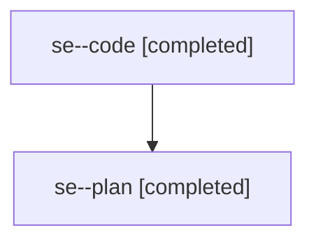

# Family: se

[Agent Hoods](../README.md) / [bbugyi200](../users/bbugyi200/README.md) / [athena](../users/bbugyi200/machines/athena/README.md) / [se](../users/bbugyi200/machines/athena/hoods/se/README.md) / se

Owner: `bbugyi200.athena` · Hood: `se` · Members: 2

## Lineage

The diagram is an optional enhancement; the ordered table below contains the same lineage in accessible text.

| Role | Agent | State | Model / provider | Timing | Commits | Prompt | Chat |
|---|---|---|---|---|---:|---|---|
| code | se--code | completed | gpt-5.5 / codex | 2026-08-02T20:00:27.946326+00:00 | [1](../agents/bbugyi200.athena.se--code/README.md#commits) | — | [Chat](../agents/bbugyi200.athena.se--code/chat.md) |
| plan | se--plan | completed | opus / claude | 2026-08-02T19:44:37.229836+00:00 | 0 | [Prompt](../agents/bbugyi200.athena.se--plan/prompt.md) | [Chat](../agents/bbugyi200.athena.se--plan/chat.md) |

## Commits

| Role | Repo | Commit | Subject | Committed |
|---|---|---|---|---|
| code | sase | [`4fcaee9`](https://github.com/sase-org/sase/commit/4fcaee95a5e543fd6635fc820e64b3cd2776480d) | fix(dev-update): guard code swaps during bead work | 2026-08-02 16:22:34 EDT |
