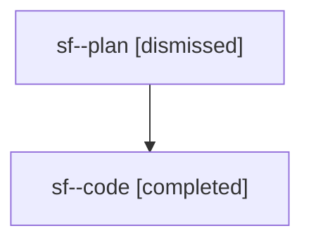

# Family: sf

[Agent Hoods](../README.md) / [bbugyi200](../users/bbugyi200/README.md) / [athena](../users/bbugyi200/machines/athena/README.md) / [sf](../users/bbugyi200/machines/athena/hoods/sf/README.md) / sf

Owner: `bbugyi200.athena` · Hood: `sf` · Members: 2

## Lineage

The diagram is an optional enhancement; the ordered table below contains the same lineage in accessible text.

| Role | Agent | State | Model / provider | Timing | Commits | Prompt | Chat |
|---|---|---|---|---|---:|---|---|
| plan | sf--plan | dismissed | opus / claude | 2026-08-03T04:10:00.074915 → 2026-08-03T04:46:08.978356 | 0 | — | [Chat](../agents/bbugyi200.athena.sf--plan/chat.md) |
| code | sf--code | completed | gpt-5.5 / codex | 2026-08-03T08:19:04.634056+00:00 | [1](../agents/bbugyi200.athena.sf--code/README.md#commits) | — | [Chat](../agents/bbugyi200.athena.sf--code/chat.md) |

## Commits

| Role | Repo | Commit | Subject | Committed |
|---|---|---|---|---|
| code | sase | [`77ef395`](https://github.com/sase-org/sase/commit/77ef3953e5c67c8be6247c4de1e2e62c474243a3) | fix(beads): repair stale project-key prefixes before minting | 2026-08-03 04:38:00 EDT |
