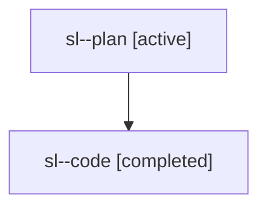

# Family: sl

[Agent Hoods](../README.md) / [bbugyi200](../users/bbugyi200/README.md) / [athena](../users/bbugyi200/machines/athena/README.md) / [sl](../users/bbugyi200/machines/athena/hoods/sl/README.md) / sl

Owner: `bbugyi200.athena` · Hood: `sl` · Members: 2

## Lineage

The diagram is an optional enhancement; the ordered table below contains the same lineage in accessible text.

| Role | Agent | State | Model / provider | Timing | Commits | Prompt | Chat |
|---|---|---|---|---|---:|---|---|
| plan | sl--plan | active | opus / claude | 2026-08-03T10:57:42.025249+00:00 | 0 | [Prompt](../agents/bbugyi200.athena.sl--plan/prompt.md) | [Chat](../agents/bbugyi200.athena.sl--plan/chat.md) |
| code | sl--code | completed | gpt-5.5 / codex | 2026-08-03T11:13:19.263774+00:00 | [1](../agents/bbugyi200.athena.sl--code/README.md#commits) | — | [Chat](../agents/bbugyi200.athena.sl--code/chat.md) |

## Commits

| Role | Repo | Commit | Subject | Committed |
|---|---|---|---|---|
| code | sase | [`e257d6b`](https://github.com/sase-org/sase/commit/e257d6b1b2da21d1b59414fe7fc1214b37aa5659) | feat(cli)!: wrap bead show prose | 2026-08-03 08:08:30 EDT |

## Neighbors

| Agent | Relation | State |
|---|---|---|
| [sl.f1](../agents/bbugyi200.athena.sl.f1/README.md) | descendant | active |
