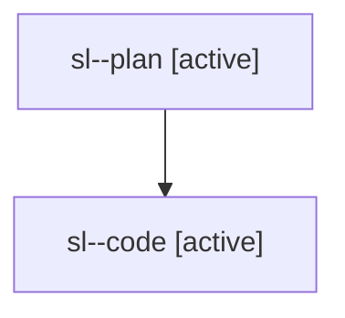

# Family: sl

[Agent Hoods](../README.md) / [bbugyi200](../users/bbugyi200/README.md) / [athena](../users/bbugyi200/machines/athena/README.md) / [sl](../users/bbugyi200/machines/athena/hoods/sl/README.md) / sl

Owner: `bbugyi200.athena` · Hood: `sl` · Members: 2

## Lineage

The diagram is an optional enhancement; the ordered table below contains the same lineage in accessible text.

| Role | Agent | State | Model / provider | Timing | Commits | Prompt | Chat |
|---|---|---|---|---|---:|---|---|
| plan | sl--plan | active | opus / claude | 2026-08-03T10:57:42.025249+00:00 | 0 | [Prompt](../agents/bbugyi200.athena.sl--plan/prompt.md) | [Chat](../agents/bbugyi200.athena.sl--plan/chat.md) |
| code | sl--code | active | gpt-5.5 / codex | 2026-08-03T11:13:19.263774+00:00 | 0 | — | — |
