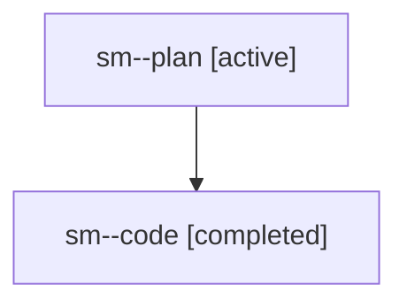

# Family: sm

[Agent Hoods](../README.md) / [bbugyi200](../users/bbugyi200/README.md) / [athena](../users/bbugyi200/machines/athena/README.md) / [sm](../users/bbugyi200/machines/athena/hoods/sm/README.md) / sm

Owner: `bbugyi200.athena` · Hood: `sm` · Members: 2

## Lineage

The diagram is an optional enhancement; the ordered table below contains the same lineage in accessible text.

| Role | Agent | State | Model / provider | Timing | Commits | Prompt | Chat |
|---|---|---|---|---|---:|---|---|
| plan | sm--plan | active | opus / claude | 2026-08-03T11:13:13.792722+00:00 | 0 | [Prompt](../agents/bbugyi200.athena.sm--plan/prompt.md) | [Chat](../agents/bbugyi200.athena.sm--plan/chat.md) |
| code | sm--code | completed | gpt-5.5 / codex | 2026-08-03T11:32:04.961505+00:00 | [1](../agents/bbugyi200.athena.sm--code/README.md#commits) | — | [Chat](../agents/bbugyi200.athena.sm--code/chat.md) |

## Commits

| Role | Repo | Commit | Subject | Committed |
|---|---|---|---|---|
| code | sase | [`a5aa2e9`](https://github.com/sase-org/sase/commit/a5aa2e9c0e426b78910a73bf7e3037e0de8d9450) | fix(ace): resolve clan summary hint targets | 2026-08-03 12:00:57 UTC |
