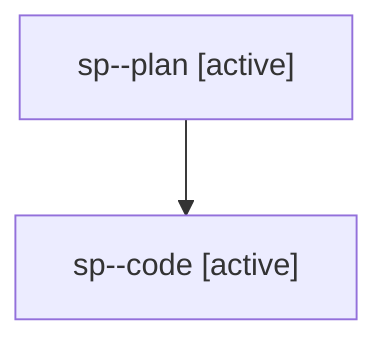

# Family: sp

[Agent Hoods](../README.md) / [bbugyi200](../users/bbugyi200/README.md) / [athena](../users/bbugyi200/machines/athena/README.md) / [sp](../users/bbugyi200/machines/athena/hoods/sp/README.md) / sp

Owner: `bbugyi200.athena` · Hood: `sp` · Members: 2

## Lineage

The diagram is an optional enhancement; the ordered table below contains the same lineage in accessible text.

| Role | Agent | State | Model / provider | Timing | Commits | Prompt | Chat |
|---|---|---|---|---|---:|---|---|
| plan | sp--plan | active | gpt-5.6-sol / codex | 2026-08-03T12:10:31.103340+00:00 | 0 | [Prompt](../agents/bbugyi200.athena.sp--plan/prompt.md) | [Chat](../agents/bbugyi200.athena.sp--plan/chat.md) |
| code | sp--code | active | gpt-5.5 / codex | 2026-08-03T12:16:39.304997+00:00 | [1](../agents/bbugyi200.athena.sp--code/README.md#commits) | — | — |

## Commits

| Role | Repo | Commit | Subject | Committed |
|---|---|---|---|---|
| code | sase | [`aace448`](https://github.com/sase-org/sase/commit/aace4488ded58da60877f75972abd48bd2156c7c) | fix(llm): route provider coder aliases through shared coder default | 2026-08-03 09:05:12 EDT |
