# Family: split\_file.projects\_pane-2

[Agent Hoods](../README.md) / [bbugyi200](../users/bbugyi200/README.md) / [athena](../users/bbugyi200/machines/athena/README.md) / [split\_file](../users/bbugyi200/machines/athena/hoods/split_file/README.md) / split\_file.projects\_pane-2

Owner: `bbugyi200.athena` · Hood: `split_file` · Members: 28

## Lineage

```mermaid
flowchart TD
  n0["split_file.projects_pane-2 [active]"]
  n1["split_file.projects_pane-2--l [active]"]
  n0 --> n1
  n2["split_file.projects_pane-2--9 [active]"]
  n0 --> n2
  n3["split_file.projects_pane-2--o [active]"]
  n0 --> n3
  n4["split_file.projects_pane-2--5 [active]"]
  n0 --> n4
  n5["split_file.projects_pane-2--4 [active]"]
  n0 --> n5
  n6["split_file.projects_pane-2--2 [active]"]
  n0 --> n6
  n7["split_file.projects_pane-2--i [active]"]
  n0 --> n7
  n8["split_file.projects_pane-2--q [active]"]
  n0 --> n8
  n9["split_file.projects_pane-2--g [active]"]
  n0 --> n9
  n10["split_file.projects_pane-2--h [active]"]
  n0 --> n10
  n11["split_file.projects_pane-2--1 [active]"]
  n0 --> n11
  n12["split_file.projects_pane-2--f [active]"]
  n0 --> n12
  n13["split_file.projects_pane-2--6 [active]"]
  n0 --> n13
  n14["split_file.projects_pane-2--k [active]"]
  n0 --> n14
  n15["split_file.projects_pane-2--m [active]"]
  n0 --> n15
  n16["split_file.projects_pane-2--8 [active]"]
  n0 --> n16
  n17["split_file.projects_pane-2--n [active]"]
  n0 --> n17
  n18["split_file.projects_pane-2--7 [active]"]
  n0 --> n18
  n19["split_file.projects_pane-2--e [active]"]
  n0 --> n19
  n20["split_file.projects_pane-2--p [waiting]"]
  n0 --> n20
  n21["split_file.projects_pane-2--a [active]"]
  n0 --> n21
  n22["split_file.projects_pane-2--b [active]"]
  n0 --> n22
  n23["split_file.projects_pane-2--d [active]"]
  n0 --> n23
  n24["split_file.projects_pane-2--q-0 [active]"]
  n0 --> n24
  n25["split_file.projects_pane-2--c [active]"]
  n0 --> n25
  n26["split_file.projects_pane-2--j [active]"]
  n0 --> n26
  n27["split_file.projects_pane-2--3 [active]"]
  n0 --> n27
```

The diagram is an optional enhancement; the ordered table below contains the same lineage in accessible text.

| Role | Agent | State | Model / provider | Timing | Commits | Prompt | Chat |
|---|---|---|---|---|---:|---|---|
| root | split\_file.projects\_pane-2 | active | gpt-5.6-sol / codex | 2026-07-15T19:25:49.404748+00:00 | 0 | [Prompt](../agents/bbugyi200.athena.split_file.projects_pane-2/prompt.md) | [Chat](../agents/bbugyi200.athena.split_file.projects_pane-2/chat.md) |
| l | split\_file.projects\_pane-2--l | active | gpt-5.6-sol / codex | 2026-07-15T19:34:18.265772+00:00 | 0 | — | [Chat](../agents/bbugyi200.athena.split_file.projects_pane-2--l/chat.md) |
| 9 | split\_file.projects\_pane-2--9 | active | gpt-5.6-sol / codex | 2026-07-15T19:29:25.958584+00:00 | 0 | — | [Chat](../agents/bbugyi200.athena.split_file.projects_pane-2--9/chat.md) |
| o | split\_file.projects\_pane-2--o | active | gpt-5.6-sol / codex | 2026-07-15T19:35:24.186993+00:00 | 0 | — | [Chat](../agents/bbugyi200.athena.split_file.projects_pane-2--o/chat.md) |
| 5 | split\_file.projects\_pane-2--5 | active | gpt-5.6-sol / codex | 2026-07-15T19:27:51.492355+00:00 | 0 | — | [Chat](../agents/bbugyi200.athena.split_file.projects_pane-2--5/chat.md) |
| 4 | split\_file.projects\_pane-2--4 | active | gpt-5.6-sol / codex | 2026-07-15T19:27:29.608070+00:00 | 0 | — | [Chat](../agents/bbugyi200.athena.split_file.projects_pane-2--4/chat.md) |
| 2 | split\_file.projects\_pane-2--2 | active | gpt-5.6-sol / codex | 2026-07-15T19:26:45.767049+00:00 | 0 | — | [Chat](../agents/bbugyi200.athena.split_file.projects_pane-2--2/chat.md) |
| i | split\_file.projects\_pane-2--i | active | gpt-5.6-sol / codex | 2026-07-15T19:33:14.874305+00:00 | 0 | — | [Chat](../agents/bbugyi200.athena.split_file.projects_pane-2--i/chat.md) |
| q | split\_file.projects\_pane-2--q | active | gpt-5.6-sol / codex | 2026-07-15T19:36:15.289998+00:00 | 0 | — | [Chat](../agents/bbugyi200.athena.split_file.projects_pane-2--q/chat.md) |
| g | split\_file.projects\_pane-2--g | active | gpt-5.6-sol / codex | 2026-07-15T19:32:22.336721+00:00 | 0 | — | [Chat](../agents/bbugyi200.athena.split_file.projects_pane-2--g/chat.md) |
| h | split\_file.projects\_pane-2--h | active | gpt-5.6-sol / codex | 2026-07-15T19:32:54.147474+00:00 | 0 | — | [Chat](../agents/bbugyi200.athena.split_file.projects_pane-2--h/chat.md) |
| 1 | split\_file.projects\_pane-2--1 | active | gpt-5.6-sol / codex | 2026-07-15T19:26:19.187350+00:00 | 0 | — | [Chat](../agents/bbugyi200.athena.split_file.projects_pane-2--1/chat.md) |
| f | split\_file.projects\_pane-2--f | active | gpt-5.6-sol / codex | 2026-07-15T19:32:02.882306+00:00 | 0 | — | [Chat](../agents/bbugyi200.athena.split_file.projects_pane-2--f/chat.md) |
| 6 | split\_file.projects\_pane-2--6 | active | gpt-5.6-sol / codex | 2026-07-15T19:28:12.364874+00:00 | 0 | — | [Chat](../agents/bbugyi200.athena.split_file.projects_pane-2--6/chat.md) |
| k | split\_file.projects\_pane-2--k | active | gpt-5.6-sol / codex | 2026-07-15T19:33:57.258193+00:00 | 0 | — | [Chat](../agents/bbugyi200.athena.split_file.projects_pane-2--k/chat.md) |
| m | split\_file.projects\_pane-2--m | active | gpt-5.6-sol / codex | 2026-07-15T19:34:39.181819+00:00 | 0 | — | [Chat](../agents/bbugyi200.athena.split_file.projects_pane-2--m/chat.md) |
| 8 | split\_file.projects\_pane-2--8 | active | gpt-5.6-sol / codex | 2026-07-15T19:29:01.136696+00:00 | 0 | — | [Chat](../agents/bbugyi200.athena.split_file.projects_pane-2--8/chat.md) |
| n | split\_file.projects\_pane-2--n | active | gpt-5.6-sol / codex | 2026-07-15T19:35:04.734328+00:00 | 0 | — | [Chat](../agents/bbugyi200.athena.split_file.projects_pane-2--n/chat.md) |
| 7 | split\_file.projects\_pane-2--7 | active | gpt-5.6-sol / codex | 2026-07-15T19:28:36.387586+00:00 | 0 | — | [Chat](../agents/bbugyi200.athena.split_file.projects_pane-2--7/chat.md) |
| e | split\_file.projects\_pane-2--e | active | gpt-5.6-sol / codex | 2026-07-15T19:31:25.921819+00:00 | 0 | — | [Chat](../agents/bbugyi200.athena.split_file.projects_pane-2--e/chat.md) |
| p | split\_file.projects\_pane-2--p | waiting | gpt-5.6-sol / codex | 2026-07-15T19:35:52.678817+00:00 | 0 | [Prompt](../agents/bbugyi200.athena.split_file.projects_pane-2--p/prompt.md) | [Chat](../agents/bbugyi200.athena.split_file.projects_pane-2--p/chat.md) |
| a | split\_file.projects\_pane-2--a | active | gpt-5.6-sol / codex | 2026-07-15T19:29:45.736106+00:00 | 0 | — | [Chat](../agents/bbugyi200.athena.split_file.projects_pane-2--a/chat.md) |
| b | split\_file.projects\_pane-2--b | active | gpt-5.6-sol / codex | 2026-07-15T19:30:09.760505+00:00 | 0 | — | [Chat](../agents/bbugyi200.athena.split_file.projects_pane-2--b/chat.md) |
| d | split\_file.projects\_pane-2--d | active | gpt-5.6-sol / codex | 2026-07-15T19:30:56.220637+00:00 | 0 | — | [Chat](../agents/bbugyi200.athena.split_file.projects_pane-2--d/chat.md) |
| q-0 | split\_file.projects\_pane-2--q-0 | active | gpt-5.6-sol / codex | 2026-07-15T19:36:35.978411+00:00 | 0 | — | [Chat](../agents/bbugyi200.athena.split_file.projects_pane-2--q-0/chat.md) |
| c | split\_file.projects\_pane-2--c | active | gpt-5.6-sol / codex | 2026-07-15T19:30:33.914626+00:00 | 0 | — | [Chat](../agents/bbugyi200.athena.split_file.projects_pane-2--c/chat.md) |
| j | split\_file.projects\_pane-2--j | active | gpt-5.6-sol / codex | 2026-07-15T19:33:35.227684+00:00 | 0 | — | [Chat](../agents/bbugyi200.athena.split_file.projects_pane-2--j/chat.md) |
| 3 | split\_file.projects\_pane-2--3 | active | gpt-5.6-sol / codex | 2026-07-15T19:27:08.474247+00:00 | 0 | — | [Chat](../agents/bbugyi200.athena.split_file.projects_pane-2--3/chat.md) |

## Neighbors

| Agent | Relation | State |
|---|---|---|
| [split\_file.\_\_init\_\_](../agents/bbugyi200.athena.split_file.__init__/README.md) | split\_file hood | completed |
| [split\_file.\_ace\_config\_center\_png\_snapshot\_helpers](../agents/bbugyi200.athena.split_file._ace_config_center_png_snapshot_helpers/README.md) | split\_file hood | active |
| [split\_file.\_agent\_display](../agents/bbugyi200.athena.split_file._agent_display/README.md) | split\_file hood | completed |
| [split\_file.\_agent\_display\_parts](../agents/bbugyi200.athena.split_file._agent_display_parts/README.md) | split\_file hood | completed |
| [split\_file.\_agent\_status\_overrides](../agents/bbugyi200.athena.split_file._agent_status_overrides/README.md) | split\_file hood | completed |
| [split\_file.\_commit](../agents/bbugyi200.athena.split_file._commit/README.md) | split\_file hood | active |
| [split\_file.\_directive\_alt](../agents/bbugyi200.athena.split_file._directive_alt/README.md) | split\_file hood | completed |
| [split\_file.\_entry\_points](../agents/bbugyi200.athena.split_file._entry_points/README.md) | split\_file hood | completed |
| [split\_file.\_event\_refresh](../agents/bbugyi200.athena.split_file._event_refresh/README.md) | split\_file hood | completed |
| [split\_file.\_file\_completion](../agents/bbugyi200.athena.split_file._file_completion/README.md) | split\_file hood | completed |
| [split\_file.\_file\_completion\_2](../agents/bbugyi200.athena.split_file._file_completion_2/README.md) | split\_file hood | completed |
| [split\_file.\_frontmatter\_panel\_editing](../agents/bbugyi200.athena.split_file._frontmatter_panel_editing/README.md) | split\_file hood | active |
| [split\_file.\_killing](../agents/bbugyi200.athena.split_file._killing/README.md) | split\_file hood | completed |
| [split\_file.\_launch\_body](../agents/bbugyi200.athena.split_file._launch_body/README.md) | split\_file hood | completed |
| [split\_file.\_meta\_enrichment](../agents/bbugyi200.athena.split_file._meta_enrichment/README.md) | split\_file hood | completed |
| [split\_file.\_notification\_modals](../agents/bbugyi200.athena.split_file._notification_modals/README.md) | split\_file hood | active |
| [split\_file.\_parsing](../agents/bbugyi200.athena.split_file._parsing/README.md) | split\_file hood | completed |
| [split\_file.\_prompt\_bar\_save\_xprompt](../agents/bbugyi200.athena.split_file._prompt_bar_save_xprompt/README.md) | split\_file hood | completed |
| [split\_file.\_prompt\_bar\_stash](../agents/bbugyi200.athena.split_file._prompt_bar_stash/README.md) | split\_file hood | active |
| [split\_file.\_prompt\_input\_bar\_completion](../agents/bbugyi200.athena.split_file._prompt_input_bar_completion/README.md) | split\_file hood | active |
| [split\_file.\_prompt\_input\_bar\_stack\_actions](../agents/bbugyi200.athena.split_file._prompt_input_bar_stack_actions/README.md) | split\_file hood | completed |
| [split\_file.\_registry](../agents/bbugyi200.athena.split_file._registry/README.md) | split\_file hood | completed |
| [split\_file.\_viewer\_loop](../agents/bbugyi200.athena.split_file._viewer_loop/README.md) | split\_file hood | active |
| [split\_file.\_vim\_normal](../agents/bbugyi200.athena.split_file._vim_normal/README.md) | split\_file hood | completed |
| [split\_file.\_vim\_normal\_ops](../agents/bbugyi200.athena.split_file._vim_normal_ops/README.md) | split\_file hood | completed |
| [split\_file.\_vim\_visual](../agents/bbugyi200.athena.split_file._vim_visual/README.md) | split\_file hood | completed |
| [split\_file.ace\_png\_snapshot\_helpers-0](../agents/bbugyi200.athena.split_file.ace_png_snapshot_helpers-0/README.md) | split\_file hood | active |
| [split\_file.ace\_png\_snapshot\_helpers-5](../agents/bbugyi200.athena.split_file.ace_png_snapshot_helpers-5/README.md) | split\_file hood | active |
| [split\_file.agent-0](../agents/bbugyi200.athena.split_file.agent-0/README.md) | split\_file hood | waiting |
| [split\_file.agent-1](../agents/bbugyi200.athena.split_file.agent-1/README.md) | split\_file hood | active |
| [split\_file.agent-2](../agents/bbugyi200.athena.split_file.agent-2/README.md) | split\_file hood | waiting |
| [split\_file.agent-3](../agents/bbugyi200.athena.split_file.agent-3/README.md) | split\_file hood | waiting |
| [split\_file.agent-4](../agents/bbugyi200.athena.split_file.agent-4/README.md) | split\_file hood | active |
| [split\_file.agent\_artifact\_index\_lifecycle-0](../agents/bbugyi200.athena.split_file.agent_artifact_index_lifecycle-0/README.md) | split\_file hood | waiting |
| [split\_file.agent\_artifact\_index\_lifecycle-1](../agents/bbugyi200.athena.split_file.agent_artifact_index_lifecycle-1/README.md) | split\_file hood | waiting |
| [split\_file.agent\_artifact\_index\_lifecycle-2](../agents/bbugyi200.athena.split_file.agent_artifact_index_lifecycle-2/README.md) | split\_file hood | waiting |
| [split\_file.agent\_artifact\_index\_lifecycle-3](../agents/bbugyi200.athena.split_file.agent_artifact_index_lifecycle-3/README.md) | split\_file hood | waiting |
| [split\_file.agent\_artifact\_index\_lifecycle-4](../agents/bbugyi200.athena.split_file.agent_artifact_index_lifecycle-4/README.md) | split\_file hood | active |
| [split\_file.agent\_artifact\_index\_lifecycle-5](../agents/bbugyi200.athena.split_file.agent_artifact_index_lifecycle-5/README.md) | split\_file hood | waiting |
| [split\_file.agent\_associated\_plan-0](../agents/bbugyi200.athena.split_file.agent_associated_plan-0/README.md) | split\_file hood | active |
| [split\_file.agent\_cleanup\_facade-0](../agents/bbugyi200.athena.split_file.agent_cleanup_facade-0/README.md) | split\_file hood | waiting |
| [split\_file.agent\_cleanup\_facade-1](../agents/bbugyi200.athena.split_file.agent_cleanup_facade-1/README.md) | split\_file hood | waiting |
| [split\_file.agent\_cleanup\_facade-2](../agents/bbugyi200.athena.split_file.agent_cleanup_facade-2/README.md) | split\_file hood | waiting |
| [split\_file.agent\_cleanup\_facade-3](../agents/bbugyi200.athena.split_file.agent_cleanup_facade-3/README.md) | split\_file hood | waiting |
| [split\_file.agent\_cleanup\_facade-4](../agents/bbugyi200.athena.split_file.agent_cleanup_facade-4/README.md) | split\_file hood | active |
| [split\_file.agent\_cleanup\_facade-5](../agents/bbugyi200.athena.split_file.agent_cleanup_facade-5/README.md) | split\_file hood | waiting |
| [split\_file.agent\_list\_entries-1](../agents/bbugyi200.athena.split_file.agent_list_entries-1/README.md) | split\_file hood | waiting |
| [split\_file.agent\_list\_entries-2](../agents/bbugyi200.athena.split_file.agent_list_entries-2/README.md) | split\_file hood | waiting |
| [split\_file.agent\_list\_entries-3](../agents/bbugyi200.athena.split_file.agent_list_entries-3/README.md) | split\_file hood | waiting |
| [split\_file.agent\_list\_entries-4](../agents/bbugyi200.athena.split_file.agent_list_entries-4/README.md) | split\_file hood | waiting |
| … and 554 more in the [hood roster](../users/bbugyi200/machines/athena/hoods/split_file/README.md) | split\_file hood | — |
