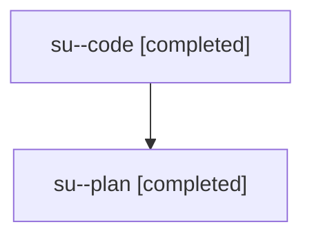

# Family: su

[Agent Hoods](../README.md) / [bbugyi200](../users/bbugyi200/README.md) / [athena](../users/bbugyi200/machines/athena/README.md) / [su](../users/bbugyi200/machines/athena/hoods/su/README.md) / su

Owner: `bbugyi200.athena` · Hood: `su` · Members: 2

## Lineage

The diagram is an optional enhancement; the ordered table below contains the same lineage in accessible text.

| Role | Agent | State | Model / provider | Timing | Commits | Prompt | Chat |
|---|---|---|---|---|---:|---|---|
| code | su--code | completed | gpt-5.5 / codex | 2026-08-03T13:22:00.134719+00:00 | [1](../agents/bbugyi200.athena.su--code/README.md#commits) | — | [Chat](../agents/bbugyi200.athena.su--code/chat.md) |
| plan | su--plan | completed | opus / claude | 2026-08-03T12:44:12.081456+00:00 | 0 | [Prompt](../agents/bbugyi200.athena.su--plan/prompt.md) | [Chat](../agents/bbugyi200.athena.su--plan/chat.md) |

## Commits

| Role | Repo | Commit | Subject | Committed (UTC) |
|---|---|---|---|---|
| code | sase | [`7fe068c`](https://github.com/sase-org/sase/commit/7fe068cee9708f74ff50395bbc15f6c451fc38ba) | fix: allow family conversion beside hood prefix claims | 2026-08-03 13:36:26 |
