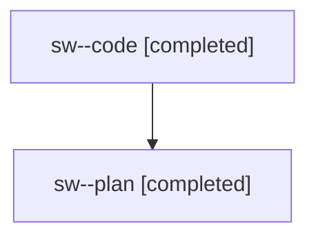

# Family: sw

[Agent Hoods](../README.md) / [bbugyi200](../users/bbugyi200/README.md) / [athena](../users/bbugyi200/machines/athena/README.md) / [sw](../users/bbugyi200/machines/athena/hoods/sw/README.md) / sw

Owner: `bbugyi200.athena` · Hood: `sw` · Members: 2

## Lineage

The diagram is an optional enhancement; the ordered table below contains the same lineage in accessible text.

| Role | Agent | State | Model / provider | Timing | Commits | Prompt | Chat |
|---|---|---|---|---|---:|---|---|
| code | sw--code | completed | gpt-5.5 / codex | 2026-08-03T13:57:34.021929+00:00 | [1](../agents/bbugyi200.athena.sw--code/README.md#commits) | — | [Chat](../agents/bbugyi200.athena.sw--code/chat.md) |
| plan | sw--plan | completed | opus / claude | 2026-08-03T13:51:54.052285+00:00 | 0 | [Prompt](../agents/bbugyi200.athena.sw--plan/prompt.md) | [Chat](../agents/bbugyi200.athena.sw--plan/chat.md) |

## Commits

| Role | Repo | Commit | Subject | Committed |
|---|---|---|---|---|
| — | sase | [`9bf11ef`](https://github.com/sase-org/sase/commit/9bf11efdaa5ca5de8f571fc2227556a00b54089a) | feat(llm): update phase worker alias defaults | 2026-08-03 10:49:55 EDT |
| code | sase | [`f4acb79`](https://github.com/sase-org/sase/commit/f4acb79189412ea61d2a59cd919aaf5aaca79b1c) | build(deps): require sase-core-rs 0.17.15 | 2026-08-03 11:23:53 EDT |

## Neighbors

| Agent | Relation | State |
|---|---|---|
| [sw.f1](../agents/bbugyi200.athena.sw.f1/README.md) | descendant | failed |
