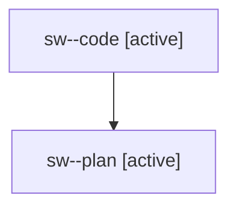

# Family: sw

[Agent Hoods](../README.md) / [bbugyi200](../users/bbugyi200/README.md) / [athena](../users/bbugyi200/machines/athena/README.md) / [sw](../users/bbugyi200/machines/athena/hoods/sw/README.md) / sw

Owner: `bbugyi200.athena` · Hood: `sw` · Members: 2

## Lineage

The diagram is an optional enhancement; the ordered table below contains the same lineage in accessible text.

| Role | Agent | State | Model / provider | Timing | Commits | Prompt | Chat |
|---|---|---|---|---|---:|---|---|
| code | sw--code | active | gpt-5.5 / codex | 2026-08-03T13:57:34.021929+00:00 | 0 | — | — |
| plan | sw--plan | active | opus / claude | 2026-08-03T13:51:54.052285+00:00 | 0 | [Prompt](../agents/bbugyi200.athena.sw--plan/prompt.md) | [Chat](../agents/bbugyi200.athena.sw--plan/chat.md) |

## Neighbors

| Agent | Relation | State |
|---|---|---|
| [sw.f0](../agents/bbugyi200.athena.sw.f0/README.md) | descendant | waiting |
