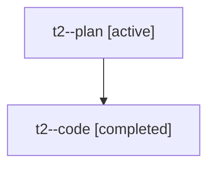

# Family: t2

[Agent Hoods](../README.md) / [bbugyi200](../users/bbugyi200/README.md) / [athena](../users/bbugyi200/machines/athena/README.md) / [t2](../users/bbugyi200/machines/athena/hoods/t2/README.md) / t2

Owner: `bbugyi200.athena` · Hood: `t2` · Members: 2

## Lineage

The diagram is an optional enhancement; the ordered table below contains the same lineage in accessible text.

| Role | Agent | State | Model / provider | Timing | Commits | Prompt | Chat |
|---|---|---|---|---|---:|---|---|
| plan | t2--plan | active | opus / claude | 2026-08-05T17:11:02.701507+00:00 | 0 | [Prompt](../agents/bbugyi200.athena.t2--plan/prompt.md) | [Chat](../agents/bbugyi200.athena.t2--plan/chat.md) |
| code | t2--code | completed | gpt-5.5 / codex | 2026-08-05T17:33:02.504183+00:00 | [1](../agents/bbugyi200.athena.t2--code/README.md#commits) | — | [Chat](../agents/bbugyi200.athena.t2--code/chat.md) |

## Commits

| Role | Repo | Commit | Subject | Committed |
|---|---|---|---|---|
| code | sase | [`0e40dec`](https://github.com/sase-org/sase/commit/0e40decdcebd063b5d136b5a8359b9a59a52bb48) | fix: tolerate forward-compatible owner manifests | 2026-08-05 17:48:22 UTC |
