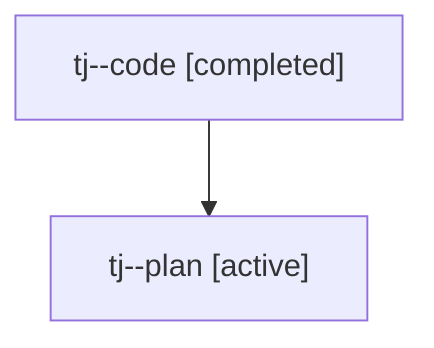

# Family: tj

[Agent Hoods](../README.md) / [bbugyi200](../users/bbugyi200/README.md) / [athena](../users/bbugyi200/machines/athena/README.md) / [tj](../users/bbugyi200/machines/athena/hoods/tj/README.md) / tj

Owner: `bbugyi200.athena` · Hood: `tj` · Members: 2

## Lineage

The diagram is an optional enhancement; the ordered table below contains the same lineage in accessible text.

| Role | Agent | State | Model / provider | Timing | Commits | Prompt | Chat |
|---|---|---|---|---|---:|---|---|
| code | tj--code | completed | sonnet / claude | 2026-08-05T21:56:21.794780+00:00 | [1](../agents/bbugyi200.athena.tj--code/README.md#commits) | — | [Chat](../agents/bbugyi200.athena.tj--code/chat.md) |
| plan | tj--plan | active | opus / claude | 2026-08-05T21:47:34.267590+00:00 | 0 | [Prompt](../agents/bbugyi200.athena.tj--plan/prompt.md) | [Chat](../agents/bbugyi200.athena.tj--plan/chat.md) |

## Commits

| Role | Repo | Commit | Subject | Committed |
|---|---|---|---|---|
| code | sase | [`840cdff`](https://github.com/sase-org/sase/commit/840cdff10664d2629ddc38f2677ec80e7dcaaca8) | fix(commit-finalizer): break async-wait deadlock in finalizer passes | 2026-08-05 18:03:40 EDT |
