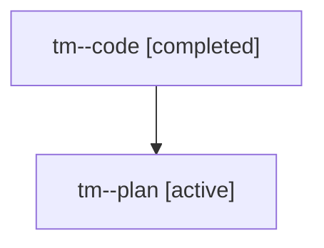

# Family: tm

[Agent Hoods](../README.md) / [bbugyi200](../users/bbugyi200/README.md) / [athena](../users/bbugyi200/machines/athena/README.md) / [tm](../users/bbugyi200/machines/athena/hoods/tm/README.md) / tm

Owner: `bbugyi200.athena` · Hood: `tm` · Members: 2

## Lineage

The diagram is an optional enhancement; the ordered table below contains the same lineage in accessible text.

| Role | Agent | State | Model / provider | Timing | Commits | Prompt | Chat |
|---|---|---|---|---|---:|---|---|
| code | tm--code | completed | sonnet / claude | 2026-08-05T23:11:28.772292+00:00 | [1](../agents/bbugyi200.athena.tm--code/README.md#commits) | — | [Chat](../agents/bbugyi200.athena.tm--code/chat.md) |
| plan | tm--plan | active | opus / claude | 2026-08-05T23:01:46.010206+00:00 | 0 | [Prompt](../agents/bbugyi200.athena.tm--plan/prompt.md) | [Chat](../agents/bbugyi200.athena.tm--plan/chat.md) |

## Commits

| Role | Repo | Commit | Subject | Committed |
|---|---|---|---|---|
| code | sase | [`9672c56`](https://github.com/sase-org/sase/commit/9672c5602816c39f3d6f2e4af2b50a2e032f0d5e) | fix(tests): stop CI worker collapse and drop visual from default lane | 2026-08-05 19:42:14 EDT |
