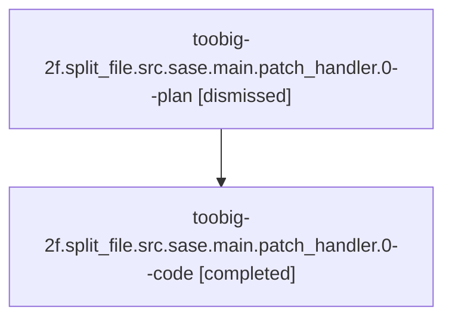

# Family: toobig-2f.split\_file.src.sase.main.patch\_handler.0

[Agent Hoods](../README.md) / [bbugyi200](../users/bbugyi200/README.md) / [athena](../users/bbugyi200/machines/athena/README.md) / [toobig-2f](../users/bbugyi200/machines/athena/hoods/toobig-2f/README.md) / toobig-2f.split\_file.src.sase.main.patch\_handler.0

Owner: `bbugyi200.athena` · Hood: `toobig-2f` · Members: 2

## Lineage

The diagram is an optional enhancement; the ordered table below contains the same lineage in accessible text.

| Role | Agent | State | Model / provider | Timing | Commits | Prompt | Chat |
|---|---|---|---|---|---:|---|---|
| plan | toobig-2f.split\_file.src.sase.main.patch\_handler.0--plan | dismissed | gpt-5.6-sol / codex | 2026-08-11T11:46:49.052488 → 2026-08-11T12:19:05.340848 | 0 | — | [Chat](../agents/bbugyi200.athena.toobig-2f.split_file.src.sase.main.patch_handler.0--plan/chat.md) |
| code | toobig-2f.split\_file.src.sase.main.patch\_handler.0--code | completed | gpt-5.5 / codex | 2026-08-11T15:49:09.242974+00:00 | [1](../agents/bbugyi200.athena.toobig-2f.split_file.src.sase.main.patch_handler.0--code/README.md#commits) | — | [Chat](../agents/bbugyi200.athena.toobig-2f.split_file.src.sase.main.patch_handler.0--code/chat.md) |

## Commits

| Role | Repo | Commit | Subject | Committed |
|---|---|---|---|---|
| code | sase | [`334ff99`](https://github.com/sase-org/sase/commit/334ff99b17faf2a17ebbd9660c3805a022897c53) | refactor: split patch command handlers | 2026-08-11 12:17:36 EDT |

## Neighbors

| Agent | Relation | State |
|---|---|---|
| [toobig-2f.split\_file.src.sase.ace.tui.actions.\_artifacts\_beads\_work.0](../agents/bbugyi200.athena.toobig-2f.split_file.src.sase.ace.tui.actions._artifacts_beads_work.0/README.md) | toobig-2f.split\_file.src.sase hood | dismissed |
| [toobig-2f.split\_file.src.sase.ace.tui.modals.wait\_modal.0](../agents/bbugyi200.athena.toobig-2f.split_file.src.sase.ace.tui.modals.wait_modal.0/README.md) | toobig-2f.split\_file.src.sase hood | dismissed |
| [toobig-2f.split\_file.tests.ace.tui.test\_wait\_modal.0](../agents/bbugyi200.athena.toobig-2f.split_file.tests.ace.tui.test_wait_modal.0/README.md) | toobig-2f.split\_file hood | dismissed |
