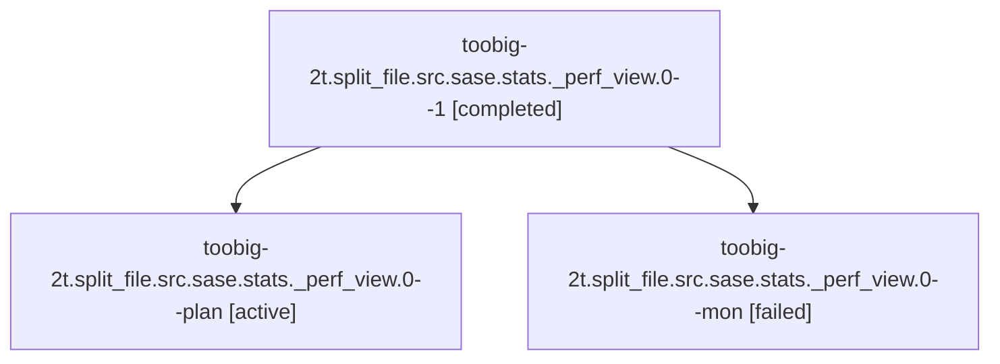

# Family: toobig-2t.split\_file.src.sase.stats.\_perf\_view.0

[Agent Hoods](../README.md) / [bbugyi200](../users/bbugyi200/README.md) / [athena](../users/bbugyi200/machines/athena/README.md) / [toobig-2t](../users/bbugyi200/machines/athena/hoods/toobig-2t/README.md) / toobig-2t.split\_file.src.sase.stats.\_perf\_view.0

Owner: `bbugyi200.athena` · Hood: `toobig-2t` · Members: 3

## Lineage

The diagram is an optional enhancement; the ordered table below contains the same lineage in accessible text.

| Role | Agent | State | Model / provider | Timing | Commits | Prompt | Chat |
|---|---|---|---|---|---:|---|---|
| 1 | toobig-2t.split\_file.src.sase.stats.\_perf\_view.0--1 | completed | gpt-5.6-sol / codex | 2026-08-16T07:04:56.599507+00:00 | 0 | [Prompt](../agents/bbugyi200.athena.toobig-2t.split_file.src.sase.stats._perf_view.0--1/prompt.md) | [Chat](../agents/bbugyi200.athena.toobig-2t.split_file.src.sase.stats._perf_view.0--1/chat.md) |
| plan | toobig-2t.split\_file.src.sase.stats.\_perf\_view.0--plan | active | gpt-5.6-sol / codex | 2026-08-16T06:44:54.457641+00:00 | [1](../agents/bbugyi200.athena.toobig-2t.split_file.src.sase.stats._perf_view.0--plan/README.md#commits) | [Prompt](../agents/bbugyi200.athena.toobig-2t.split_file.src.sase.stats._perf_view.0--plan/prompt.md) | — |
| mon | toobig-2t.split\_file.src.sase.stats.\_perf\_view.0--mon | failed | gpt-5.6-sol / codex | 2026-08-16T06:59:25.097748+00:00 | 0 | — | [Chat](../agents/bbugyi200.athena.toobig-2t.split_file.src.sase.stats._perf_view.0--mon/chat.md) |

## Commits

| Role | Repo | Commit | Subject | Committed |
|---|---|---|---|---|
| plan | sase | [`89511fb`](https://github.com/sase-org/sase/commit/89511fb744a9c992e6b1da4c7a2f0136f7ede19a) | refactor(stats): split performance view builder | 2026-08-16 03:04:53 EDT |

## Neighbors

| Agent | Relation | State |
|---|---|---|
| [toobig-2t.split\_file.src.sase.ace.tui.modals.models\_panel\_display.0](../agents/bbugyi200.athena.toobig-2t.split_file.src.sase.ace.tui.modals.models_panel_display.0/README.md) | toobig-2t.split\_file.src.sase hood | completed |
| [toobig-2t.split\_file.src.sase.ace.tui.modals.models\_panel\_rendering.0](../agents/bbugyi200.athena.toobig-2t.split_file.src.sase.ace.tui.modals.models_panel_rendering.0/README.md) | toobig-2t.split\_file.src.sase hood | completed |
| [toobig-2t.split\_file.src.sase.bead.\_stream\_integrity.0](../agents/bbugyi200.athena.toobig-2t.split_file.src.sase.bead._stream_integrity.0/README.md) | toobig-2t.split\_file.src.sase hood | completed |
| [toobig-2t.split\_file.src.sase.bead.cli\_work\_cleanup.0](../agents/bbugyi200.athena.toobig-2t.split_file.src.sase.bead.cli_work_cleanup.0/README.md) | toobig-2t.split\_file.src.sase hood | completed |
| [toobig-2t.split\_file.tests.main.test\_var\_get.0](../agents/bbugyi200.athena.toobig-2t.split_file.tests.main.test_var_get.0/README.md) | toobig-2t.split\_file hood | waiting |
| [toobig-2t.split\_file.tests.main.test\_var\_handler.0](../agents/bbugyi200.athena.toobig-2t.split_file.tests.main.test_var_handler.0/README.md) | toobig-2t.split\_file hood | waiting |
| [toobig-2t.split\_file.tests.test\_models\_panel\_navigation.0](../agents/bbugyi200.athena.toobig-2t.split_file.tests.test_models_panel_navigation.0/README.md) | toobig-2t.split\_file hood | waiting |
| [toobig-2t.split\_file.tests.test\_models\_panel\_provider\_routing.0](../agents/bbugyi200.athena.toobig-2t.split_file.tests.test_models_panel_provider_routing.0/README.md) | toobig-2t.split\_file hood | waiting |
| [toobig-2t.split\_file.tests.test\_test\_selection\_health\_correlation.0](../agents/bbugyi200.athena.toobig-2t.split_file.tests.test_test_selection_health_correlation.0/README.md) | toobig-2t.split\_file hood | waiting |
