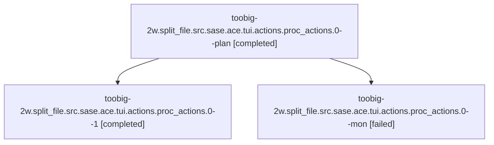

# Family: toobig-2w.split\_file.src.sase.ace.tui.actions.proc\_actions.0

[Agent Hoods](../README.md) / [bbugyi200](../users/bbugyi200/README.md) / [athena](../users/bbugyi200/machines/athena/README.md) / [toobig-2w](../users/bbugyi200/machines/athena/hoods/toobig-2w/README.md) / toobig-2w.split\_file.src.sase.ace.tui.actions.proc\_actions.0

Owner: `bbugyi200.athena` · Hood: `toobig-2w` · Members: 3

## Lineage

The diagram is an optional enhancement; the ordered table below contains the same lineage in accessible text.

| Role | Agent | State | Model / provider | Timing | Commits | Prompt | Chat |
|---|---|---|---|---|---:|---|---|
| plan | toobig-2w.split\_file.src.sase.ace.tui.actions.proc\_actions.0--plan | completed | gpt-5.6-sol / codex | 2026-08-17T00:18:53.451920+00:00 | [1](../agents/bbugyi200.athena.toobig-2w.split_file.src.sase.ace.tui.actions.proc_actions.0--plan/README.md#commits) | [Prompt](../agents/bbugyi200.athena.toobig-2w.split_file.src.sase.ace.tui.actions.proc_actions.0--plan/prompt.md) | [Chat](../agents/bbugyi200.athena.toobig-2w.split_file.src.sase.ace.tui.actions.proc_actions.0--plan/chat.md) |
| 1 | toobig-2w.split\_file.src.sase.ace.tui.actions.proc\_actions.0--1 | completed | gpt-5.6-sol / codex | 2026-08-17T00:42:03.421036+00:00 | 0 | [Prompt](../agents/bbugyi200.athena.toobig-2w.split_file.src.sase.ace.tui.actions.proc_actions.0--1/prompt.md) | [Chat](../agents/bbugyi200.athena.toobig-2w.split_file.src.sase.ace.tui.actions.proc_actions.0--1/chat.md) |
| mon | toobig-2w.split\_file.src.sase.ace.tui.actions.proc\_actions.0--mon | failed | gpt-5.6-sol / codex | 2026-08-17T00:37:45.328773+00:00 | 0 | — | [Chat](../agents/bbugyi200.athena.toobig-2w.split_file.src.sase.ace.tui.actions.proc_actions.0--mon/chat.md) |

## Commits

| Role | Repo | Commit | Subject | Committed |
|---|---|---|---|---|
| plan | sase | [`91fecc9`](https://github.com/sase-org/sase/commit/91fecc9c12822e68210faff5b43bf3824792fa0c) | refactor(ace): split proc actions into focused modules | 2026-08-16 20:38:47 EDT |

## Neighbors

| Agent | Relation | State |
|---|---|---|
| [toobig-2w.split\_file.src.sase.bead.cli\_crud.0](../agents/bbugyi200.athena.toobig-2w.split_file.src.sase.bead.cli_crud.0/README.md) | toobig-2w.split\_file.src.sase hood | active |
| [toobig-2w.split\_file.tests.ace.tui.test\_agent\_completion.0](../agents/bbugyi200.athena.toobig-2w.split_file.tests.ace.tui.test_agent_completion.0/README.md) | toobig-2w.split\_file hood | waiting |
| [toobig-2w.split\_file.tests.ace.tui.widgets.test\_history\_word\_completion.0](../agents/bbugyi200.athena.toobig-2w.split_file.tests.ace.tui.widgets.test_history_word_completion.0/README.md) | toobig-2w.split\_file hood | waiting |
| [toobig-2w.split\_file.tests.monitor.test\_monitor\_store\_reconcile.0](../agents/bbugyi200.athena.toobig-2w.split_file.tests.monitor.test_monitor_store_reconcile.0/README.md) | toobig-2w.split\_file hood | waiting |
| [toobig-2w.split\_file.tests.test\_bead.test\_sync.0](../agents/bbugyi200.athena.toobig-2w.split_file.tests.test_bead.test_sync.0/README.md) | toobig-2w.split\_file hood | waiting |
| [toobig-2w.split\_file.tests.test\_notification\_toast\_polling.0](../agents/bbugyi200.athena.toobig-2w.split_file.tests.test_notification_toast_polling.0/README.md) | toobig-2w.split\_file hood | waiting |
| [toobig-2w.split\_file.tests.test\_validate\_sase\_core\_rs\_tool.0](../agents/bbugyi200.athena.toobig-2w.split_file.tests.test_validate_sase_core_rs_tool.0/README.md) | toobig-2w.split\_file hood | waiting |
