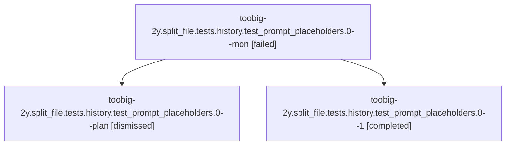

# Family: toobig-2y.split\_file.tests.history.test\_prompt\_placeholders.0

[Agent Hoods](../README.md) / [bbugyi200](../users/bbugyi200/README.md) / [athena](../users/bbugyi200/machines/athena/README.md) / [toobig-2y](../users/bbugyi200/machines/athena/hoods/toobig-2y/README.md) / toobig-2y.split\_file.tests.history.test\_prompt\_placeholders.0

Owner: `bbugyi200.athena` · Hood: `toobig-2y` · Members: 3

## Lineage

The diagram is an optional enhancement; the ordered table below contains the same lineage in accessible text.

| Role | Agent | State | Model / provider | Timing | Commits | Prompt | Chat |
|---|---|---|---|---|---:|---|---|
| mon | toobig-2y.split\_file.tests.history.test\_prompt\_placeholders.0--mon | failed | opus / claude | 2026-08-17T18:24:09.544575+00:00 | 0 | — | [Chat](../agents/bbugyi200.athena.toobig-2y.split_file.tests.history.test_prompt_placeholders.0--mon/chat.md) |
| plan | toobig-2y.split\_file.tests.history.test\_prompt\_placeholders.0--plan | dismissed | — | 2026-08-17T10:12:07 | 0 | — | — |
| 1 | toobig-2y.split\_file.tests.history.test\_prompt\_placeholders.0--1 | completed | opus / claude | 2026-08-17T18:27:33.336445+00:00 | [1](../agents/bbugyi200.athena.toobig-2y.split_file.tests.history.test_prompt_placeholders.0--1/README.md#commits) | [Prompt](../agents/bbugyi200.athena.toobig-2y.split_file.tests.history.test_prompt_placeholders.0--1/prompt.md) | [Chat](../agents/bbugyi200.athena.toobig-2y.split_file.tests.history.test_prompt_placeholders.0--1/chat.md) |

## Commits

| Role | Repo | Commit | Subject | Committed |
|---|---|---|---|---|
| 1 | sase | [`3db8be3`](https://github.com/sase-org/sase/commit/3db8be3c67d111c1e83f5ff610206978ebc2268a) | test(history): split prompt-placeholder tests into focused modules | 2026-08-17 14:31:00 EDT |

## Neighbors

| Agent | Relation | State |
|---|---|---|
| [toobig-2y.split\_file.tests.ace.tui.models.test\_agent\_tree.0](../agents/bbugyi200.athena.toobig-2y.split_file.tests.ace.tui.models.test_agent_tree.0/README.md) | toobig-2y.split\_file.tests hood | dismissed |
| [toobig-2y.split\_file.tests.test\_llm\_provider\_usage\_limit\_config.0](../agents/bbugyi200.athena.toobig-2y.split_file.tests.test_llm_provider_usage_limit_config.0/README.md) | toobig-2y.split\_file.tests hood | dismissed |
