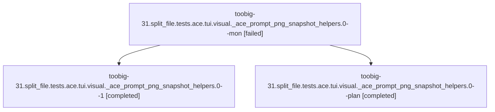

# Family: toobig-31.split\_file.tests.ace.tui.visual.\_ace\_prompt\_png\_snapshot\_helpers.0

[Agent Hoods](../README.md) / [bbugyi200](../users/bbugyi200/README.md) / [athena](../users/bbugyi200/machines/athena/README.md) / [toobig-31](../users/bbugyi200/machines/athena/hoods/toobig-31/README.md) / toobig-31.split\_file.tests.ace.tui.visual.\_ace\_prompt\_png\_snapshot\_helpers.0

Owner: `bbugyi200.athena` · Hood: `toobig-31` · Members: 3

## Lineage

The diagram is an optional enhancement; the ordered table below contains the same lineage in accessible text.

| Role | Agent | State | Model / provider | Timing | Commits | Prompt | Chat |
|---|---|---|---|---|---:|---|---|
| mon | toobig-31.split\_file.tests.ace.tui.visual.\_ace\_prompt\_png\_snapshot\_helpers.0--mon | failed | opus / claude | 2026-08-18T11:25:30.169015+00:00 | 0 | — | [Chat](../agents/bbugyi200.athena.toobig-31.split_file.tests.ace.tui.visual._ace_prompt_png_snapshot_helpers.0--mon/chat.md) |
| 1 | toobig-31.split\_file.tests.ace.tui.visual.\_ace\_prompt\_png\_snapshot\_helpers.0--1 | completed | opus / claude | 2026-08-18T11:28:44.868377+00:00 | [1](../agents/bbugyi200.athena.toobig-31.split_file.tests.ace.tui.visual._ace_prompt_png_snapshot_helpers.0--1/README.md#commits) | [Prompt](../agents/bbugyi200.athena.toobig-31.split_file.tests.ace.tui.visual._ace_prompt_png_snapshot_helpers.0--1/prompt.md) | [Chat](../agents/bbugyi200.athena.toobig-31.split_file.tests.ace.tui.visual._ace_prompt_png_snapshot_helpers.0--1/chat.md) |
| plan | toobig-31.split\_file.tests.ace.tui.visual.\_ace\_prompt\_png\_snapshot\_helpers.0--plan | completed | opus / claude | 2026-08-18T11:15:24.050728+00:00 | 0 | [Prompt](../agents/bbugyi200.athena.toobig-31.split_file.tests.ace.tui.visual._ace_prompt_png_snapshot_helpers.0--plan/prompt.md) | [Chat](../agents/bbugyi200.athena.toobig-31.split_file.tests.ace.tui.visual._ace_prompt_png_snapshot_helpers.0--plan/chat.md) |

## Commits

| Role | Repo | Commit | Subject | Committed |
|---|---|---|---|---|
| 1 | sase | [`02cf238`](https://github.com/sase-org/sase/commit/02cf2385270e088cfdc36908a0e6497c4d223414) | test(visual): split ACE prompt PNG snapshot helpers into focused modules | 2026-08-18 07:35:05 EDT |

## Neighbors

| Agent | Relation | State |
|---|---|---|
| [toobig-31.split\_file.tests.ace.tui.widgets.test\_agent\_display\_bead\_section.0](../agents/bbugyi200.athena.toobig-31.split_file.tests.ace.tui.widgets.test_agent_display_bead_section.0/README.md) | toobig-31.split\_file.tests.ace.tui hood | waiting |
| [toobig-31.split\_file.src.sase.ace.tui.modals.glossary\_panel.0](../agents/bbugyi200.athena.toobig-31.split_file.src.sase.ace.tui.modals.glossary_panel.0/README.md) | toobig-31.split\_file hood | completed |
| [toobig-31.split\_file.src.sase.config.core.0](../agents/bbugyi200.athena.toobig-31.split_file.src.sase.config.core.0/README.md) | toobig-31.split\_file hood | completed |
