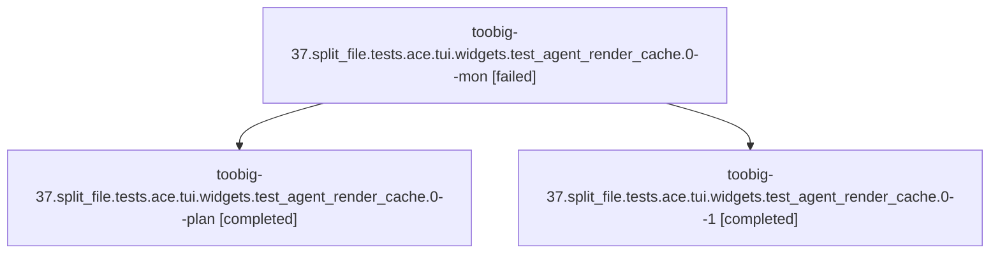

# Family: toobig-37.split\_file.tests.ace.tui.widgets.test\_agent\_render\_cache.0

[Agent Hoods](../README.md) / [bbugyi200](../users/bbugyi200/README.md) / [athena](../users/bbugyi200/machines/athena/README.md) / [toobig-37](../users/bbugyi200/machines/athena/hoods/toobig-37/README.md) / toobig-37.split\_file.tests.ace.tui.widgets.test\_agent\_render\_cache.0

Owner: `bbugyi200.athena` · Hood: `toobig-37` · Members: 3

## Lineage

The diagram is an optional enhancement; the ordered table below contains the same lineage in accessible text.

| Role | Agent | State | Model / provider | Timing | Commits | Prompt | Chat |
|---|---|---|---|---|---:|---|---|
| mon | toobig-37.split\_file.tests.ace.tui.widgets.test\_agent\_render\_cache.0--mon | failed | grok-4.6 / grok | 2026-08-20T05:18:53.607245+00:00 | 0 | — | [Chat](../agents/bbugyi200.athena.toobig-37.split_file.tests.ace.tui.widgets.test_agent_render_cache.0--mon/chat.md) |
| plan | toobig-37.split\_file.tests.ace.tui.widgets.test\_agent\_render\_cache.0--plan | completed | grok-4.6 / grok | 2026-08-20T05:07:06.440186+00:00 | 0 | [Prompt](../agents/bbugyi200.athena.toobig-37.split_file.tests.ace.tui.widgets.test_agent_render_cache.0--plan/prompt.md) | [Chat](../agents/bbugyi200.athena.toobig-37.split_file.tests.ace.tui.widgets.test_agent_render_cache.0--plan/chat.md) |
| 1 | toobig-37.split\_file.tests.ace.tui.widgets.test\_agent\_render\_cache.0--1 | completed | grok-4.6 / grok | 2026-08-20T05:22:08.120122+00:00 | [1](../agents/bbugyi200.athena.toobig-37.split_file.tests.ace.tui.widgets.test_agent_render_cache.0--1/README.md#commits) | [Prompt](../agents/bbugyi200.athena.toobig-37.split_file.tests.ace.tui.widgets.test_agent_render_cache.0--1/prompt.md) | [Chat](../agents/bbugyi200.athena.toobig-37.split_file.tests.ace.tui.widgets.test_agent_render_cache.0--1/chat.md) |

## Commits

| Role | Repo | Commit | Subject | Committed |
|---|---|---|---|---|
| 1 | sase | [`4d09745`](https://github.com/sase-org/sase/commit/4d09745a04f99478bb041942f1c3f052853d7c80) | test: split agent render-cache tests under 500-line files | 2026-08-20 01:23:59 EDT |

## Neighbors

| Agent | Relation | State |
|---|---|---|
| [toobig-37.split\_file.tests.ace.tui.widgets.test\_agent\_list\_monitor\_rows.0](../agents/bbugyi200.athena.toobig-37.split_file.tests.ace.tui.widgets.test_agent_list_monitor_rows.0/README.md) | toobig-37.split\_file.tests.ace.tui.widgets hood | completed |
| [toobig-37.split\_file.tests.ace.tui.modals.test\_memory\_panel\_actions.0](../agents/bbugyi200.athena.toobig-37.split_file.tests.ace.tui.modals.test_memory_panel_actions.0/README.md) | toobig-37.split\_file.tests.ace.tui hood | completed |
| [toobig-37.split\_file.tests.main.test\_monitor\_handler\_start.0](../agents/bbugyi200.athena.toobig-37.split_file.tests.main.test_monitor_handler_start.0/README.md) | toobig-37.split\_file.tests hood | completed |
| [toobig-37.split\_file.tests.memory.test\_mutation.0](../agents/bbugyi200.athena.toobig-37.split_file.tests.memory.test_mutation.0/README.md) | toobig-37.split\_file.tests hood | completed |
| [toobig-37.split\_file.tests.test\_check\_feature\_flags\_tool.0](../agents/bbugyi200.athena.toobig-37.split_file.tests.test_check_feature_flags_tool.0/README.md) | toobig-37.split\_file.tests hood | completed |
| [toobig-37.split\_file.tests.test\_keymaps\_registry\_loading.0](../agents/bbugyi200.athena.toobig-37.split_file.tests.test_keymaps_registry_loading.0/README.md) | toobig-37.split\_file.tests hood | active |
| [toobig-37.split\_file.tests.test\_models\_panel\_edit.0](../agents/bbugyi200.athena.toobig-37.split_file.tests.test_models_panel_edit.0/README.md) | toobig-37.split\_file.tests hood | waiting |
| [toobig-37.split\_file.src.sase.ace.tui.modals.memory\_panel\_actions.0](../agents/bbugyi200.athena.toobig-37.split_file.src.sase.ace.tui.modals.memory_panel_actions.0/README.md) | toobig-37.split\_file hood | completed |
| [toobig-37.split\_file.src.sase.ace.tui.widgets.\_prompt\_text\_area\_key\_handling.0](bbugyi200.athena.toobig-37.split_file.src.sase.ace.tui.widgets._prompt_text_area_key_handling.0.md) (family · 11) | toobig-37.split\_file hood | completed 6, failed 5 |
| [toobig-37.split\_file.src.sase.llm\_provider.model\_alias\_resolution.0](../agents/bbugyi200.athena.toobig-37.split_file.src.sase.llm_provider.model_alias_resolution.0/README.md) | toobig-37.split\_file hood | completed |
| [toobig-37.split\_file.src.sase.llm\_provider.usage\_limit\_config.0](../agents/bbugyi200.athena.toobig-37.split_file.src.sase.llm_provider.usage_limit_config.0/README.md) | toobig-37.split\_file hood | completed |
| [toobig-37.split\_file.src.sase.main.init\_memory.root\_planning.0](../agents/bbugyi200.athena.toobig-37.split_file.src.sase.main.init_memory.root_planning.0/README.md) | toobig-37.split\_file hood | completed |
| [toobig-37.split\_file.src.sase.main.init\_memory.root\_rendering.0](../agents/bbugyi200.athena.toobig-37.split_file.src.sase.main.init_memory.root_rendering.0/README.md) | toobig-37.split\_file hood | completed |
| [toobig-37.split\_file.src.sase.memory.mutation.0](../agents/bbugyi200.athena.toobig-37.split_file.src.sase.memory.mutation.0/README.md) | toobig-37.split\_file hood | completed |
