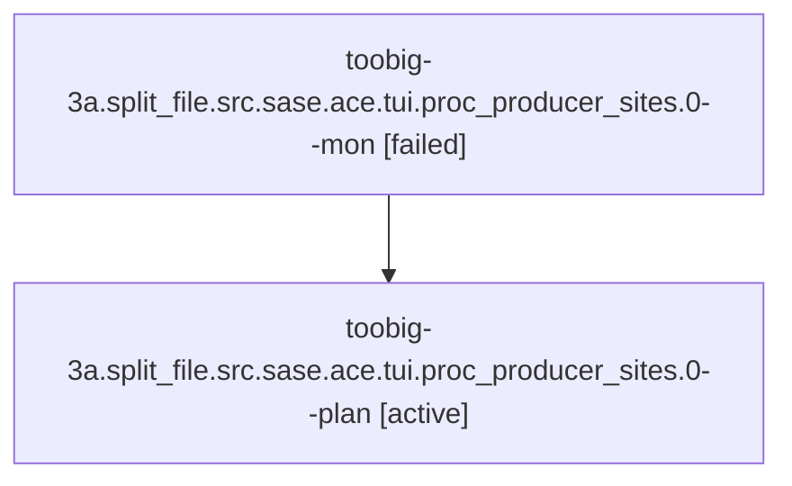

# Family: toobig-3a.split\_file.src.sase.ace.tui.proc\_producer\_sites.0

[Agent Hoods](../README.md) / [bbugyi200](../users/bbugyi200/README.md) / [athena](../users/bbugyi200/machines/athena/README.md) / [toobig-3a](../users/bbugyi200/machines/athena/hoods/toobig-3a/README.md) / toobig-3a.split\_file.src.sase.ace.tui.proc\_producer\_sites.0

Owner: `bbugyi200.athena` · Hood: `toobig-3a` · Members: 2

## Lineage

The diagram is an optional enhancement; the ordered table below contains the same lineage in accessible text.

| Role | Agent | State | Model / provider | Timing | Commits | Prompt | Chat |
|---|---|---|---|---|---:|---|---|
| mon | toobig-3a.split\_file.src.sase.ace.tui.proc\_producer\_sites.0--mon | failed | gpt-5.6-sol / codex | 2026-08-20T21:27:53.656110+00:00 | 0 | — | [Chat](../agents/bbugyi200.athena.toobig-3a.split_file.src.sase.ace.tui.proc_producer_sites.0--mon/chat.md) |
| plan | toobig-3a.split\_file.src.sase.ace.tui.proc\_producer\_sites.0--plan | active | gpt-5.6-sol / codex | 2026-08-20T21:12:56.280927+00:00 | [1](../agents/bbugyi200.athena.toobig-3a.split_file.src.sase.ace.tui.proc_producer_sites.0--plan/README.md#commits) | [Prompt](../agents/bbugyi200.athena.toobig-3a.split_file.src.sase.ace.tui.proc_producer_sites.0--plan/prompt.md) | — |

## Commits

| Role | Repo | Commit | Subject | Committed |
|---|---|---|---|---|
| plan | sase | [`1db274e`](https://github.com/sase-org/sase/commit/1db274e84e368b1bdc2057b148a43cd12ee38575) | refactor(ace): split proc producer inventory | 2026-08-20 21:29:06 UTC |
