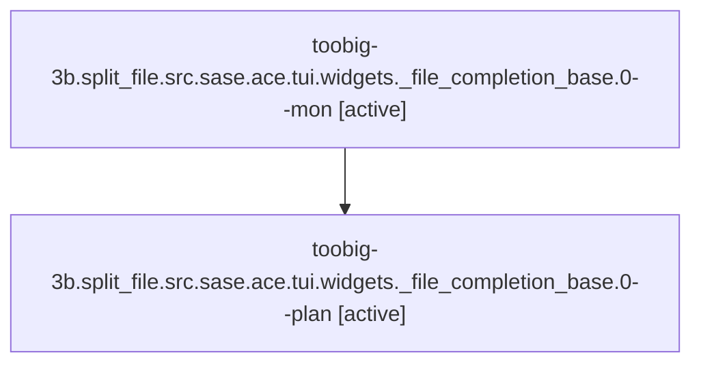

# Family: toobig-3b.split\_file.src.sase.ace.tui.widgets.\_file\_completion\_base.0

[Agent Hoods](../README.md) / [bbugyi200](../users/bbugyi200/README.md) / [athena](../users/bbugyi200/machines/athena/README.md) / [toobig-3b](../users/bbugyi200/machines/athena/hoods/toobig-3b/README.md) / toobig-3b.split\_file.src.sase.ace.tui.widgets.\_file\_completion\_base.0

Owner: `bbugyi200.athena` · Hood: `toobig-3b` · Members: 2

## Lineage

The diagram is an optional enhancement; the ordered table below contains the same lineage in accessible text.

| Role | Agent | State | Model / provider | Timing | Commits | Prompt | Chat |
|---|---|---|---|---|---:|---|---|
| mon | toobig-3b.split\_file.src.sase.ace.tui.widgets.\_file\_completion\_base.0--mon | active | gpt-5.6-sol / codex | 2026-08-20T22:04:10.855701+00:00 | 0 | — | — |
| plan | toobig-3b.split\_file.src.sase.ace.tui.widgets.\_file\_completion\_base.0--plan | active | gpt-5.6-sol / codex | 2026-08-20T21:49:23.141894+00:00 | [1](../agents/bbugyi200.athena.toobig-3b.split_file.src.sase.ace.tui.widgets._file_completion_base.0--plan/README.md#commits) | [Prompt](../agents/bbugyi200.athena.toobig-3b.split_file.src.sase.ace.tui.widgets._file_completion_base.0--plan/prompt.md) | — |

## Commits

| Role | Repo | Commit | Subject | Committed |
|---|---|---|---|---|
| plan | sase | [`29bbfe2`](https://github.com/sase-org/sase/commit/29bbfe2eeb94019d75ca29c5b86b3f3ffbebb3f2) | refactor(tui): split file completion base helpers | 2026-08-20 18:05:06 EDT |

## Neighbors

| Agent | Relation | State |
|---|---|---|
| [toobig-3b.split\_file.tests.ace.tui.widgets.test\_directive\_completion\_interactions.0](../agents/bbugyi200.athena.toobig-3b.split_file.tests.ace.tui.widgets.test_directive_completion_interactions.0/README.md) | toobig-3b.split\_file hood | waiting |
| [toobig-3b.split\_file.tests.test\_editor\_helper\_agent\_catalog.0](../agents/bbugyi200.athena.toobig-3b.split_file.tests.test_editor_helper_agent_catalog.0/README.md) | toobig-3b.split\_file hood | waiting |
