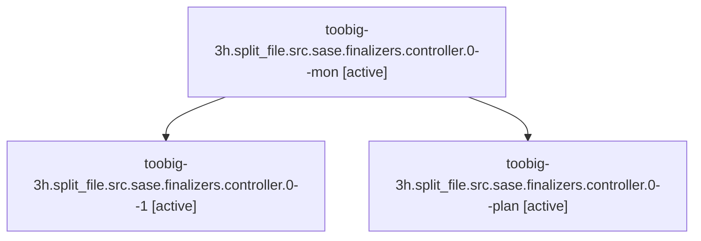

# Family: toobig-3h.split\_file.src.sase.finalizers.controller.0

[Agent Hoods](../README.md) / [bbugyi200](../users/bbugyi200/README.md) / [athena](../users/bbugyi200/machines/athena/README.md) / [toobig-3h](../users/bbugyi200/machines/athena/hoods/toobig-3h/README.md) / toobig-3h.split\_file.src.sase.finalizers.controller.0

Owner: `bbugyi200.athena` · Hood: `toobig-3h` · Members: 3

## Lineage

The diagram is an optional enhancement; the ordered table below contains the same lineage in accessible text.

| Role | Agent | State | Model / provider | Timing | Commits | Prompt | Chat |
|---|---|---|---|---|---:|---|---|
| mon | toobig-3h.split\_file.src.sase.finalizers.controller.0--mon | active | gpt-5.6-sol / codex | 2026-08-22T17:34:06.248155+00:00 | 0 | — | — |
| 1 | toobig-3h.split\_file.src.sase.finalizers.controller.0--1 | active | gpt-5.6-sol / codex | 2026-08-22T17:39:20.277684+00:00 | 0 | [Prompt](../agents/bbugyi200.athena.toobig-3h.split_file.src.sase.finalizers.controller.0--1/prompt.md) | — |
| plan | toobig-3h.split\_file.src.sase.finalizers.controller.0--plan | active | gpt-5.6-sol / codex | 2026-08-22T17:09:21.506834+00:00 | 0 | [Prompt](../agents/bbugyi200.athena.toobig-3h.split_file.src.sase.finalizers.controller.0--plan/prompt.md) | [Chat](../agents/bbugyi200.athena.toobig-3h.split_file.src.sase.finalizers.controller.0--plan/chat.md) |

## Neighbors

| Agent | Relation | State |
|---|---|---|
| [toobig-3h.split\_file.src.sase.finalizers.commit.0](../agents/bbugyi200.athena.toobig-3h.split_file.src.sase.finalizers.commit.0/README.md) | toobig-3h.split\_file.src.sase.finalizers hood | active |
| [toobig-3h.split\_file.src.sase.finalizers.executor.0](../agents/bbugyi200.athena.toobig-3h.split_file.src.sase.finalizers.executor.0/README.md) | toobig-3h.split\_file.src.sase.finalizers hood | active |
| [toobig-3h.split\_file.src.sase.bead.cli\_detail.0](../agents/bbugyi200.athena.toobig-3h.split_file.src.sase.bead.cli_detail.0/README.md) | toobig-3h.split\_file.src.sase hood | active |
| [toobig-3h.split\_file.tests.ace.tui.models.test\_agent\_family\_members.0](../agents/bbugyi200.athena.toobig-3h.split_file.tests.ace.tui.models.test_agent_family_members.0/README.md) | toobig-3h.split\_file hood | active |
| [toobig-3h.split\_file.tests.ace.tui.test\_config\_hub\_pane.0](../agents/bbugyi200.athena.toobig-3h.split_file.tests.ace.tui.test_config_hub_pane.0/README.md) | toobig-3h.split\_file hood | active |
| [toobig-3h.split\_file.tests.ace.tui.test\_statistics\_pane\_interactions.0](../agents/bbugyi200.athena.toobig-3h.split_file.tests.ace.tui.test_statistics_pane_interactions.0/README.md) | toobig-3h.split\_file hood | waiting |
| [toobig-3h.split\_file.tests.test\_file\_hook\_engine.0](../agents/bbugyi200.athena.toobig-3h.split_file.tests.test_file_hook_engine.0/README.md) | toobig-3h.split\_file hood | active |
| [toobig-3h.split\_file.tests.test\_finalizers\_protocol\_harness.0](../agents/bbugyi200.athena.toobig-3h.split_file.tests.test_finalizers_protocol_harness.0/README.md) | toobig-3h.split\_file hood | active |
| [toobig-3h.split\_file.tests.test\_ratchet\_core\_window\_tool.0](../agents/bbugyi200.athena.toobig-3h.split_file.tests.test_ratchet_core_window_tool.0/README.md) | toobig-3h.split\_file hood | waiting |
