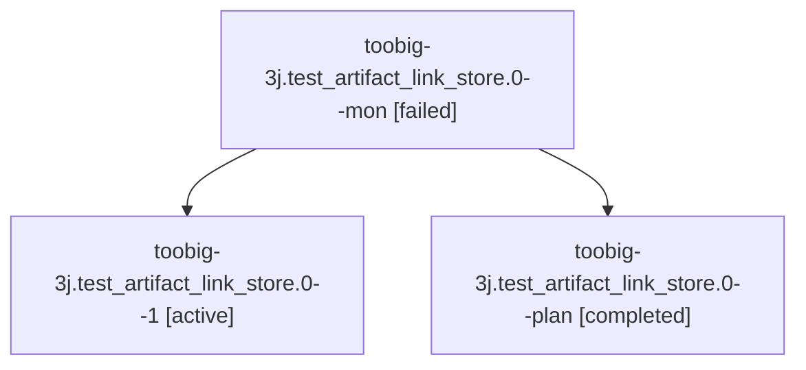

# Family: toobig-3j.test\_artifact\_link\_store.0

[Agent Hoods](../README.md) / [bbugyi200](../users/bbugyi200/README.md) / [athena](../users/bbugyi200/machines/athena/README.md) / [toobig-3j](../users/bbugyi200/machines/athena/hoods/toobig-3j/README.md) / toobig-3j.test\_artifact\_link\_store.0

Owner: `bbugyi200.athena` · Hood: `toobig-3j` · Members: 3

## Lineage

The diagram is an optional enhancement; the ordered table below contains the same lineage in accessible text.

| Role | Agent | State | Model / provider | Timing | Commits | Prompt | Chat |
|---|---|---|---|---|---:|---|---|
| mon | toobig-3j.test\_artifact\_link\_store.0--mon | failed | sonnet / claude | 2026-08-26T02:20:44.082206+00:00 | 0 | — | [Chat](../agents/bbugyi200.athena.toobig-3j.test_artifact_link_store.0--mon/chat.md) |
| 1 | toobig-3j.test\_artifact\_link\_store.0--1 | active | sonnet / claude | 2026-08-26T02:29:56.502436+00:00 | [1](../agents/bbugyi200.athena.toobig-3j.test_artifact_link_store.0--1/README.md#commits) | [Prompt](../agents/bbugyi200.athena.toobig-3j.test_artifact_link_store.0--1/prompt.md) | — |
| plan | toobig-3j.test\_artifact\_link\_store.0--plan | completed | sonnet / claude | 2026-08-26T02:12:20.267239+00:00 → 2026-08-26T02:20:54.912314+00:00 | 0 | [Prompt](../agents/bbugyi200.athena.toobig-3j.test_artifact_link_store.0--plan/prompt.md) | [Chat](../agents/bbugyi200.athena.toobig-3j.test_artifact_link_store.0--plan/chat.md) |

## Commits

| Role | Repo | Commit | Subject | Committed |
|---|---|---|---|---|
| 1 | sase | [`6c9027e`](https://github.com/sase-org/sase/commit/6c9027e6b576dab07d3e1611b34ea01d19e6c4f1) | test(sdd): split test\_artifact\_link\_store into focused topic files | 2026-08-25 22:30:59 EDT |

## Neighbors

| Agent | Relation | State |
|---|---|---|
| [toobig-3j.artifact\_link\_store\_impl.0](../agents/bbugyi200.athena.toobig-3j.artifact_link_store_impl.0/README.md) | toobig-3j hood | completed |
| [toobig-3j.availability.0](../agents/bbugyi200.athena.toobig-3j.availability.0/README.md) | toobig-3j hood | completed |
| [toobig-3j.profile\_evaluator.0](../agents/bbugyi200.athena.toobig-3j.profile_evaluator.0/README.md) | toobig-3j hood | completed |
| [toobig-3j.test\_prompt\_panel\_section\_navigation.0](../agents/bbugyi200.athena.toobig-3j.test_prompt_panel_section_navigation.0/README.md) | toobig-3j hood | completed |
