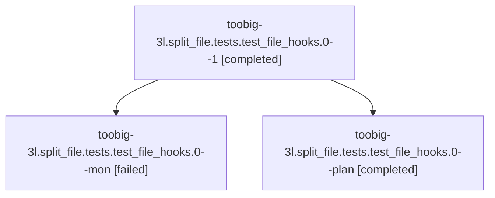

# Family: toobig-3l.split\_file.tests.test\_file\_hooks.0

[Agent Hoods](../README.md) / [bbugyi200](../users/bbugyi200/README.md) / [athena](../users/bbugyi200/machines/athena/README.md) / [toobig-3l](../users/bbugyi200/machines/athena/hoods/toobig-3l/README.md) / toobig-3l.split\_file.tests.test\_file\_hooks.0

Owner: `bbugyi200.athena` · Hood: `toobig-3l` · Members: 3

## Lineage

The diagram is an optional enhancement; the ordered table below contains the same lineage in accessible text.

| Role | Agent | State | Model / provider | Timing | Commits | Prompt | Chat |
|---|---|---|---|---|---:|---|---|
| 1 | toobig-3l.split\_file.tests.test\_file\_hooks.0--1 | completed | grok-4.6 / grok | 2026-08-23T17:46:52.687959+00:00 → 2026-08-23T17:49:42.373632+00:00 | [1](../agents/bbugyi200.athena.toobig-3l.split_file.tests.test_file_hooks.0--1/README.md#commits) | [Prompt](../agents/bbugyi200.athena.toobig-3l.split_file.tests.test_file_hooks.0--1/prompt.md) | [Chat](../agents/bbugyi200.athena.toobig-3l.split_file.tests.test_file_hooks.0--1/chat.md) |
| mon | toobig-3l.split\_file.tests.test\_file\_hooks.0--mon | failed | grok-4.6 / grok | 2026-08-23T17:43:47.284995+00:00 | 0 | — | [Chat](../agents/bbugyi200.athena.toobig-3l.split_file.tests.test_file_hooks.0--mon/chat.md) |
| plan | toobig-3l.split\_file.tests.test\_file\_hooks.0--plan | completed | grok-4.6 / grok | 2026-08-23T17:29:30.088660+00:00 → 2026-08-23T17:43:53.763852+00:00 | 0 | [Prompt](../agents/bbugyi200.athena.toobig-3l.split_file.tests.test_file_hooks.0--plan/prompt.md) | [Chat](../agents/bbugyi200.athena.toobig-3l.split_file.tests.test_file_hooks.0--plan/chat.md) |

## Commits

| Role | Repo | Commit | Subject | Committed |
|---|---|---|---|---|
| 1 | sase | [`1b2dda6`](https://github.com/sase-org/sase/commit/1b2dda699527585995f136097928e7eba374e15a) | test: split file-hook tests by loader and matching concerns | 2026-08-23 13:48:00 EDT |

## Neighbors

| Agent | Relation | State |
|---|---|---|
| [toobig-3l.split\_file.tests.ace.tui.test\_config\_hub\_pane.0](../agents/bbugyi200.athena.toobig-3l.split_file.tests.ace.tui.test_config_hub_pane.0/README.md) | toobig-3l.split\_file.tests hood | completed |
| [toobig-3l.split\_file.tests.ace.tui.test\_statistics\_pane\_interactions.0](bbugyi200.athena.toobig-3l.split_file.tests.ace.tui.test_statistics_pane_interactions.0.md) (family · 3) | toobig-3l.split\_file.tests hood | completed 2, failed 1 |
| [toobig-3l.split\_file.tests.monitor.test\_monitor\_supervise.0](../agents/bbugyi200.athena.toobig-3l.split_file.tests.monitor.test_monitor_supervise.0/README.md) | toobig-3l.split\_file.tests hood | completed |
| [toobig-3l.split\_file.tests.test\_axe\_run\_agent\_exec\_plan\_followup\_approvals.0](../agents/bbugyi200.athena.toobig-3l.split_file.tests.test_axe_run_agent_exec_plan_followup_approvals.0/README.md) | toobig-3l.split\_file.tests hood | completed |
| [toobig-3l.split\_file.tests.test\_bead.test\_epic\_launch.0](bbugyi200.athena.toobig-3l.split_file.tests.test_bead.test_epic_launch.0.md) (family · 3) | toobig-3l.split\_file.tests hood | completed 2, failed 1 |
| [toobig-3l.split\_file.tests.test\_file\_hook\_engine.0](../agents/bbugyi200.athena.toobig-3l.split_file.tests.test_file_hook_engine.0/README.md) | toobig-3l.split\_file.tests hood | completed |
| [toobig-3l.split\_file.tests.test\_finalizers\_commit\_reconciliation.0](../agents/bbugyi200.athena.toobig-3l.split_file.tests.test_finalizers_commit_reconciliation.0/README.md) | toobig-3l.split\_file.tests hood | completed |
| [toobig-3l.split\_file.tests.test\_finalizers\_live\_e2e.0](../agents/bbugyi200.athena.toobig-3l.split_file.tests.test_finalizers_live_e2e.0/README.md) | toobig-3l.split\_file.tests hood | completed |
| [toobig-3l.split\_file.tests.test\_finalizers\_protocol\_harness.0](../agents/bbugyi200.athena.toobig-3l.split_file.tests.test_finalizers_protocol_harness.0/README.md) | toobig-3l.split\_file.tests hood | completed |
| [toobig-3l.split\_file.tests.test\_plan\_approval\_launch\_reliability\_integration.0](../agents/bbugyi200.athena.toobig-3l.split_file.tests.test_plan_approval_launch_reliability_integration.0/README.md) | toobig-3l.split\_file.tests hood | active |
| [toobig-3l.split\_file.tests.test\_ratchet\_core\_window\_tool.0](../agents/bbugyi200.athena.toobig-3l.split_file.tests.test_ratchet_core_window_tool.0/README.md) | toobig-3l.split\_file.tests hood | waiting |
