# Family: toobig-3l.split\_file.tests.test\_ratchet\_core\_window\_tool.0

[Agent Hoods](../README.md) / [bbugyi200](../users/bbugyi200/README.md) / [athena](../users/bbugyi200/machines/athena/README.md) / [toobig-3l](../users/bbugyi200/machines/athena/hoods/toobig-3l/README.md) / toobig-3l.split\_file.tests.test\_ratchet\_core\_window\_tool.0

Owner: `bbugyi200.athena` · Hood: `toobig-3l` · Members: 12

## Lineage

```mermaid
flowchart TD
  n0["toobig-3l.split_file.tests.test_ratchet_core_window_tool.0--mon-3 [active]"]
  n1["toobig-3l.split_file.tests.test_ratchet_core_window_tool.0--1 [active]"]
  n0 --> n1
  n2["toobig-3l.split_file.tests.test_ratchet_core_window_tool.0--3 [active]"]
  n0 --> n2
  n3["toobig-3l.split_file.tests.test_ratchet_core_window_tool.0--mon-1 [active]"]
  n0 --> n3
  n4["toobig-3l.split_file.tests.test_ratchet_core_window_tool.0--mon-2 [active]"]
  n0 --> n4
  n5["toobig-3l.split_file.tests.test_ratchet_core_window_tool.0--plan [active]"]
  n0 --> n5
  n6["toobig-3l.split_file.tests.test_ratchet_core_window_tool.0--mon [active]"]
  n0 --> n6
  n7["toobig-3l.split_file.tests.test_ratchet_core_window_tool.0--5 [active]"]
  n0 --> n7
  n8["toobig-3l.split_file.tests.test_ratchet_core_window_tool.0--4 [active]"]
  n0 --> n8
  n9["toobig-3l.split_file.tests.test_ratchet_core_window_tool.0--2 [active]"]
  n0 --> n9
  n10["toobig-3l.split_file.tests.test_ratchet_core_window_tool.0--mon-4 [failed]"]
  n0 --> n10
  n11["toobig-3l.split_file.tests.test_ratchet_core_window_tool.0--mon-0 [active]"]
  n0 --> n11
```

The diagram is an optional enhancement; the ordered table below contains the same lineage in accessible text.

| Role | Agent | State | Model / provider | Timing | Commits | Prompt | Chat |
|---|---|---|---|---|---:|---|---|
| mon-3 | toobig-3l.split\_file.tests.test\_ratchet\_core\_window\_tool.0--mon-3 | active | grok-4.6 / grok | 2026-08-23T21:25:38.357608+00:00 | 0 | — | — |
| 1 | toobig-3l.split\_file.tests.test\_ratchet\_core\_window\_tool.0--1 | active | grok-4.6 / grok | 2026-08-23T19:42:31.739071+00:00 | 0 | [Prompt](../agents/bbugyi200.athena.toobig-3l.split_file.tests.test_ratchet_core_window_tool.0--1/prompt.md) | [Chat](../agents/bbugyi200.athena.toobig-3l.split_file.tests.test_ratchet_core_window_tool.0--1/chat.md) |
| 3 | toobig-3l.split\_file.tests.test\_ratchet\_core\_window\_tool.0--3 | active | grok-4.6 / grok | 2026-08-23T20:48:46.844984+00:00 | 0 | [Prompt](../agents/bbugyi200.athena.toobig-3l.split_file.tests.test_ratchet_core_window_tool.0--3/prompt.md) | [Chat](../agents/bbugyi200.athena.toobig-3l.split_file.tests.test_ratchet_core_window_tool.0--3/chat.md) |
| mon-1 | toobig-3l.split\_file.tests.test\_ratchet\_core\_window\_tool.0--mon-1 | active | grok-4.6 / grok | 2026-08-23T20:03:26.872789+00:00 | 0 | — | — |
| mon-2 | toobig-3l.split\_file.tests.test\_ratchet\_core\_window\_tool.0--mon-2 | active | grok-4.6 / grok | 2026-08-23T20:55:36.089184+00:00 | 0 | — | — |
| plan | toobig-3l.split\_file.tests.test\_ratchet\_core\_window\_tool.0--plan | active | grok-4.6 / grok | 2026-08-23T19:03:45.111894+00:00 | 0 | [Prompt](../agents/bbugyi200.athena.toobig-3l.split_file.tests.test_ratchet_core_window_tool.0--plan/prompt.md) | [Chat](../agents/bbugyi200.athena.toobig-3l.split_file.tests.test_ratchet_core_window_tool.0--plan/chat.md) |
| mon | toobig-3l.split\_file.tests.test\_ratchet\_core\_window\_tool.0--mon | active | grok-4.6 / grok | 2026-08-23T19:23:42.998442+00:00 | 0 | — | — |
| 5 | toobig-3l.split\_file.tests.test\_ratchet\_core\_window\_tool.0--5 | active | grok-4.6 / grok | 2026-08-23T21:43:01.366110+00:00 | 0 | [Prompt](../agents/bbugyi200.athena.toobig-3l.split_file.tests.test_ratchet_core_window_tool.0--5/prompt.md) | [Chat](../agents/bbugyi200.athena.toobig-3l.split_file.tests.test_ratchet_core_window_tool.0--5/chat.md) |
| 4 | toobig-3l.split\_file.tests.test\_ratchet\_core\_window\_tool.0--4 | active | grok-4.6 / grok | 2026-08-23T21:13:14.723605+00:00 | 0 | [Prompt](../agents/bbugyi200.athena.toobig-3l.split_file.tests.test_ratchet_core_window_tool.0--4/prompt.md) | [Chat](../agents/bbugyi200.athena.toobig-3l.split_file.tests.test_ratchet_core_window_tool.0--4/chat.md) |
| 2 | toobig-3l.split\_file.tests.test\_ratchet\_core\_window\_tool.0--2 | active | grok-4.6 / grok | 2026-08-23T20:01:23.006711+00:00 | 0 | [Prompt](../agents/bbugyi200.athena.toobig-3l.split_file.tests.test_ratchet_core_window_tool.0--2/prompt.md) | [Chat](../agents/bbugyi200.athena.toobig-3l.split_file.tests.test_ratchet_core_window_tool.0--2/chat.md) |
| mon-4 | toobig-3l.split\_file.tests.test\_ratchet\_core\_window\_tool.0--mon-4 | failed | grok-4.6 / grok | 2026-08-23T21:51:06.584765+00:00 | 0 | — | [Chat](../agents/bbugyi200.athena.toobig-3l.split_file.tests.test_ratchet_core_window_tool.0--mon-4/chat.md) |
| mon-0 | toobig-3l.split\_file.tests.test\_ratchet\_core\_window\_tool.0--mon-0 | active | grok-4.6 / grok | 2026-08-23T19:53:50.667968+00:00 | 0 | — | — |

## Neighbors

| Agent | Relation | State |
|---|---|---|
| [toobig-3l.split\_file.tests.ace.tui.test\_config\_hub\_pane.0](../agents/bbugyi200.athena.toobig-3l.split_file.tests.ace.tui.test_config_hub_pane.0/README.md) | toobig-3l.split\_file.tests hood | active |
| [toobig-3l.split\_file.tests.ace.tui.test\_statistics\_pane\_interactions.0](bbugyi200.athena.toobig-3l.split_file.tests.ace.tui.test_statistics_pane_interactions.0.md) (family · 3) | toobig-3l.split\_file.tests hood | active 3 |
| [toobig-3l.split\_file.tests.monitor.test\_monitor\_supervise.0](../agents/bbugyi200.athena.toobig-3l.split_file.tests.monitor.test_monitor_supervise.0/README.md) | toobig-3l.split\_file.tests hood | active |
| [toobig-3l.split\_file.tests.test\_axe\_run\_agent\_exec\_plan\_followup\_approvals.0](../agents/bbugyi200.athena.toobig-3l.split_file.tests.test_axe_run_agent_exec_plan_followup_approvals.0/README.md) | toobig-3l.split\_file.tests hood | active |
| [toobig-3l.split\_file.tests.test\_bead.test\_epic\_launch.0](bbugyi200.athena.toobig-3l.split_file.tests.test_bead.test_epic_launch.0.md) (family · 3) | toobig-3l.split\_file.tests hood | active 3 |
| [toobig-3l.split\_file.tests.test\_file\_hook\_engine.0](../agents/bbugyi200.athena.toobig-3l.split_file.tests.test_file_hook_engine.0/README.md) | toobig-3l.split\_file.tests hood | active |
| [toobig-3l.split\_file.tests.test\_file\_hooks.0](bbugyi200.athena.toobig-3l.split_file.tests.test_file_hooks.0.md) (family · 3) | toobig-3l.split\_file.tests hood | active 3 |
| [toobig-3l.split\_file.tests.test\_finalizers\_commit\_reconciliation.0](../agents/bbugyi200.athena.toobig-3l.split_file.tests.test_finalizers_commit_reconciliation.0/README.md) | toobig-3l.split\_file.tests hood | active |
| [toobig-3l.split\_file.tests.test\_finalizers\_live\_e2e.0](../agents/bbugyi200.athena.toobig-3l.split_file.tests.test_finalizers_live_e2e.0/README.md) | toobig-3l.split\_file.tests hood | active |
| [toobig-3l.split\_file.tests.test\_finalizers\_protocol\_harness.0](../agents/bbugyi200.athena.toobig-3l.split_file.tests.test_finalizers_protocol_harness.0/README.md) | toobig-3l.split\_file.tests hood | active |
| [toobig-3l.split\_file.tests.test\_plan\_approval\_launch\_reliability\_integration.0](../agents/bbugyi200.athena.toobig-3l.split_file.tests.test_plan_approval_launch_reliability_integration.0/README.md) | toobig-3l.split\_file.tests hood | active |
