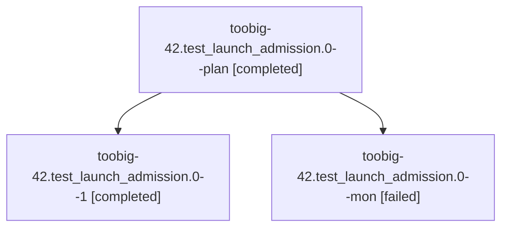

# Family: toobig-42.test\_launch\_admission.0

[Agent Hoods](../README.md) / [bbugyi200](../users/bbugyi200/README.md) / [athena](../users/bbugyi200/machines/athena/README.md) / [toobig-42](../users/bbugyi200/machines/athena/hoods/toobig-42/README.md) / toobig-42.test\_launch\_admission.0

Owner: `bbugyi200.athena` · Hood: `toobig-42` · Members: 3

## Lineage

The diagram is an optional enhancement; the ordered table below contains the same lineage in accessible text.

| Role | Agent | State | Model / provider | Timing | Commits | Prompt | Chat |
|---|---|---|---|---|---:|---|---|
| plan | toobig-42.test\_launch\_admission.0--plan | completed | sonnet / claude | 2026-08-25T03:01:42.229055+00:00 → 2026-08-25T03:07:57.059432+00:00 | 0 | [Prompt](../agents/bbugyi200.athena.toobig-42.test_launch_admission.0--plan/prompt.md) | [Chat](../agents/bbugyi200.athena.toobig-42.test_launch_admission.0--plan/chat.md) |
| 1 | toobig-42.test\_launch\_admission.0--1 | completed | sonnet / claude | 2026-08-25T03:15:17.751705+00:00 → 2026-08-25T03:19:45.111773+00:00 | [1](../agents/bbugyi200.athena.toobig-42.test_launch_admission.0--1/README.md#commits) | [Prompt](../agents/bbugyi200.athena.toobig-42.test_launch_admission.0--1/prompt.md) | [Chat](../agents/bbugyi200.athena.toobig-42.test_launch_admission.0--1/chat.md) |
| mon | toobig-42.test\_launch\_admission.0--mon | failed | sonnet / claude | 2026-08-25T03:07:47.898549+00:00 | 0 | — | [Chat](../agents/bbugyi200.athena.toobig-42.test_launch_admission.0--mon/chat.md) |

## Commits

| Role | Repo | Commit | Subject | Committed |
|---|---|---|---|---|
| 1 | sase | [`6cc02fd`](https://github.com/sase-org/sase/commit/6cc02fd68604b2afc0b39f0c8db832414a5119ed) | test: split launch admission mixed-matrix tests | 2026-08-24 23:19:14 EDT |

## Neighbors

| Agent | Relation | State |
|---|---|---|
| [toobig-42.agent\_chat\_from\_name.0](../agents/bbugyi200.athena.toobig-42.agent_chat_from_name.0/README.md) | toobig-42 hood | completed |
| [toobig-42.chat\_fork.0](../agents/bbugyi200.athena.toobig-42.chat_fork.0/README.md) | toobig-42 hood | completed |
| [toobig-42.project\_mutations.0](../agents/bbugyi200.athena.toobig-42.project_mutations.0/README.md) | toobig-42 hood | completed |
| [toobig-42.test\_agent\_marking.0](../agents/bbugyi200.athena.toobig-42.test_agent_marking.0/README.md) | toobig-42 hood | completed |
| [toobig-42.test\_finalizer\_declaration\_channel.0](../agents/bbugyi200.athena.toobig-42.test_finalizer_declaration_channel.0/README.md) | toobig-42 hood | completed |
| [toobig-42.test\_init\_memory\_managed\_agents.0](../agents/bbugyi200.athena.toobig-42.test_init_memory_managed_agents.0/README.md) | toobig-42 hood | completed |
| [toobig-42.test\_models\_panel\_provider\_modal.0](../agents/bbugyi200.athena.toobig-42.test_models_panel_provider_modal.0/README.md) | toobig-42 hood | completed |
| [toobig-42.test\_query\_profile.0](../agents/bbugyi200.athena.toobig-42.test_query_profile.0/README.md) | toobig-42 hood | completed |
| [toobig-42.test\_ratchet\_core\_window\_tool.0](../agents/bbugyi200.athena.toobig-42.test_ratchet_core_window_tool.0/README.md) | toobig-42 hood | completed |
| [toobig-42.test\_test\_cost.0](../agents/bbugyi200.athena.toobig-42.test_test_cost.0/README.md) | toobig-42 hood | completed |
