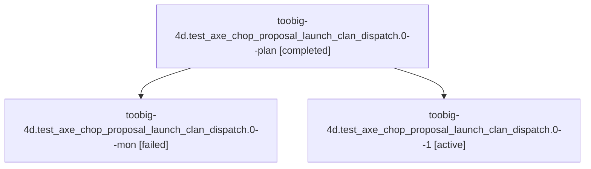

# Family: toobig-4d.test\_axe\_chop\_proposal\_launch\_clan\_dispatch.0

[Agent Hoods](../README.md) / [bbugyi200](../users/bbugyi200/README.md) / [athena](../users/bbugyi200/machines/athena/README.md) / [toobig-4d](../users/bbugyi200/machines/athena/hoods/toobig-4d/README.md) / toobig-4d.test\_axe\_chop\_proposal\_launch\_clan\_dispatch.0

Owner: `bbugyi200.athena` · Hood: `toobig-4d` · Members: 3

## Lineage

The diagram is an optional enhancement; the ordered table below contains the same lineage in accessible text.

| Role | Agent | State | Model / provider | Timing | Commits | Prompt | Chat |
|---|---|---|---|---|---:|---|---|
| plan | toobig-4d.test\_axe\_chop\_proposal\_launch\_clan\_dispatch.0--plan | completed | sonnet / claude | 2026-08-25T23:59:04.743413+00:00 → 2026-08-26T00:06:45.035062+00:00 | 0 | [Prompt](../agents/bbugyi200.athena.toobig-4d.test_axe_chop_proposal_launch_clan_dispatch.0--plan/prompt.md) | [Chat](../agents/bbugyi200.athena.toobig-4d.test_axe_chop_proposal_launch_clan_dispatch.0--plan/chat.md) |
| mon | toobig-4d.test\_axe\_chop\_proposal\_launch\_clan\_dispatch.0--mon | failed | sonnet / claude | 2026-08-26T00:06:24.781823+00:00 | 0 | — | [Chat](../agents/bbugyi200.athena.toobig-4d.test_axe_chop_proposal_launch_clan_dispatch.0--mon/chat.md) |
| 1 | toobig-4d.test\_axe\_chop\_proposal\_launch\_clan\_dispatch.0--1 | active | sonnet / claude | 2026-08-26T00:15:01.884867+00:00 | [1](../agents/bbugyi200.athena.toobig-4d.test_axe_chop_proposal_launch_clan_dispatch.0--1/README.md#commits) | [Prompt](../agents/bbugyi200.athena.toobig-4d.test_axe_chop_proposal_launch_clan_dispatch.0--1/prompt.md) | — |

## Commits

| Role | Repo | Commit | Subject | Committed |
|---|---|---|---|---|
| 1 | sase | [`befa255`](https://github.com/sase-org/sase/commit/befa255f95fcfed2ec9452fa426aebf93c0bf41a) | test(clan-dispatch): split axe-chop clan dispatch tests by concern | 2026-08-25 20:17:50 EDT |

## Neighbors

| Agent | Relation | State |
|---|---|---|
| [toobig-4d.commit\_finalizer\_state.0](../agents/bbugyi200.athena.toobig-4d.commit_finalizer_state.0/README.md) | toobig-4d hood | completed |
| [toobig-4d.copy\_targets.0](../agents/bbugyi200.athena.toobig-4d.copy_targets.0/README.md) | toobig-4d hood | completed |
| [toobig-4d.lease.0](../agents/bbugyi200.athena.toobig-4d.lease.0/README.md) | toobig-4d hood | completed |
| [toobig-4d.profiles.0](../agents/bbugyi200.athena.toobig-4d.profiles.0/README.md) | toobig-4d hood | completed |
| [toobig-4d.test\_launch\_condition\_workspace.0](../agents/bbugyi200.athena.toobig-4d.test_launch_condition_workspace.0/README.md) | toobig-4d hood | waiting |
