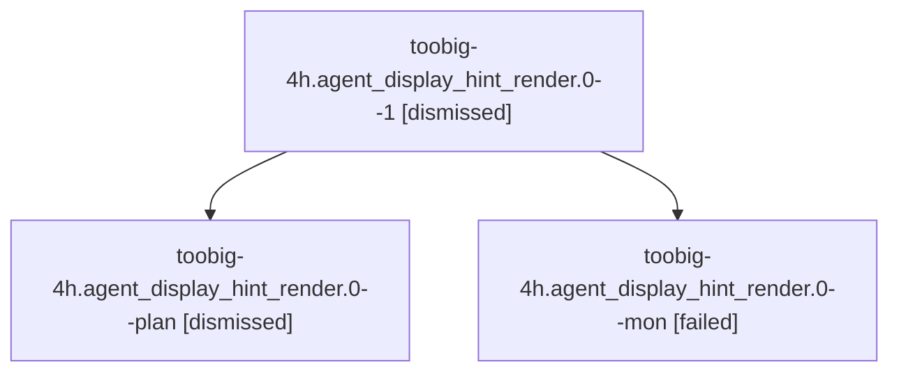

# Family: toobig-4h.agent\_display\_hint\_render.0

[Agent Hoods](../README.md) / [bbugyi200](../users/bbugyi200/README.md) / [athena](../users/bbugyi200/machines/athena/README.md) / [toobig-4h](../users/bbugyi200/machines/athena/hoods/toobig-4h/README.md) / toobig-4h.agent\_display\_hint\_render.0

Owner: `bbugyi200.athena` · Hood: `toobig-4h` · Members: 3

## Lineage

The diagram is an optional enhancement; the ordered table below contains the same lineage in accessible text.

| Role | Agent | State | Model / provider | Timing | Commits | Prompt | Chat |
|---|---|---|---|---|---:|---|---|
| 1 | toobig-4h.agent\_display\_hint\_render.0--1 | dismissed | — | 2026-08-27T18:00:26 | 0 | — | — |
| plan | toobig-4h.agent\_display\_hint\_render.0--plan | dismissed | — | 2026-08-27T11:11:23 | 0 | — | — |
| mon | toobig-4h.agent\_display\_hint\_render.0--mon | failed | sonnet / claude | 2026-08-27T21:57:19.657064+00:00 | 0 | — | [Chat](../agents/bbugyi200.athena.toobig-4h.agent_display_hint_render.0--mon/chat.md) |

## Neighbors

| Agent | Relation | State |
|---|---|---|
| [toobig-4h.app.0](../agents/bbugyi200.athena.toobig-4h.app.0/README.md) | toobig-4h hood | completed |
| [toobig-4h.done\_loaders.0](../agents/bbugyi200.athena.toobig-4h.done_loaders.0/README.md) | toobig-4h hood | completed |
| [toobig-4h.init.0](bbugyi200.athena.toobig-4h.init.0.md) (family · 9) | toobig-4h hood | completed 5, failed 4 |
| [toobig-4h.plan\_gate.0](../agents/bbugyi200.athena.toobig-4h.plan_gate.0/README.md) | toobig-4h hood | completed |
| [toobig-4h.test\_ace\_png\_snapshots\_agents\_family\_panel.0](../agents/bbugyi200.athena.toobig-4h.test_ace_png_snapshots_agents_family_panel.0/README.md) | toobig-4h hood | completed |
| [toobig-4h.test\_artifacts\_relation\_collapse.0](../agents/bbugyi200.athena.toobig-4h.test_artifacts_relation_collapse.0/README.md) | toobig-4h hood | completed |
| [toobig-4h.test\_github\_actions\_ci.0](../agents/bbugyi200.athena.toobig-4h.test_github_actions_ci.0/README.md) | toobig-4h hood | active |
| [toobig-4h.test\_suite\_gate\_integration.0](../agents/bbugyi200.athena.toobig-4h.test_suite_gate_integration.0/README.md) | toobig-4h hood | waiting |
