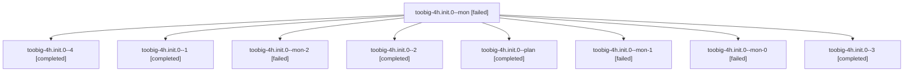

# Family: toobig-4h.init.0

[Agent Hoods](../README.md) / [bbugyi200](../users/bbugyi200/README.md) / [athena](../users/bbugyi200/machines/athena/README.md) / [toobig-4h](../users/bbugyi200/machines/athena/hoods/toobig-4h/README.md) / toobig-4h.init.0

Owner: `bbugyi200.athena` · Hood: `toobig-4h` · Members: 9

## Lineage

The diagram is an optional enhancement; the ordered table below contains the same lineage in accessible text.

| Role | Agent | State | Model / provider | Timing | Commits | Prompt | Chat |
|---|---|---|---|---|---:|---|---|
| mon | toobig-4h.init.0--mon | failed | sonnet / claude | 2026-08-27T15:44:05.331981+00:00 | 0 | — | [Chat](../agents/bbugyi200.athena.toobig-4h.init.0--mon/chat.md) |
| 4 | toobig-4h.init.0--4 | completed | sonnet / claude | 2026-08-27T17:40:45.631262+00:00 → 2026-08-27T17:44:54.795419+00:00 | [1](../agents/bbugyi200.athena.toobig-4h.init.0--4/README.md#commits) | [Prompt](../agents/bbugyi200.athena.toobig-4h.init.0--4/prompt.md) | [Chat](../agents/bbugyi200.athena.toobig-4h.init.0--4/chat.md) |
| 1 | toobig-4h.init.0--1 | completed | sonnet / claude | 2026-08-27T15:53:13.630233+00:00 → 2026-08-27T15:56:36.973024+00:00 | 0 | [Prompt](../agents/bbugyi200.athena.toobig-4h.init.0--1/prompt.md) | [Chat](../agents/bbugyi200.athena.toobig-4h.init.0--1/chat.md) |
| mon-2 | toobig-4h.init.0--mon-2 | failed | sonnet / claude | 2026-08-27T17:01:29.513803+00:00 | 0 | — | [Chat](../agents/bbugyi200.athena.toobig-4h.init.0--mon-2/chat.md) |
| 2 | toobig-4h.init.0--2 | completed | sonnet / claude | 2026-08-27T16:26:39.496835+00:00 → 2026-08-27T16:28:12.035578+00:00 | 0 | [Prompt](../agents/bbugyi200.athena.toobig-4h.init.0--2/prompt.md) | [Chat](../agents/bbugyi200.athena.toobig-4h.init.0--2/chat.md) |
| plan | toobig-4h.init.0--plan | completed | sonnet / claude | 2026-08-27T15:33:26.890546+00:00 → 2026-08-27T15:44:14.877679+00:00 | 0 | [Prompt](../agents/bbugyi200.athena.toobig-4h.init.0--plan/prompt.md) | [Chat](../agents/bbugyi200.athena.toobig-4h.init.0--plan/chat.md) |
| mon-1 | toobig-4h.init.0--mon-1 | failed | sonnet / claude | 2026-08-27T16:28:03.801707+00:00 | 0 | — | [Chat](../agents/bbugyi200.athena.toobig-4h.init.0--mon-1/chat.md) |
| mon-0 | toobig-4h.init.0--mon-0 | failed | sonnet / claude | 2026-08-27T15:56:13.594119+00:00 | 0 | — | [Chat](../agents/bbugyi200.athena.toobig-4h.init.0--mon-0/chat.md) |
| 3 | toobig-4h.init.0--3 | completed | sonnet / claude | 2026-08-27T16:51:54.223017+00:00 → 2026-08-27T17:03:39.463248+00:00 | 0 | [Prompt](../agents/bbugyi200.athena.toobig-4h.init.0--3/prompt.md) | [Chat](../agents/bbugyi200.athena.toobig-4h.init.0--3/chat.md) |

## Commits

| Role | Repo | Commit | Subject | Committed |
|---|---|---|---|---|
| 4 | sase | [`65f289e`](https://github.com/sase-org/sase/commit/65f289eb4c5f20de37438b605737ccbee03b3fcd) | refactor(modals): split lazy-export table out of \_\_init\_\_.py | 2026-08-27 13:44:22 EDT |

## Neighbors

| Agent | Relation | State |
|---|---|---|
| [toobig-4h.agent\_display\_hint\_render.0](bbugyi200.athena.toobig-4h.agent_display_hint_render.0.md) (family · 3) | toobig-4h hood | dismissed 2, failed 1 |
| [toobig-4h.app.0](../agents/bbugyi200.athena.toobig-4h.app.0/README.md) | toobig-4h hood | completed |
| [toobig-4h.done\_loaders.0](../agents/bbugyi200.athena.toobig-4h.done_loaders.0/README.md) | toobig-4h hood | completed |
| [toobig-4h.plan\_gate.0](../agents/bbugyi200.athena.toobig-4h.plan_gate.0/README.md) | toobig-4h hood | completed |
| [toobig-4h.test\_ace\_png\_snapshots\_agents\_family\_panel.0](../agents/bbugyi200.athena.toobig-4h.test_ace_png_snapshots_agents_family_panel.0/README.md) | toobig-4h hood | completed |
| [toobig-4h.test\_artifacts\_relation\_collapse.0](../agents/bbugyi200.athena.toobig-4h.test_artifacts_relation_collapse.0/README.md) | toobig-4h hood | completed |
| [toobig-4h.test\_github\_actions\_ci.0](../agents/bbugyi200.athena.toobig-4h.test_github_actions_ci.0/README.md) | toobig-4h hood | completed |
| [toobig-4h.test\_suite\_gate\_integration.0](bbugyi200.athena.toobig-4h.test_suite_gate_integration.0.md) (family · 3) | toobig-4h hood | completed 2, failed 1 |
