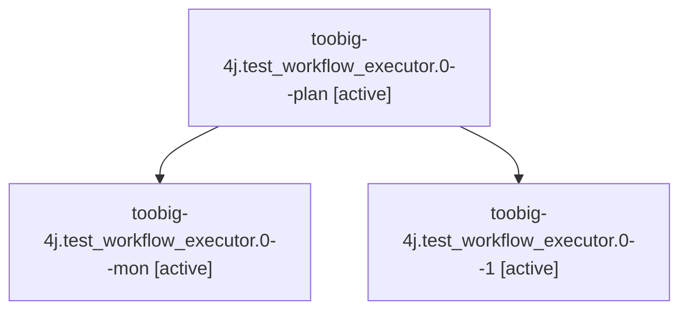

# Family: toobig-4j.test\_workflow\_executor.0

[Agent Hoods](../README.md) / [bbugyi200](../users/bbugyi200/README.md) / [athena](../users/bbugyi200/machines/athena/README.md) / [toobig-4j](../users/bbugyi200/machines/athena/hoods/toobig-4j/README.md) / toobig-4j.test\_workflow\_executor.0

Owner: `bbugyi200.athena` · Hood: `toobig-4j` · Members: 3

## Lineage

The diagram is an optional enhancement; the ordered table below contains the same lineage in accessible text.

| Role | Agent | State | Model / provider | Timing | Commits | Prompt | Chat |
|---|---|---|---|---|---:|---|---|
| plan | toobig-4j.test\_workflow\_executor.0--plan | active | grok-4.6 / grok | 2026-08-29T11:15:54.751350+00:00 | 0 | [Prompt](../agents/bbugyi200.athena.toobig-4j.test_workflow_executor.0--plan/prompt.md) | [Chat](../agents/bbugyi200.athena.toobig-4j.test_workflow_executor.0--plan/chat.md) |
| mon | toobig-4j.test\_workflow\_executor.0--mon | active | grok-4.6 / grok | 2026-08-29T11:25:28.696926+00:00 | 0 | — | — |
| 1 | toobig-4j.test\_workflow\_executor.0--1 | active | grok-4.6 / grok | 2026-08-29T11:29:27.588518+00:00 | [1](../agents/bbugyi200.athena.toobig-4j.test_workflow_executor.0--1/README.md#commits) | [Prompt](../agents/bbugyi200.athena.toobig-4j.test_workflow_executor.0--1/prompt.md) | — |

## Commits

| Role | Repo | Commit | Subject | Committed |
|---|---|---|---|---|
| 1 | sase | [`8067c9f`](https://github.com/sase-org/sase/commit/8067c9f0ae1c4538fc05ad6324ed27d085c96919) | test: split workflow executor tests into focused files | 2026-08-29 07:30:35 EDT |

## Neighbors

| Agent | Relation | State |
|---|---|---|
| [toobig-4j.test\_lazy\_tier2\_reconcile.0](../agents/bbugyi200.athena.toobig-4j.test_lazy_tier2_reconcile.0/README.md) | toobig-4j hood | active |
| [toobig-4j.workflow\_executor\_steps\_prompt.0](../agents/bbugyi200.athena.toobig-4j.workflow_executor_steps_prompt.0/README.md) | toobig-4j hood | active |
