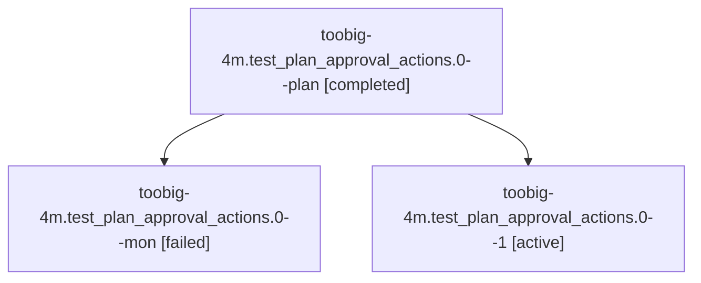

# Family: toobig-4m.test\_plan\_approval\_actions.0

[Agent Hoods](../README.md) / [bbugyi200](../users/bbugyi200/README.md) / [athena](../users/bbugyi200/machines/athena/README.md) / [toobig-4m](../users/bbugyi200/machines/athena/hoods/toobig-4m/README.md) / toobig-4m.test\_plan\_approval\_actions.0

Owner: `bbugyi200.athena` · Hood: `toobig-4m` · Members: 3

## Lineage

The diagram is an optional enhancement; the ordered table below contains the same lineage in accessible text.

| Role | Agent | State | Model / provider | Timing | Commits | Prompt | Chat |
|---|---|---|---|---|---:|---|---|
| plan | toobig-4m.test\_plan\_approval\_actions.0--plan | completed | grok-4.6 / grok | 2026-08-30T13:39:31.990650+00:00 → 2026-08-30T13:49:32.492932+00:00 | 0 | [Prompt](../agents/bbugyi200.athena.toobig-4m.test_plan_approval_actions.0--plan/prompt.md) | [Chat](../agents/bbugyi200.athena.toobig-4m.test_plan_approval_actions.0--plan/chat.md) |
| mon | toobig-4m.test\_plan\_approval\_actions.0--mon | failed | grok-4.6 / grok | 2026-08-30T13:49:25.035875+00:00 → 2026-08-30T14:04:31.796874+00:00 | 0 | — | [Chat](../agents/bbugyi200.athena.toobig-4m.test_plan_approval_actions.0--mon/chat.md) |
| 1 | toobig-4m.test\_plan\_approval\_actions.0--1 | active | grok-4.6 / grok | 2026-08-30T14:04:47.591118+00:00 | [1](../agents/bbugyi200.athena.toobig-4m.test_plan_approval_actions.0--1/README.md#commits) | [Prompt](../agents/bbugyi200.athena.toobig-4m.test_plan_approval_actions.0--1/prompt.md) | — |

## Commits

| Role | Repo | Commit | Subject | Committed |
|---|---|---|---|---|
| 1 | sase | [`d2f6cb8`](https://github.com/sase-org/sase/commit/d2f6cb8223ea97f6fe585320257cdcf4ae0825ed) | test(plan): split plan approval action tests under 500 lines | 2026-08-30 10:06:39 EDT |
