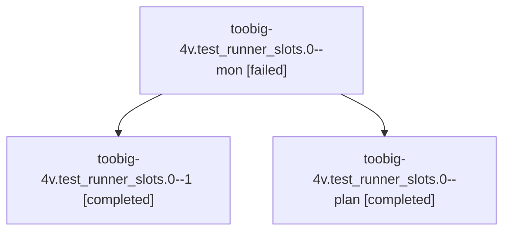

# Family: toobig-4v.test\_runner\_slots.0

[Agent Hoods](../README.md) / [bbugyi200](../users/bbugyi200/README.md) / [athena](../users/bbugyi200/machines/athena/README.md) / [toobig-4v](../users/bbugyi200/machines/athena/hoods/toobig-4v/README.md) / toobig-4v.test\_runner\_slots.0

Owner: `bbugyi200.athena` · Hood: `toobig-4v` · Members: 3

## Lineage

The diagram is an optional enhancement; the ordered table below contains the same lineage in accessible text.

| Role | Agent | State | Model / provider | Timing | Commits | Prompt | Chat |
|---|---|---|---|---|---:|---|---|
| mon | toobig-4v.test\_runner\_slots.0--mon | failed | sonnet / claude | 2026-09-07T07:53:36.970919+00:00 → 2026-09-07T07:58:08.058722+00:00 | 0 | — | [Chat](../agents/bbugyi200.athena.toobig-4v.test_runner_slots.0--mon/chat.md) |
| 1 | toobig-4v.test\_runner\_slots.0--1 | completed | sonnet / claude | 2026-09-07T07:58:29.691514+00:00 → 2026-09-07T08:01:00.003356+00:00 | [1](../agents/bbugyi200.athena.toobig-4v.test_runner_slots.0--1/README.md#commits) | [Prompt](../agents/bbugyi200.athena.toobig-4v.test_runner_slots.0--1/prompt.md) | [Chat](../agents/bbugyi200.athena.toobig-4v.test_runner_slots.0--1/chat.md) |
| plan | toobig-4v.test\_runner\_slots.0--plan | completed | sonnet / claude | 2026-09-07T07:46:41.511204+00:00 → 2026-09-07T07:53:47.302714+00:00 | 0 | [Prompt](../agents/bbugyi200.athena.toobig-4v.test_runner_slots.0--plan/prompt.md) | [Chat](../agents/bbugyi200.athena.toobig-4v.test_runner_slots.0--plan/chat.md) |

## Commits

| Role | Repo | Commit | Subject | Committed |
|---|---|---|---|---|
| 1 | sase | [`d6dfe6b`](https://github.com/sase-org/sase/commit/d6dfe6bf766d6ca449e317c5dbb5967e48b1cfb2) | test(runner-slots): split test\_runner\_slots.py by domain | 2026-09-07 03:59:31 EDT |

## Neighbors

| Agent | Relation | State |
|---|---|---|
| [toobig-4v.federation.0](../agents/bbugyi200.athena.toobig-4v.federation.0/README.md) | toobig-4v hood | completed |
| [toobig-4v.test\_agent\_loader.0](../agents/bbugyi200.athena.toobig-4v.test_agent_loader.0/README.md) | toobig-4v hood | completed |
| [toobig-4v.test\_fleet\_contract\_sase\_core\_rs.0](../agents/bbugyi200.athena.toobig-4v.test_fleet_contract_sase_core_rs.0/README.md) | toobig-4v hood | completed |
| [toobig-4v.test\_running\_agents\_snapshot.0](../agents/bbugyi200.athena.toobig-4v.test_running_agents_snapshot.0/README.md) | toobig-4v hood | active |
