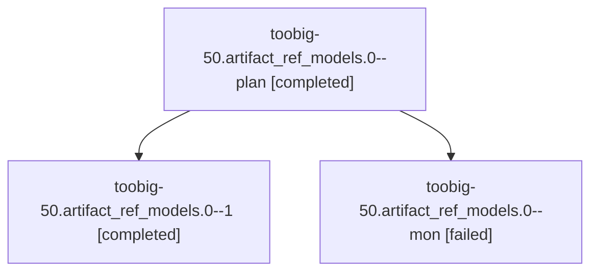

# Family: toobig-50.artifact\_ref\_models.0

[Agent Hoods](../README.md) / [bbugyi200](../users/bbugyi200/README.md) / [athena](../users/bbugyi200/machines/athena/README.md) / [toobig-50](../users/bbugyi200/machines/athena/hoods/toobig-50/README.md) / toobig-50.artifact\_ref\_models.0

Owner: `bbugyi200.athena` · Hood: `toobig-50` · Members: 3

## Lineage

The diagram is an optional enhancement; the ordered table below contains the same lineage in accessible text.

| Role | Agent | State | Model / provider | Timing | Commits | Prompt | Chat |
|---|---|---|---|---|---:|---|---|
| plan | toobig-50.artifact\_ref\_models.0--plan | completed | gpt-5.5 / codex | 2026-09-08T23:31:25.575709+00:00 → 2026-09-09T00:11:41.913163+00:00 | 0 | [Prompt](../agents/bbugyi200.athena.toobig-50.artifact_ref_models.0--plan/prompt.md) | [Chat](../agents/bbugyi200.athena.toobig-50.artifact_ref_models.0--plan/chat.md) |
| 1 | toobig-50.artifact\_ref\_models.0--1 | completed | gpt-5.5 / codex | 2026-09-09T00:44:48.948378+00:00 → 2026-09-09T00:50:44.499764+00:00 | [1](../agents/bbugyi200.athena.toobig-50.artifact_ref_models.0--1/README.md#commits) | [Prompt](../agents/bbugyi200.athena.toobig-50.artifact_ref_models.0--1/prompt.md) | [Chat](../agents/bbugyi200.athena.toobig-50.artifact_ref_models.0--1/chat.md) |
| mon | toobig-50.artifact\_ref\_models.0--mon | failed | gpt-5.5 / codex | 2026-09-09T00:11:28.428385+00:00 → 2026-09-09T00:44:24.558574+00:00 | 0 | — | [Chat](../agents/bbugyi200.athena.toobig-50.artifact_ref_models.0--mon/chat.md) |

## Commits

| Role | Repo | Commit | Subject | Committed |
|---|---|---|---|---|
| 1 | sase | [`7678e4f`](https://github.com/sase-org/sase/commit/7678e4f04278f441eebef300cc63d5fdf3adb20d) | refactor(artifact-ref): split artifact reference models | 2026-09-08 20:48:33 EDT |

## Neighbors

| Agent | Relation | State |
|---|---|---|
| [toobig-50.processing.0](../agents/bbugyi200.athena.toobig-50.processing.0/README.md) | toobig-50 hood | completed |
| [toobig-50.resolve.0](../agents/bbugyi200.athena.toobig-50.resolve.0/README.md) | toobig-50 hood | completed |
| [toobig-50.store.0](../agents/bbugyi200.athena.toobig-50.store.0/README.md) | toobig-50 hood | completed |
| [toobig-50.test\_app.0](../agents/bbugyi200.athena.toobig-50.test_app.0/README.md) | toobig-50 hood | waiting |
| [toobig-50.test\_command\_availability\_agents.0](../agents/bbugyi200.athena.toobig-50.test_command_availability_agents.0/README.md) | toobig-50 hood | waiting |
| [toobig-50.test\_notify\_handler.0](../agents/bbugyi200.athena.toobig-50.test_notify_handler.0/README.md) | toobig-50 hood | active |
| [toobig-50.test\_resolve.0](../agents/bbugyi200.athena.toobig-50.test_resolve.0/README.md) | toobig-50 hood | waiting |
| [toobig-50.test\_view\_files\_pager.0](../agents/bbugyi200.athena.toobig-50.test_view_files_pager.0/README.md) | toobig-50 hood | completed |
