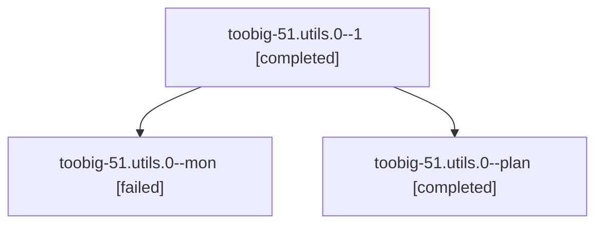

# Family: toobig-51.utils.0

[Agent Hoods](../README.md) / [bbugyi200](../users/bbugyi200/README.md) / [athena](../users/bbugyi200/machines/athena/README.md) / [toobig-51](../users/bbugyi200/machines/athena/hoods/toobig-51/README.md) / toobig-51.utils.0

Owner: `bbugyi200.athena` · Hood: `toobig-51` · Members: 3

## Lineage

The diagram is an optional enhancement; the ordered table below contains the same lineage in accessible text.

| Role | Agent | State | Model / provider | Timing | Commits | Prompt | Chat |
|---|---|---|---|---|---:|---|---|
| 1 | toobig-51.utils.0--1 | completed | grok-4.6 / grok | 2026-09-09T06:38:32.393994+00:00 → 2026-09-09T06:52:32.843578+00:00 | [1](../agents/bbugyi200.athena.toobig-51.utils.0--1/README.md#commits) | [Prompt](../agents/bbugyi200.athena.toobig-51.utils.0--1/prompt.md) | [Chat](../agents/bbugyi200.athena.toobig-51.utils.0--1/chat.md) |
| mon | toobig-51.utils.0--mon | failed | grok-4.6 / grok | 2026-09-09T06:15:42.920221+00:00 → 2026-09-09T06:38:09.856629+00:00 | 0 | — | [Chat](../agents/bbugyi200.athena.toobig-51.utils.0--mon/chat.md) |
| plan | toobig-51.utils.0--plan | completed | grok-4.6 / grok | 2026-09-09T05:56:51.752570+00:00 → 2026-09-09T06:15:52.011023+00:00 | 0 | [Prompt](../agents/bbugyi200.athena.toobig-51.utils.0--plan/prompt.md) | [Chat](../agents/bbugyi200.athena.toobig-51.utils.0--plan/chat.md) |

## Commits

| Role | Repo | Commit | Subject | Committed |
|---|---|---|---|---|
| 1 | sase | [`4de990b`](https://github.com/sase-org/sase/commit/4de990b3611aeb64d0b715d322d801ed3b74eee5) | refactor(workspace-provider): split utils.py into focused private modules | 2026-09-09 02:50:30 EDT |

## Neighbors

| Agent | Relation | State |
|---|---|---|
| [toobig-51.claude\_support.0](../agents/bbugyi200.athena.toobig-51.claude_support.0/README.md) | toobig-51 hood | completed |
| [toobig-51.commit\_tracking.0](../agents/bbugyi200.athena.toobig-51.commit_tracking.0/README.md) | toobig-51 hood | completed |
| [toobig-51.file\_completion\_workers.0](../agents/bbugyi200.athena.toobig-51.file_completion_workers.0/README.md) | toobig-51 hood | completed |
| [toobig-51.fleet\_agents.0](../agents/bbugyi200.athena.toobig-51.fleet_agents.0/README.md) | toobig-51 hood | completed |
| [toobig-51.model\_completion.0](../agents/bbugyi200.athena.toobig-51.model_completion.0/README.md) | toobig-51 hood | active |
| [toobig-51.providers.0](../agents/bbugyi200.athena.toobig-51.providers.0/README.md) | toobig-51 hood | completed |
| [toobig-51.tailnet\_discovery.0](../agents/bbugyi200.athena.toobig-51.tailnet_discovery.0/README.md) | toobig-51 hood | completed |
| [toobig-51.test\_dispatch.0](../agents/bbugyi200.athena.toobig-51.test_dispatch.0/README.md) | toobig-51 hood | waiting |
| [toobig-51.test\_settlement\_followup.0](../agents/bbugyi200.athena.toobig-51.test_settlement_followup.0/README.md) | toobig-51 hood | waiting |
| [toobig-51.test\_utils.0](../agents/bbugyi200.athena.toobig-51.test_utils.0/README.md) | toobig-51 hood | waiting |
