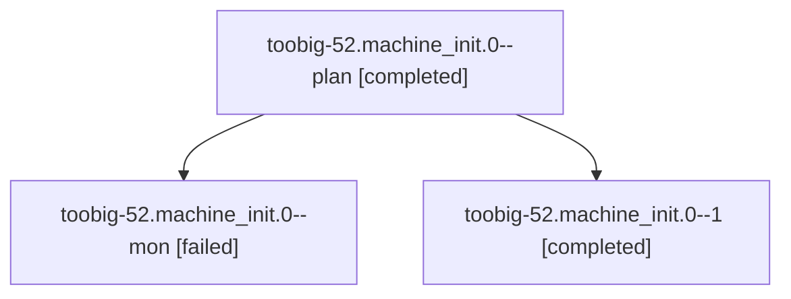

# Family: toobig-52.machine\_init.0

[Agent Hoods](../README.md) / [bbugyi200](../users/bbugyi200/README.md) / [athena](../users/bbugyi200/machines/athena/README.md) / [toobig-52](../users/bbugyi200/machines/athena/hoods/toobig-52/README.md) / toobig-52.machine\_init.0

Owner: `bbugyi200.athena` · Hood: `toobig-52` · Members: 3

## Lineage

The diagram is an optional enhancement; the ordered table below contains the same lineage in accessible text.

| Role | Agent | State | Model / provider | Timing | Commits | Prompt | Chat |
|---|---|---|---|---|---:|---|---|
| plan | toobig-52.machine\_init.0--plan | completed | gpt-5.5 / codex | 2026-09-09T15:33:36.845011+00:00 → 2026-09-09T16:14:02.852082+00:00 | 0 | [Prompt](../agents/bbugyi200.athena.toobig-52.machine_init.0--plan/prompt.md) | [Chat](../agents/bbugyi200.athena.toobig-52.machine_init.0--plan/chat.md) |
| mon | toobig-52.machine\_init.0--mon | failed | gpt-5.5 / codex | 2026-09-09T16:13:00.105712+00:00 → 2026-09-09T16:46:20.825401+00:00 | 0 | — | [Chat](../agents/bbugyi200.athena.toobig-52.machine_init.0--mon/chat.md) |
| 1 | toobig-52.machine\_init.0--1 | completed | gpt-5.5 / codex | 2026-09-09T16:46:43.796728+00:00 → 2026-09-09T16:50:33.744952+00:00 | [1](../agents/bbugyi200.athena.toobig-52.machine_init.0--1/README.md#commits) | [Prompt](../agents/bbugyi200.athena.toobig-52.machine_init.0--1/prompt.md) | [Chat](../agents/bbugyi200.athena.toobig-52.machine_init.0--1/chat.md) |

## Commits

| Role | Repo | Commit | Subject | Committed |
|---|---|---|---|---|
| 1 | sase | [`54b1d07`](https://github.com/sase-org/sase/commit/54b1d07a4ca2bdefb15cb2fecfb0e34ed892ced5) | refactor(dispatch): split machine init helpers | 2026-09-09 12:48:39 EDT |

## Neighbors

| Agent | Relation | State |
|---|---|---|
| [toobig-52.artifact\_link\_publication\_retry.0](../agents/bbugyi200.athena.toobig-52.artifact_link_publication_retry.0/README.md) | toobig-52 hood | active |
| [toobig-52.test\_machine\_init.0](../agents/bbugyi200.athena.toobig-52.test_machine_init.0/README.md) | toobig-52 hood | waiting |
