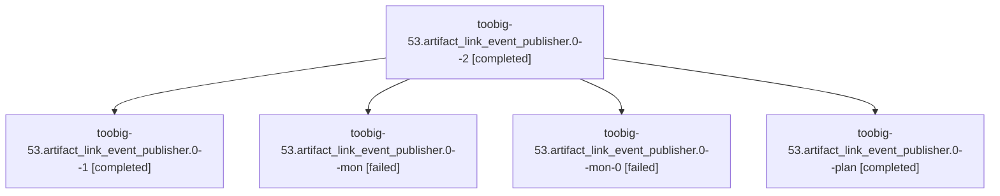

# Family: toobig-53.artifact\_link\_event\_publisher.0

[Agent Hoods](../README.md) / [bbugyi200](../users/bbugyi200/README.md) / [athena](../users/bbugyi200/machines/athena/README.md) / [toobig-53](../users/bbugyi200/machines/athena/hoods/toobig-53/README.md) / toobig-53.artifact\_link\_event\_publisher.0

Owner: `bbugyi200.athena` · Hood: `toobig-53` · Members: 5

## Lineage

The diagram is an optional enhancement; the ordered table below contains the same lineage in accessible text.

| Role | Agent | State | Model / provider | Timing | Commits | Prompt | Chat |
|---|---|---|---|---|---:|---|---|
| 2 | toobig-53.artifact\_link\_event\_publisher.0--2 | completed | grok-4.6 / grok | 2026-09-10T09:38:18.428801+00:00 → 2026-09-10T09:41:46.896357+00:00 | [1](../agents/bbugyi200.athena.toobig-53.artifact_link_event_publisher.0--2/README.md#commits) | [Prompt](../agents/bbugyi200.athena.toobig-53.artifact_link_event_publisher.0--2/prompt.md) | [Chat](../agents/bbugyi200.athena.toobig-53.artifact_link_event_publisher.0--2/chat.md) |
| 1 | toobig-53.artifact\_link\_event\_publisher.0--1 | completed | grok-4.6 / grok | 2026-09-10T09:25:18.390044+00:00 → 2026-09-10T09:31:45.770101+00:00 | 0 | [Prompt](../agents/bbugyi200.athena.toobig-53.artifact_link_event_publisher.0--1/prompt.md) | [Chat](../agents/bbugyi200.athena.toobig-53.artifact_link_event_publisher.0--1/chat.md) |
| mon | toobig-53.artifact\_link\_event\_publisher.0--mon | failed | grok-4.6 / grok | 2026-09-10T09:21:00.798501+00:00 → 2026-09-10T09:24:56.342854+00:00 | 0 | — | [Chat](../agents/bbugyi200.athena.toobig-53.artifact_link_event_publisher.0--mon/chat.md) |
| mon-0 | toobig-53.artifact\_link\_event\_publisher.0--mon-0 | failed | grok-4.6 / grok | 2026-09-10T09:31:37.304100+00:00 → 2026-09-10T09:37:56.144359+00:00 | 0 | — | [Chat](../agents/bbugyi200.athena.toobig-53.artifact_link_event_publisher.0--mon-0/chat.md) |
| plan | toobig-53.artifact\_link\_event\_publisher.0--plan | completed | grok-4.6 / grok | 2026-09-10T09:06:51.193135+00:00 → 2026-09-10T09:21:09.111595+00:00 | 0 | [Prompt](../agents/bbugyi200.athena.toobig-53.artifact_link_event_publisher.0--plan/prompt.md) | [Chat](../agents/bbugyi200.athena.toobig-53.artifact_link_event_publisher.0--plan/chat.md) |

## Commits

| Role | Repo | Commit | Subject | Committed |
|---|---|---|---|---|
| 2 | sase | [`59c4d11`](https://github.com/sase-org/sase/commit/59c4d118637da36277e96223a9ead3305c84f252) | refactor(sdd): split artifact\_link\_event\_publisher under 500-line files | 2026-09-10 05:39:56 EDT |

## Neighbors

| Agent | Relation | State |
|---|---|---|
| [toobig-53.artifact\_link\_outbox.0](../agents/bbugyi200.athena.toobig-53.artifact_link_outbox.0/README.md) | toobig-53 hood | active |
| [toobig-53.file\_completion\_accept.0](bbugyi200.athena.toobig-53.file_completion_accept.0.md) (family · 3) | toobig-53 hood | completed 2, failed 1 |
| [toobig-53.test\_ace\_png\_snapshots\_model\_completion.0](../agents/bbugyi200.athena.toobig-53.test_ace_png_snapshots_model_completion.0/README.md) | toobig-53 hood | waiting |
| [toobig-53.test\_checks\_providers.0](../agents/bbugyi200.athena.toobig-53.test_checks_providers.0/README.md) | toobig-53 hood | waiting |
| [toobig-53.test\_machine\_init.0](../agents/bbugyi200.athena.toobig-53.test_machine_init.0/README.md) | toobig-53 hood | waiting |
| [toobig-53.trail\_chrome.0](../agents/bbugyi200.athena.toobig-53.trail_chrome.0/README.md) | toobig-53 hood | completed |
