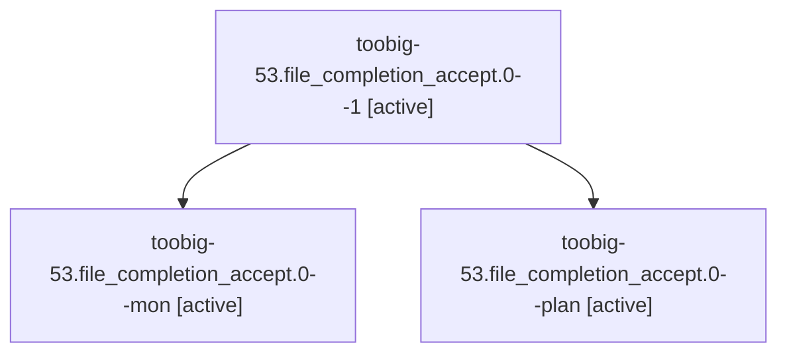

# Family: toobig-53.file\_completion\_accept.0

[Agent Hoods](../README.md) / [bbugyi200](../users/bbugyi200/README.md) / [athena](../users/bbugyi200/machines/athena/README.md) / [toobig-53](../users/bbugyi200/machines/athena/hoods/toobig-53/README.md) / toobig-53.file\_completion\_accept.0

Owner: `bbugyi200.athena` · Hood: `toobig-53` · Members: 3

## Lineage

The diagram is an optional enhancement; the ordered table below contains the same lineage in accessible text.

| Role | Agent | State | Model / provider | Timing | Commits | Prompt | Chat |
|---|---|---|---|---|---:|---|---|
| 1 | toobig-53.file\_completion\_accept.0--1 | active | grok-4.6 / grok | 2026-09-10T08:36:24.290271+00:00 | [1](../agents/bbugyi200.athena.toobig-53.file_completion_accept.0--1/README.md#commits) | [Prompt](../agents/bbugyi200.athena.toobig-53.file_completion_accept.0--1/prompt.md) | [Chat](../agents/bbugyi200.athena.toobig-53.file_completion_accept.0--1/chat.md) |
| mon | toobig-53.file\_completion\_accept.0--mon | active | grok-4.6 / grok | 2026-09-10T08:29:01.943471+00:00 | 0 | — | [Chat](../agents/bbugyi200.athena.toobig-53.file_completion_accept.0--mon/chat.md) |
| plan | toobig-53.file\_completion\_accept.0--plan | active | grok-4.6 / grok | 2026-09-10T08:20:44.276709+00:00 | 0 | [Prompt](../agents/bbugyi200.athena.toobig-53.file_completion_accept.0--plan/prompt.md) | [Chat](../agents/bbugyi200.athena.toobig-53.file_completion_accept.0--plan/chat.md) |

## Commits

| Role | Repo | Commit | Subject | Committed |
|---|---|---|---|---|
| 1 | sase | [`4de32fc`](https://github.com/sase-org/sase/commit/4de32fc3c54dc56f71b81ef409491209ecdea1fa) | refactor(ace): split file-completion accept mixin into sibling modules | 2026-09-10 04:37:59 EDT |

## Neighbors

| Agent | Relation | State |
|---|---|---|
| [toobig-53.artifact\_link\_event\_publisher.0](bbugyi200.athena.toobig-53.artifact_link_event_publisher.0.md) (family · 5) | toobig-53 hood | active 5 |
| [toobig-53.artifact\_link\_outbox.0](../agents/bbugyi200.athena.toobig-53.artifact_link_outbox.0/README.md) | toobig-53 hood | active |
| [toobig-53.test\_ace\_png\_snapshots\_model\_completion.0](../agents/bbugyi200.athena.toobig-53.test_ace_png_snapshots_model_completion.0/README.md) | toobig-53 hood | active |
| [toobig-53.test\_checks\_providers.0](../agents/bbugyi200.athena.toobig-53.test_checks_providers.0/README.md) | toobig-53 hood | active |
| [toobig-53.test\_machine\_init.0](bbugyi200.athena.toobig-53.test_machine_init.0.md) (family · 3) | toobig-53 hood | active 3 |
| [toobig-53.trail\_chrome.0](../agents/bbugyi200.athena.toobig-53.trail_chrome.0/README.md) | toobig-53 hood | active |
