# Family: toobig-57.test\_provider\_usage\_indicator\_presentation.0

[Agent Hoods](../README.md) / [bbugyi200](../users/bbugyi200/README.md) / [athena](../users/bbugyi200/machines/athena/README.md) / [toobig-57](../users/bbugyi200/machines/athena/hoods/toobig-57/README.md) / toobig-57.test\_provider\_usage\_indicator\_presentation.0

Owner: `bbugyi200.athena` · Hood: `toobig-57` · Members: 9

## Lineage

```mermaid
flowchart TD
  n0["toobig-57.test_provider_usage_indicator_presentation.0--3 [active]"]
  n1["toobig-57.test_provider_usage_indicator_presentation.0--4 [active]"]
  n0 --> n1
  n2["toobig-57.test_provider_usage_indicator_presentation.0--mon-1 [active]"]
  n0 --> n2
  n3["toobig-57.test_provider_usage_indicator_presentation.0--plan [active]"]
  n0 --> n3
  n4["toobig-57.test_provider_usage_indicator_presentation.0--2 [active]"]
  n0 --> n4
  n5["toobig-57.test_provider_usage_indicator_presentation.0--mon-2 [active]"]
  n0 --> n5
  n6["toobig-57.test_provider_usage_indicator_presentation.0--1 [active]"]
  n0 --> n6
  n7["toobig-57.test_provider_usage_indicator_presentation.0--mon-0 [active]"]
  n0 --> n7
  n8["toobig-57.test_provider_usage_indicator_presentation.0--mon [active]"]
  n0 --> n8
```

The diagram is an optional enhancement; the ordered table below contains the same lineage in accessible text.

| Role | Agent | State | Model / provider | Timing | Commits | Prompt | Chat |
|---|---|---|---|---|---:|---|---|
| 3 | toobig-57.test\_provider\_usage\_indicator\_presentation.0--3 | active | grok-4.6 / grok | 2026-09-11T18:05:23.757026+00:00 | [1](../agents/bbugyi200.athena.toobig-57.test_provider_usage_indicator_presentation.0--3/README.md#commits) | [Prompt](../agents/bbugyi200.athena.toobig-57.test_provider_usage_indicator_presentation.0--3/prompt.md) | [Chat](../agents/bbugyi200.athena.toobig-57.test_provider_usage_indicator_presentation.0--3/chat.md) |
| 4 | toobig-57.test\_provider\_usage\_indicator\_presentation.0--4 | active | grok-4.6 / grok | 2026-09-11T18:27:45.201779+00:00 | 0 | [Prompt](../agents/bbugyi200.athena.toobig-57.test_provider_usage_indicator_presentation.0--4/prompt.md) | [Chat](../agents/bbugyi200.athena.toobig-57.test_provider_usage_indicator_presentation.0--4/chat.md) |
| mon-1 | toobig-57.test\_provider\_usage\_indicator\_presentation.0--mon-1 | active | grok-4.6 / grok | 2026-09-11T18:01:52.962429+00:00 | 0 | — | [Chat](../agents/bbugyi200.athena.toobig-57.test_provider_usage_indicator_presentation.0--mon-1/chat.md) |
| plan | toobig-57.test\_provider\_usage\_indicator\_presentation.0--plan | active | grok-4.6 / grok | 2026-09-11T17:15:48.875327+00:00 | 0 | [Prompt](../agents/bbugyi200.athena.toobig-57.test_provider_usage_indicator_presentation.0--plan/prompt.md) | [Chat](../agents/bbugyi200.athena.toobig-57.test_provider_usage_indicator_presentation.0--plan/chat.md) |
| 2 | toobig-57.test\_provider\_usage\_indicator\_presentation.0--2 | active | grok-4.6 / grok | 2026-09-11T17:57:43.817891+00:00 | 0 | [Prompt](../agents/bbugyi200.athena.toobig-57.test_provider_usage_indicator_presentation.0--2/prompt.md) | [Chat](../agents/bbugyi200.athena.toobig-57.test_provider_usage_indicator_presentation.0--2/chat.md) |
| mon-2 | toobig-57.test\_provider\_usage\_indicator\_presentation.0--mon-2 | active | grok-4.6 / grok | 2026-09-11T18:24:01.766396+00:00 | 0 | — | [Chat](../agents/bbugyi200.athena.toobig-57.test_provider_usage_indicator_presentation.0--mon-2/chat.md) |
| 1 | toobig-57.test\_provider\_usage\_indicator\_presentation.0--1 | active | grok-4.6 / grok | 2026-09-11T17:33:59.595538+00:00 | 0 | [Prompt](../agents/bbugyi200.athena.toobig-57.test_provider_usage_indicator_presentation.0--1/prompt.md) | [Chat](../agents/bbugyi200.athena.toobig-57.test_provider_usage_indicator_presentation.0--1/chat.md) |
| mon-0 | toobig-57.test\_provider\_usage\_indicator\_presentation.0--mon-0 | active | grok-4.6 / grok | 2026-09-11T17:55:21.221656+00:00 | 0 | — | [Chat](../agents/bbugyi200.athena.toobig-57.test_provider_usage_indicator_presentation.0--mon-0/chat.md) |
| mon | toobig-57.test\_provider\_usage\_indicator\_presentation.0--mon | active | grok-4.6 / grok | 2026-09-11T17:22:47.613440+00:00 | 0 | — | [Chat](../agents/bbugyi200.athena.toobig-57.test_provider_usage_indicator_presentation.0--mon/chat.md) |

## Commits

| Role | Repo | Commit | Subject | Committed |
|---|---|---|---|---|
| 3 | sase | [`1218967`](https://github.com/sase-org/sase/commit/121896776f4b53b8798d9cb2342cc3e74866a17b) | test: split provider-usage indicator presentation tests | 2026-09-11 14:15:00 EDT |
