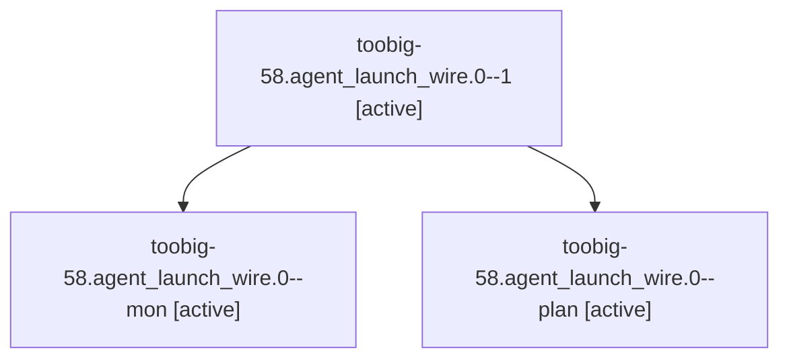

# Family: toobig-58.agent\_launch\_wire.0

[Agent Hoods](../README.md) / [bbugyi200](../users/bbugyi200/README.md) / [athena](../users/bbugyi200/machines/athena/README.md) / [toobig-58](../users/bbugyi200/machines/athena/hoods/toobig-58/README.md) / toobig-58.agent\_launch\_wire.0

Owner: `bbugyi200.athena` · Hood: `toobig-58` · Members: 3

## Lineage

The diagram is an optional enhancement; the ordered table below contains the same lineage in accessible text.

| Role | Agent | State | Model / provider | Timing | Commits | Prompt | Chat |
|---|---|---|---|---|---:|---|---|
| 1 | toobig-58.agent\_launch\_wire.0--1 | active | grok-4.6 / grok | 2026-09-12T00:09:15.385228+00:00 | [1](../agents/bbugyi200.athena.toobig-58.agent_launch_wire.0--1/README.md#commits) | [Prompt](../agents/bbugyi200.athena.toobig-58.agent_launch_wire.0--1/prompt.md) | [Chat](../agents/bbugyi200.athena.toobig-58.agent_launch_wire.0--1/chat.md) |
| mon | toobig-58.agent\_launch\_wire.0--mon | active | grok-4.6 / grok | 2026-09-11T23:46:57.067443+00:00 | 0 | — | [Chat](../agents/bbugyi200.athena.toobig-58.agent_launch_wire.0--mon/chat.md) |
| plan | toobig-58.agent\_launch\_wire.0--plan | active | grok-4.6 / grok | 2026-09-11T23:30:22.090077+00:00 | 0 | [Prompt](../agents/bbugyi200.athena.toobig-58.agent_launch_wire.0--plan/prompt.md) | [Chat](../agents/bbugyi200.athena.toobig-58.agent_launch_wire.0--plan/chat.md) |

## Commits

| Role | Repo | Commit | Subject | Committed |
|---|---|---|---|---|
| 1 | sase | [`a694708`](https://github.com/sase-org/sase/commit/a694708f45927206fb6af95eef56c0be789d5a4a) | refactor(core): split agent\_launch\_wire into sibling modules | 2026-09-11 20:17:36 EDT |

## Neighbors

| Agent | Relation | State |
|---|---|---|
| [toobig-58.continuation.0](bbugyi200.athena.toobig-58.continuation.0.md) (family · 3) | toobig-58 hood | active 3 |
| [toobig-58.continuation\_capture.0](../agents/bbugyi200.athena.toobig-58.continuation_capture.0/README.md) | toobig-58 hood | active |
| [toobig-58.runner\_workspace.0](bbugyi200.athena.toobig-58.runner_workspace.0.md) (family · 3) | toobig-58 hood | active 3 |
| [toobig-58.test\_llm\_provider\_invoke.0](bbugyi200.athena.toobig-58.test_llm_provider_invoke.0.md) (family · 3) | toobig-58 hood | active 3 |
| [toobig-58.test\_repo\_handler\_open.0](../agents/bbugyi200.athena.toobig-58.test_repo_handler_open.0/README.md) | toobig-58 hood | active |
