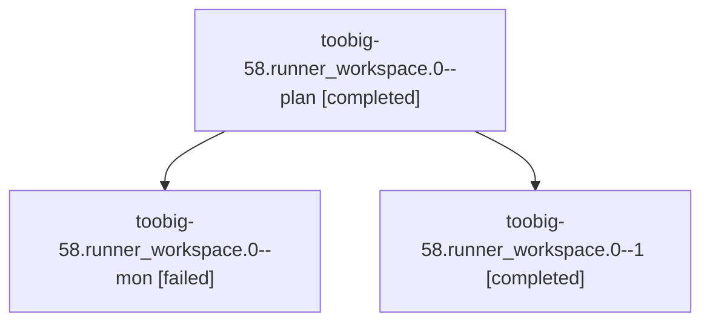

# Family: toobig-58.runner\_workspace.0

[Agent Hoods](../README.md) / [bbugyi200](../users/bbugyi200/README.md) / [athena](../users/bbugyi200/machines/athena/README.md) / [toobig-58](../users/bbugyi200/machines/athena/hoods/toobig-58/README.md) / toobig-58.runner\_workspace.0

Owner: `bbugyi200.athena` · Hood: `toobig-58` · Members: 3

## Lineage

The diagram is an optional enhancement; the ordered table below contains the same lineage in accessible text.

| Role | Agent | State | Model / provider | Timing | Commits | Prompt | Chat |
|---|---|---|---|---|---:|---|---|
| plan | toobig-58.runner\_workspace.0--plan | completed | grok-4.6 / grok | 2026-09-11T18:39:06.056997+00:00 → 2026-09-11T19:17:38.780868+00:00 | 0 | [Prompt](../agents/bbugyi200.athena.toobig-58.runner_workspace.0--plan/prompt.md) | [Chat](../agents/bbugyi200.athena.toobig-58.runner_workspace.0--plan/chat.md) |
| mon | toobig-58.runner\_workspace.0--mon | failed | grok-4.6 / grok | 2026-09-11T19:17:13.602035+00:00 → 2026-09-11T19:19:20.344948+00:00 | 0 | — | [Chat](../agents/bbugyi200.athena.toobig-58.runner_workspace.0--mon/chat.md) |
| 1 | toobig-58.runner\_workspace.0--1 | completed | grok-4.6 / grok | 2026-09-11T19:19:26.726241+00:00 → 2026-09-11T19:29:29.831875+00:00 | [1](../agents/bbugyi200.athena.toobig-58.runner_workspace.0--1/README.md#commits) | [Prompt](../agents/bbugyi200.athena.toobig-58.runner_workspace.0--1/prompt.md) | [Chat](../agents/bbugyi200.athena.toobig-58.runner_workspace.0--1/chat.md) |

## Commits

| Role | Repo | Commit | Subject | Committed |
|---|---|---|---|---|
| 1 | sase | [`f911ad4`](https://github.com/sase-org/sase/commit/f911ad47540caf0245d4bfe3a201f0c7d30cb39c) | refactor(axe): split runner\_workspace into focused modules | 2026-09-11 15:26:23 EDT |

## Neighbors

| Agent | Relation | State |
|---|---|---|
| [toobig-58.agent\_launch\_wire.0](../agents/bbugyi200.athena.toobig-58.agent_launch_wire.0/README.md) | toobig-58 hood | waiting |
| [toobig-58.continuation.0](../agents/bbugyi200.athena.toobig-58.continuation.0/README.md) | toobig-58 hood | waiting |
| [toobig-58.continuation\_capture.0](../agents/bbugyi200.athena.toobig-58.continuation_capture.0/README.md) | toobig-58 hood | active |
| [toobig-58.test\_llm\_provider\_invoke.0](../agents/bbugyi200.athena.toobig-58.test_llm_provider_invoke.0/README.md) | toobig-58 hood | waiting |
| [toobig-58.test\_repo\_handler\_open.0](../agents/bbugyi200.athena.toobig-58.test_repo_handler_open.0/README.md) | toobig-58 hood | waiting |
