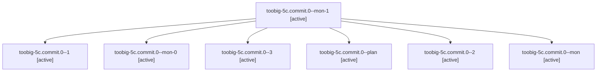

# Family: toobig-5c.commit.0

[Agent Hoods](../README.md) / [bbugyi200](../users/bbugyi200/README.md) / [athena](../users/bbugyi200/machines/athena/README.md) / [toobig-5c](../users/bbugyi200/machines/athena/hoods/toobig-5c/README.md) / toobig-5c.commit.0

Owner: `bbugyi200.athena` · Hood: `toobig-5c` · Members: 7

## Lineage

The diagram is an optional enhancement; the ordered table below contains the same lineage in accessible text.

| Role | Agent | State | Model / provider | Timing | Commits | Prompt | Chat |
|---|---|---|---|---|---:|---|---|
| mon-1 | toobig-5c.commit.0--mon-1 | active | sonnet / claude | 2026-09-14T04:34:11.172928+00:00 | 0 | — | [Chat](../agents/bbugyi200.athena.toobig-5c.commit.0--mon-1/chat.md) |
| 1 | toobig-5c.commit.0--1 | active | sonnet / claude | 2026-09-14T04:16:29.191162+00:00 | 0 | [Prompt](../agents/bbugyi200.athena.toobig-5c.commit.0--1/prompt.md) | [Chat](../agents/bbugyi200.athena.toobig-5c.commit.0--1/chat.md) |
| mon-0 | toobig-5c.commit.0--mon-0 | active | sonnet / claude | 2026-09-14T04:27:55.693063+00:00 | 0 | — | [Chat](../agents/bbugyi200.athena.toobig-5c.commit.0--mon-0/chat.md) |
| 3 | toobig-5c.commit.0--3 | active | gpt-5.5 / codex | 2026-09-14T04:38:08.855071+00:00 | [1](../agents/bbugyi200.athena.toobig-5c.commit.0--3/README.md#commits) | [Prompt](../agents/bbugyi200.athena.toobig-5c.commit.0--3/prompt.md) | [Chat](../agents/bbugyi200.athena.toobig-5c.commit.0--3/chat.md) |
| plan | toobig-5c.commit.0--plan | active | sonnet / claude | 2026-09-14T04:06:43.635015+00:00 | 0 | [Prompt](../agents/bbugyi200.athena.toobig-5c.commit.0--plan/prompt.md) | [Chat](../agents/bbugyi200.athena.toobig-5c.commit.0--plan/chat.md) |
| 2 | toobig-5c.commit.0--2 | active | sonnet / claude | 2026-09-14T04:31:37.444840+00:00 | 0 | [Prompt](../agents/bbugyi200.athena.toobig-5c.commit.0--2/prompt.md) | [Chat](../agents/bbugyi200.athena.toobig-5c.commit.0--2/chat.md) |
| mon | toobig-5c.commit.0--mon | active | sonnet / claude | 2026-09-14T04:13:03.211396+00:00 | 0 | — | [Chat](../agents/bbugyi200.athena.toobig-5c.commit.0--mon/chat.md) |

## Commits

| Role | Repo | Commit | Subject | Committed |
|---|---|---|---|---|
| 3 | sase | [`2863ed2`](https://github.com/sase-org/sase/commit/2863ed2f19a2431baeff25cca3f943f44e3e81c8) | refactor(finalizers): split commit finalizer helpers | 2026-09-14 00:43:42 EDT |

## Neighbors

| Agent | Relation | State |
|---|---|---|
| [toobig-5c.agent.0](../agents/bbugyi200.athena.toobig-5c.agent.0/README.md) | toobig-5c hood | active |
| [toobig-5c.commit\_repair.0](../agents/bbugyi200.athena.toobig-5c.commit_repair.0/README.md) | toobig-5c hood | active |
| [toobig-5c.continuation\_budget.0](../agents/bbugyi200.athena.toobig-5c.continuation_budget.0/README.md) | toobig-5c hood | active |
| [toobig-5c.disk\_footprint.0](../agents/bbugyi200.athena.toobig-5c.disk_footprint.0/README.md) | toobig-5c hood | active |
| [toobig-5c.followup.0](../agents/bbugyi200.athena.toobig-5c.followup.0/README.md) | toobig-5c hood | active |
| [toobig-5c.loading\_disk.0](../agents/bbugyi200.athena.toobig-5c.loading_disk.0/README.md) | toobig-5c hood | active |
| [toobig-5c.resume.0](../agents/bbugyi200.athena.toobig-5c.resume.0/README.md) | toobig-5c hood | active |
| [toobig-5c.run\_agent\_wait\_slots.0](../agents/bbugyi200.athena.toobig-5c.run_agent_wait_slots.0/README.md) | toobig-5c hood | active |
| [toobig-5c.start.0](../agents/bbugyi200.athena.toobig-5c.start.0/README.md) | toobig-5c hood | active |
| [toobig-5c.store.0](../agents/bbugyi200.athena.toobig-5c.store.0/README.md) | toobig-5c hood | active |
