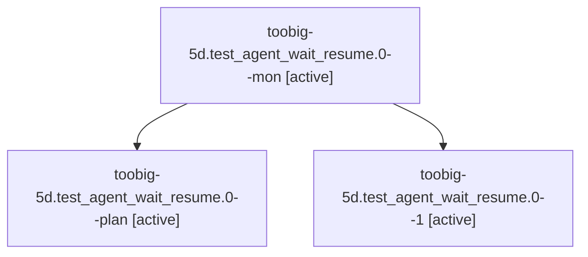

# Family: toobig-5d.test\_agent\_wait\_resume.0

[Agent Hoods](../README.md) / [bbugyi200](../users/bbugyi200/README.md) / [athena](../users/bbugyi200/machines/athena/README.md) / [toobig-5d](../users/bbugyi200/machines/athena/hoods/toobig-5d/README.md) / toobig-5d.test\_agent\_wait\_resume.0

Owner: `bbugyi200.athena` · Hood: `toobig-5d` · Members: 3

## Lineage

The diagram is an optional enhancement; the ordered table below contains the same lineage in accessible text.

| Role | Agent | State | Model / provider | Timing | Commits | Prompt | Chat |
|---|---|---|---|---|---:|---|---|
| mon | toobig-5d.test\_agent\_wait\_resume.0--mon | active | sonnet / claude | 2026-09-14T08:23:51.678480+00:00 | 0 | — | [Chat](../agents/bbugyi200.athena.toobig-5d.test_agent_wait_resume.0--mon/chat.md) |
| plan | toobig-5d.test\_agent\_wait\_resume.0--plan | active | sonnet / claude | 2026-09-14T08:17:40.099630+00:00 | 0 | [Prompt](../agents/bbugyi200.athena.toobig-5d.test_agent_wait_resume.0--plan/prompt.md) | [Chat](../agents/bbugyi200.athena.toobig-5d.test_agent_wait_resume.0--plan/chat.md) |
| 1 | toobig-5d.test\_agent\_wait\_resume.0--1 | active | sonnet / claude | 2026-09-14T08:26:48.544252+00:00 | [1](../agents/bbugyi200.athena.toobig-5d.test_agent_wait_resume.0--1/README.md#commits) | [Prompt](../agents/bbugyi200.athena.toobig-5d.test_agent_wait_resume.0--1/prompt.md) | [Chat](../agents/bbugyi200.athena.toobig-5d.test_agent_wait_resume.0--1/chat.md) |

## Commits

| Role | Repo | Commit | Subject | Committed |
|---|---|---|---|---|
| 1 | sase | [`e87a5b4`](https://github.com/sase-org/sase/commit/e87a5b459528ecc3a3dfc039e5c117b48ee1beb1) | test(ace): split test\_agent\_wait\_resume.py into focused files | 2026-09-14 04:48:18 EDT |

## Neighbors

| Agent | Relation | State |
|---|---|---|
| [toobig-5d.agent\_load\_tiering\_fixture.0](../agents/bbugyi200.athena.toobig-5d.agent_load_tiering_fixture.0/README.md) | toobig-5d hood | waiting |
| [toobig-5d.agent\_load\_tiering\_harness.0](../agents/bbugyi200.athena.toobig-5d.agent_load_tiering_harness.0/README.md) | toobig-5d hood | waiting |
| [toobig-5d.rendered\_link\_corpus.0](bbugyi200.athena.toobig-5d.rendered_link_corpus.0.md) (family · 5) | toobig-5d hood | active 5 |
| [toobig-5d.test\_artifact\_cli\_link\_health.0](../agents/bbugyi200.athena.toobig-5d.test_artifact_cli_link_health.0/README.md) | toobig-5d hood | active |
| [toobig-5d.test\_axe\_chop\_agents.0](../agents/bbugyi200.athena.toobig-5d.test_axe_chop_agents.0/README.md) | toobig-5d hood | waiting |
| [toobig-5d.test\_bare\_git\_workspace.0](../agents/bbugyi200.athena.toobig-5d.test_bare_git_workspace.0/README.md) | toobig-5d hood | active |
| [toobig-5d.test\_continuation\_facade.0](../agents/bbugyi200.athena.toobig-5d.test_continuation_facade.0/README.md) | toobig-5d hood | active |
| [toobig-5d.test\_gate\_capacity\_e2e.0](../agents/bbugyi200.athena.toobig-5d.test_gate_capacity_e2e.0/README.md) | toobig-5d hood | active |
| [toobig-5d.test\_keymaps\_display\_help.0](../agents/bbugyi200.athena.toobig-5d.test_keymaps_display_help.0/README.md) | toobig-5d hood | active |
| [toobig-5d.test\_monitor\_followup.0](../agents/bbugyi200.athena.toobig-5d.test_monitor_followup.0/README.md) | toobig-5d hood | active |
| [toobig-5d.test\_monitor\_followup\_prompt.0](../agents/bbugyi200.athena.toobig-5d.test_monitor_followup_prompt.0/README.md) | toobig-5d hood | active |
| [toobig-5d.test\_monitor\_resume.0](../agents/bbugyi200.athena.toobig-5d.test_monitor_resume.0/README.md) | toobig-5d hood | active |
| [toobig-5d.test\_notification\_store.0](../agents/bbugyi200.athena.toobig-5d.test_notification_store.0/README.md) | toobig-5d hood | waiting |
| [toobig-5d.test\_pooled\_alias\_single\_consumption.0](../agents/bbugyi200.athena.toobig-5d.test_pooled_alias_single_consumption.0/README.md) | toobig-5d hood | active |
| [toobig-5d.test\_prompt\_panel\_section\_navigation\_targets.0](../agents/bbugyi200.athena.toobig-5d.test_prompt_panel_section_navigation_targets.0/README.md) | toobig-5d hood | active |
