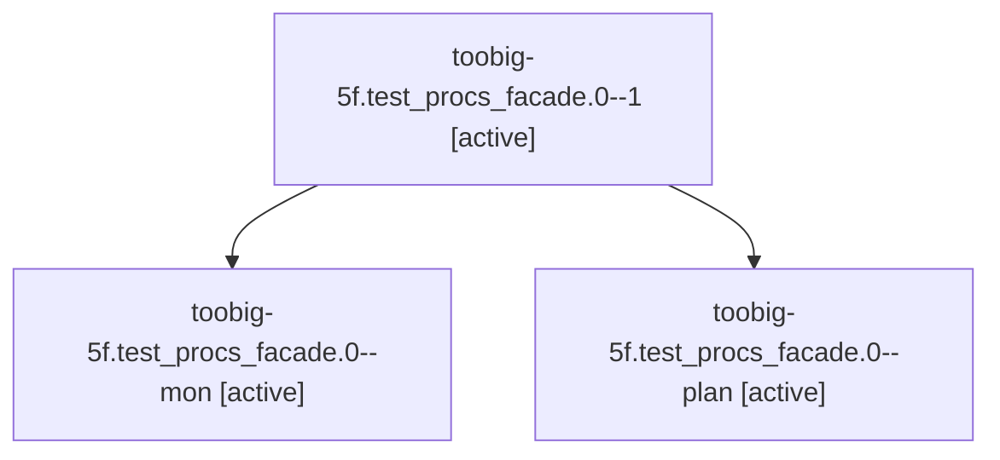

# Family: toobig-5f.test\_procs\_facade.0

[Agent Hoods](../README.md) / [bbugyi200](../users/bbugyi200/README.md) / [athena](../users/bbugyi200/machines/athena/README.md) / [toobig-5f](../users/bbugyi200/machines/athena/hoods/toobig-5f/README.md) / toobig-5f.test\_procs\_facade.0

Owner: `bbugyi200.athena` · Hood: `toobig-5f` · Members: 3

## Lineage

The diagram is an optional enhancement; the ordered table below contains the same lineage in accessible text.

| Role | Agent | State | Model / provider | Timing | Commits | Prompt | Chat |
|---|---|---|---|---|---:|---|---|
| 1 | toobig-5f.test\_procs\_facade.0--1 | active | sonnet / claude | 2026-09-15T00:05:19.239935+00:00 | [1](../agents/bbugyi200.athena.toobig-5f.test_procs_facade.0--1/README.md#commits) | [Prompt](../agents/bbugyi200.athena.toobig-5f.test_procs_facade.0--1/prompt.md) | [Chat](../agents/bbugyi200.athena.toobig-5f.test_procs_facade.0--1/chat.md) |
| mon | toobig-5f.test\_procs\_facade.0--mon | active | sonnet / claude | 2026-09-15T00:00:29.533391+00:00 | 0 | — | [Chat](../agents/bbugyi200.athena.toobig-5f.test_procs_facade.0--mon/chat.md) |
| plan | toobig-5f.test\_procs\_facade.0--plan | active | sonnet / claude | 2026-09-14T23:52:56.947190+00:00 | 0 | [Prompt](../agents/bbugyi200.athena.toobig-5f.test_procs_facade.0--plan/prompt.md) | [Chat](../agents/bbugyi200.athena.toobig-5f.test_procs_facade.0--plan/chat.md) |

## Commits

| Role | Repo | Commit | Subject | Committed |
|---|---|---|---|---|
| 1 | sase | [`7420b82`](https://github.com/sase-org/sase/commit/7420b829868e78d4a19fa9f649ed3a3d7bc2bb39) | test(procs-facade): split into focused files | 2026-09-14 20:06:34 EDT |

## Neighbors

| Agent | Relation | State |
|---|---|---|
| [toobig-5f.test\_axe\_chop\_output\_contract.0](../agents/bbugyi200.athena.toobig-5f.test_axe_chop_output_contract.0/README.md) | toobig-5f hood | active |
| [toobig-5f.test\_axe\_chop\_wait\_checks.0](../agents/bbugyi200.athena.toobig-5f.test_axe_chop_wait_checks.0/README.md) | toobig-5f hood | active |
| [toobig-5f.test\_notification\_custom\_gate.0](../agents/bbugyi200.athena.toobig-5f.test_notification_custom_gate.0/README.md) | toobig-5f hood | active |
